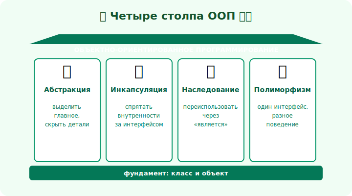

# 08 · Абстракция 🖼️⭐⭐

> 🎯 **Цель блока (ЯДРО трека):** понять абстракцию — умение выделять **существенное** и
> скрывать несущественное. Это первый из четырёх столпов ООП.

---

## 📖 Четыре столпа ООП

Ядро ООП — **четыре столпа**, на которых стоит всё остальное:

🖼️


```
   🎭 АБСТРАКЦИЯ    — выделить главное, скрыть детали (этот модуль)
   🔒 ИНКАПСУЛЯЦИЯ  — спрятать внутренности за интерфейсом (модуль 09)
   🧬 НАСЛЕДОВАНИЕ  — переиспользовать через «является» (модуль 10)
   🔄 ПОЛИМОРФИЗМ   — один интерфейс, разное поведение (модуль 11)
```

💡 Эти четыре — то, что спрашивают на собеседованиях и что лежит в основе любого ООП-кода.
Разберём каждый. Начинаем с абстракции — она про **мышление**.

---

## ⭐⭐ Абстракция — модель, а не реальность

**Абстракция** — выделить из сущности только то, что **важно для задачи**, и игнорировать
остальное.

```
   Машина для задачи «навигатор»:  важно — позиция, скорость, маршрут
                                   неважно — цвет сидений, марка магнитолы

   Машина для задачи «автосалон»:  важно — цвет, комплектация, цена
                                   неважно — текущая скорость
```

💡 ⭐⭐ Одна и та же сущность абстрагируется **по-разному** под разные задачи. Абстракция — это
выбор: «что из бесконечного количества деталей реальной вещи мне нужно в коде?». Хорошая
абстракция содержит ровно нужное — не больше (лишняя сложность) и не меньше (не хватит).

---

## ⭐⭐ Абстракция = «что», а не «как»

Абстракция описывает **что** объект делает, скрывая **как** он это делает.

```
   «список» (абстракция):  добавить, получить по индексу, размер   ← ЧТО
        реализация:        массив? связные узлы? — неважно для пользователя ← КАК

   «отправитель писем»:    отправить(письмо)   ← ЧТО
        реализация:        SMTP? сторонний сервис? — скрыто ← КАК
```

💡 Когда ты думаешь об объекте через «что он умеет», а не «как устроен» — ты мыслишь
абстракциями. Это позволяет менять «как» (модуль 09 — инкапсуляция) и подставлять разные «как»
(модуль 11 — полиморфизм). Абстракция — фундамент для остальных трёх столпов.

---

## 📖 Уровни абстракции

Хороший код организован **слоями абстракции** — от высокоуровневых понятий к деталям:

```
   высокий уровень:  ОформитьЗаказ()           ← бизнес-смысл
        ▼
   средний:          СписатьОплату(), Отправить() ← операции
        ▼
   низкий:           HTTP-запрос, запись в БД     ← детали
```

💡 ⭐⭐ Каждый уровень **прячет** детали нижнего. Читая `ОформитьЗаказ()`, ты видишь смысл, а не
SQL-запросы. Смешивать уровни (бизнес-логика вперемешку с байтами) — главный источник нечитаемого
кода. «Не заставляй читателя прыгать между уровнями абстракции в одном методе».

---

## ⚠️ Ловушки

- ❌ **Дырявая абстракция** — детали «протекают» наружу (метод `сохранить()`, но надо знать про
  SQL внутри). Хорошая абстракция не заставляет знать «как».
- ❌ **Переусложнение** — абстракция ради абстракции, интерфейсы на каждый чих (YAGNI, модуль 17).
- ❌ Смешивать уровни абстракции в одном методе (бизнес-логика + работа с байтами).
- ❌ Абстракция, не отражающая задачу (моделируешь не то, что важно).

---

## 🛠️ Практика

1. Опиши сущность «Пользователь» **двумя** абстракциями: для авторизации и для профиля. Что важно
   в каждой?
2. Возьми метод, где смешаны уровни (бизнес-логика + детали), и раздели на уровни.
3. Сформулируй абстракцию «хранилище» через «что» (методы), не привязываясь к «как».

---

## ✅ Задачи

1. **Назови** четыре столпа ООП.
2. **Объясни** абстракцию как выделение существенного под задачу.
3. **Покажи**, как одна сущность абстрагируется по-разному.
4. **Разведи** уровни абстракции и объясни, почему их не смешивают.

---

## ❓ Проверь себя

1. Какие четыре столпа у ООП?
2. Что такое абстракция и почему она зависит от задачи?
3. Чем «что» отличается от «как»?
4. Что такое дырявая абстракция?

---

## ✅ Чек-лист

- [ ] Знаю четыре столпа ООП
- [ ] Понимаю абстракцию как выделение существенного
- [ ] Мыслю через «что», а не «как»
- [ ] Не смешиваю уровни абстракции

➡️ Следующий (ядро): [09 · Инкапсуляция (глубоко)](09-encapsulation-deep.md)
