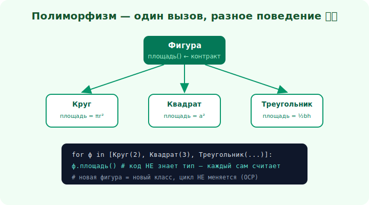

# 11 · Полиморфизм 🖼️⭐⭐

> 🎯 **Цель блока (ЯДРО трека):** понять полиморфизм — четвёртый и самый мощный столп: один
> интерфейс, много реализаций. Это то, что делает ООП гибким.

---

## ⭐⭐ Полиморфизм — один вызов, разное поведение

**Полиморфизм** (греч. «много форм») — способность объектов **разных** классов отвечать на
**один и тот же** вызов **по-своему**.

🖼️


```python
class Фигура:
    def площадь(self): ...          # общий интерфейс

class Круг(Фигура):
    def площадь(self): return 3.14 * self.r**2

class Квадрат(Фигура):
    def площадь(self): return self.a**2

# КЛЮЧЕВОЙ МОМЕНТ — код НЕ знает конкретный класс:
for ф in [Круг(2), Квадрат(3), Круг(5)]:
    print(ф.площадь())             # каждый считает ПО-СВОЕМУ
```

💡 ⭐⭐ Цикл вызывает `площадь()`, **не зная**, круг там или квадрат — каждый объект сам знает, как
себя посчитать. Добавишь `Треугольник` — цикл **не меняется**. Вот это и есть сила: код работает
с **абстракцией** (Фигура), а конкретное поведение выбирается **в рантайме** по реальному типу.

---

## ⭐⭐ Почему это мощно: код, открытый к расширению

```
   БЕЗ полиморфизма:                  С полиморфизмом:
   if тип == "круг": ...              ф.площадь()   ← и всё
   elif тип == "квадрат": ...
   elif тип == "треугольник": ...     добавить фигуру = новый класс,
   # добавить фигуру = править ВЕЗДЕ    старый код НЕ трогаем
   #   все if-ы по всему коду
```

💡 ⭐⭐ Полиморфизм **убирает простыни `if/switch` по типу**. Вместо «проверить тип и сделать
по-разному» — «вызвать метод, объект сам разберётся». Новый вариант = новый класс, а не правка
десятка `if`-ов. Это прямой путь к принципу открытости/закрытости (OCP, модуль 14): код **открыт
для расширения** (новые классы), но **закрыт для изменения** (старый код не трогаешь).

---

## 📖 Виды полиморфизма

```
   полиморфизм ПОДТИПОВ (главный в ООП) — через общий интерфейс/базовый класс + переопределение
        (наш пример с Фигурой)

   ПЕРЕГРУЗКА (ad-hoc) — один метод с разными типами аргументов (C++/Java): print(int), print(str)

   ПАРАМЕТРИЧЕСКИЙ — обобщения/шаблоны: один код для любого типа
        (вспомни Stack<T> в [C++](../../Cpp/03-middle/15-templates.md) и
         обобщения в [Rust](../../Rust/03-middle/16-generics-traits.md))
```

💡 В ООП «полиморфизм» обычно означает **полиморфизм подтипов** — наш главный герой. Он работает
через **позднее связывание**: какой именно метод вызвать, решается **в рантайме** по реальному
классу объекта (виртуальные методы — vtable, как в
[C++](../../Cpp/03-middle/14-inheritance-polymorphism.md)).

---

## ⭐ Полиморфизм без наследования

Полиморфизм **не требует** наследования! Достаточно, чтобы объекты имели **одинаковый интерфейс**:

```
   утиная типизация (Python): «если крякает как утка — это утка»
        любой объект с методом площадь() подойдёт, без общего родителя

   интерфейсы (Java/C#/Go): классы реализуют общий интерфейс (модуль 12)
   трейты (Rust): тип реализует трейт
```

💡 ⭐ Это важно: полиморфизм — про **общий контракт** (интерфейс), а не про общего предка.
Поэтому он отлично сочетается с **композицией** (модуль 16): подставляй разные реализации одного
интерфейса, не строя иерархий наследования. Полиморфизм — настоящая причина, по которой ООП гибок.

---

## ⚠️ Ловушки

- ❌ Простыни `if/switch` по типу вместо полиморфизма — главный «запах», который он лечит.
- ❌ Думать, что полиморфизм требует наследования (нужен лишь общий интерфейс).
- ❌ Проверять тип объекта (`isinstance`/`instanceof`) и ветвиться — часто признак, что нужен
  полиморфизм.
- ❌ Потомок, нарушающий контракт базового типа (полиморфизм сломается — LSP, модуль 15).

---

## 🛠️ Практика

1. Сделай иерархию `Фигура` с `Круг/Квадрат/Треугольник` и посчитай суммарную площадь списка,
   **не проверяя тип**.
2. Возьми код с `if тип == ...` и перепиши на полиморфизм — добавь новый вариант, не трогая
   старый код.
3. Покажи полиморфизм **без** общего родителя (разные классы с одним методом `звук()`).

---

## ✅ Задачи

1. **Объясни** полиморфизм как «один интерфейс — разное поведение».
2. **Покажи**, как он убирает `if/switch` по типу.
3. **Назови** виды полиморфизма.
4. **Покажи** полиморфизм через общий интерфейс без наследования.

---

## ❓ Проверь себя

1. Что такое полиморфизм и как он выбирает поведение?
2. Почему он делает код открытым к расширению?
3. Какие есть виды полиморфизма?
4. Требует ли полиморфизм наследования?

---

## ✅ Чек-лист

- [ ] Понимаю полиморфизм (один вызов, разное поведение)
- [ ] Вижу, как он убирает if/switch по типу
- [ ] Знаю виды полиморфизма и позднее связывание
- [ ] Понимаю, что нужен общий интерфейс, а не предок

➡️ Следующий: [12 · Интерфейсы и абстрактные классы](12-interfaces.md)
