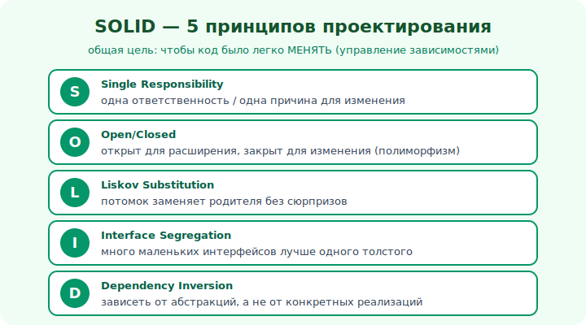

# 13 · SOLID — введение 🖼️⭐

> 🎯 **Цель блока:** познакомиться с SOLID — пятью принципами, которые превращают «работающий
> код» в «гибкий, поддерживаемый код». Это азбука Senior-проектирования.

---

## 📖 Зачем принципы

Четыре столпа (уровень 2) дают **механизмы** ООП. Но как ими пользоваться **правильно**? Можно
написать классы и наследование так, что получится «клубок». **Принципы проектирования** —
накопленный опыт «как делать хорошо». Главный набор — **SOLID** (5 принципов от Роберта Мартина).

🖼️


```
   S — Single Responsibility   — одна ответственность на класс
   O — Open/Closed             — открыт для расширения, закрыт для изменения
   L — Liskov Substitution     — потомок заменяет родителя без сюрпризов
   I — Interface Segregation   — много маленьких интерфейсов лучше одного толстого
   D — Dependency Inversion    — зависеть от абстракций, не от конкретики
```

💡 Все пять служат **одной цели**: чтобы код было легко **менять**. Хорошая система — не та, что
красиво написана сейчас, а та, что **легко изменить** через год, когда придут новые требования.

---

## ⭐ Главная идея за SOLID: управление зависимостями

```
   плохой код:  всё связано со всем → дёрнул тут → сломалось там → страшно менять
   SOLID-код:   связи минимальны и идут к абстракциям → менять локально и безопасно
```

💡 ⭐ SOLID — это в основном про **зависимости**: между классами должно быть как можно меньше
связей, и они должны идти к **стабильным абстракциям** (интерфейсам), а не к изменчивым деталям.
Тогда изменение в одном месте не расползается по системе. Это конкретизация инкапсуляции (модуль
09) на уровне всей архитектуры.

---

## 📖 Принципы — это ориентиры, не догмы

```
   ✅ SOLID помогает, когда система растёт и меняется
   ⚠️ но слепое следование → переусложнение (интерфейс на каждый чих, классы-однострочники)
   ✅ Senior применяет принципы С УМОМ, по ситуации, помня про YAGNI (модуль 17)
```

💡 ⚠️ Важная зрелость: принципы — **инструменты под задачу**, а не религия. Для скрипта на 50
строк SOLID может быть избыточен. Для системы, которая живёт годами и растёт командой —
бесценен. Понимать **зачем** принцип важнее, чем зубрить аббревиатуру.

---

## ⭐ Как мы их разберём

```
   модуль 14: S (SRP) и O (OCP) — про ответственность и расширяемость
   модуль 15: L, I, D (LSP/ISP/DIP) — про наследование, интерфейсы, зависимости
   модуль 16: композиция > наследование (тесно связано с SOLID)
   модуль 17: другие принципы (DRY, KISS, YAGNI, coupling/cohesion)
```

💡 Каждый принцип — это «лекарство» от конкретной болезни кода. Будем разбирать: какую проблему
лечит, как выглядит нарушение, как починить. Многое ты уже видел в действии: OCP — это полиморфизм
из модуля 11, DIP — «программируй к интерфейсу» из модуля 12.

---

## ⚠️ Ловушки

- ❌ Зубрить расшифровку SOLID без понимания, какую боль лечит каждый принцип.
- ❌ Применять все принципы максимально везде → переусложнение (нарушение KISS/YAGNI).
- ❌ Думать, что SOLID — про «красоту». Это про **стоимость изменений** в будущем.
- ❌ Игнорировать принципы в растущей системе → она превращается в «легаси-клубок».

---

## 🛠️ Практика

1. Выпиши пять букв SOLID и своими словами — какую проблему лечит каждая.
2. Вспомни код, который было **страшно менять** — какие принципы там нарушены?
3. Сформулируй: «хорошая архитектура = легко менять». Согласен ли ты и почему?

---

## ✅ Задачи

1. **Расшифруй** SOLID и назови цель каждого принципа.
2. **Объясни**, почему SOLID — это про управление зависимостями.
3. **Объясни**, почему принципы — ориентиры, а не догмы.
4. **Свяжи** OCP с полиморфизмом, а DIP — с «программируй к интерфейсу».

---

## ❓ Проверь себя

1. Что означает каждая буква SOLID?
2. Какой общей цели служат все пять?
3. Почему слепое следование принципам вредно?
4. Что значит «хорошая архитектура = легко менять»?

---

## ✅ Чек-лист

- [ ] Знаю расшифровку и цель SOLID
- [ ] Понимаю, что это про управление зависимостями
- [ ] Применяю принципы с умом, не догматично
- [ ] Связываю SOLID со столпами ООП

➡️ Следующий: [14 · SRP и OCP](14-srp-ocp.md)
