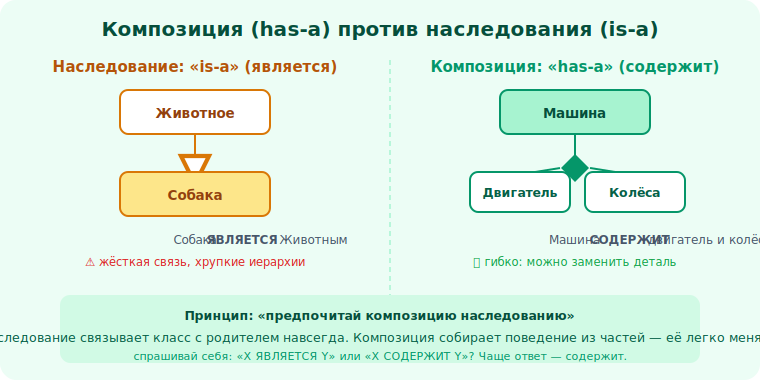

# 16 · Композиция вместо наследования 🖼️⭐

> 🎯 **Цель блока:** понять одно из главных правил Senior — «предпочитай композицию
> наследованию» — и когда всё же наследовать.

---

## 📖 Почему наследование подводит

Из модуля 10: наследование создаёт **жёсткую** связь потомка с родителем. Проблемы накапливаются:

```
   🧱 хрупкий базовый класс — меняешь родителя → ломаются все потомки
   🔗 жёсткость — иерархия фиксируется на этапе написания, менять трудно
   📦 наследуешь ВСЁ — даже ненужные методы родителя
   🌳 комбинаторный взрыв — нужны Летающий+Плавающий? Утка наследует обоих? → ад
   ⏱️ статичность — класс объекта нельзя сменить в рантайме
```

💡 Наследование выглядит как «переиспользование кода», но платит за это **связанностью**. Чем
глубже и шире иерархия, тем хрупче система.

---

## ⭐ Композиция — собирай поведение из частей

**Композиция** (модуль 06): вместо «быть подтипом» — **содержать** объект, которому делегируешь
работу.

🖼️
```
   ❌ НАСЛЕДОВАНИЕ:                    ✅ КОМПОЗИЦИЯ:
   class Утка(Летающий, Плавающий):   class Утка:
       ...                                def __init__(self):
   # жёстко зашито, всё или ничего         self.полёт = МашущийПолёт()    ← поведение-часть
                                            self.плавание = ОбычноеПлавание()
                                        def лететь(self): self.полёт.выполнить()
   # → поведение можно ПОДМЕНИТЬ: self.полёт = НеЛетает() (рантайм!)
```



💡 ⭐ Композиция: поведение — это **подставляемые объекты-стратегии**, а не зашитое наследование.
Хочешь утку, которая не летает? Подставь `НеЛетает()`. Нужна резиновая утка? Меняешь части, не
трогая иерархию. Это гибкость **в рантайме** против жёсткости наследования на этапе компиляции.
(Это прямой путь к паттерну Стратегия, уровень 4.)

---

## ⭐ Правило и тест

```
   ПРАВИЛО: «предпочитай композицию наследованию»
            (Composition over Inheritance — из «банды четырёх»)

   ТЕСТ (модуль 06):
     X «является» Y (is-a)?  → возможно наследование (но проверь LSP!)
     X «имеет» Y / «использует» Y (has-a)?  → КОМПОЗИЦИЯ
     хочешь просто переиспользовать код?  → КОМПОЗИЦИЯ (не наследование!)
```

💡 ⭐ Главная ошибка — наследовать ради переиспользования кода. Если тебе нужны методы другого
класса, но отношения «является» нет — **содержи** его объект и делегируй. Наследование оставь для
честного «является» + когда нужен полиморфизм через общий базовый тип.

---

## 📖 Когда наследование всё же уместно

```
   ✅ честное и стабильное «является» (LSP не нарушается)
   ✅ неглубокая иерархия (1-2 уровня)
   ✅ нужен полиморфизм через общий тип, а интерфейса недостаточно (нужен и общий код)
   ✅ родитель — абстрактный класс с общим кодом + контрактом (модуль 12)
```

💡 Наследование — не зло, а **узкий** инструмент. Современная практика: **интерфейсы** (контракт)
+ **композиция** (переиспользование) покрывают большинство задач, оставляя наследование для
случаев настоящего родства. «Наследуй интерфейс, композируй реализацию».

---

## ⚠️ Ловушки

- ❌ Наследование ради «взять методы» (нет отношения «является»).
- ❌ Глубокие иерархии вместо плоской композиции.
- ❌ Дублирование классов под комбинации поведений (Летающая+Плавающая+...) вместо частей.
- ❌ Догматизм в обе стороны: «никогда не наследуй» тоже неверно — наследуй при честном is-a.

---

## 🛠️ Практика

1. Возьми иерархию-злоупотребление (например, типы уток наследованием) и перепиши на композицию
   подставляемых поведений (полёт, звук).
2. Подмени поведение в рантайме (утка перестала летать) — почувствуй гибкость.
3. Для 6 пар классов реши: наследование или композиция? Обоснуй через тест is-a/has-a + LSP.

---

## ✅ Задачи

1. **Перечисли** проблемы наследования.
2. **Объясни** композицию как подставляемое поведение.
3. **Сформулируй** правило и тест выбора.
4. **Назови**, когда наследование всё же оправдано.

---

## ❓ Проверь себя

1. Чем плоха жёсткая связь наследования?
2. Как композиция даёт гибкость в рантайме?
3. Какой тест помогает выбрать между ними?
4. Когда наследование уместно?

---

## ✅ Чек-лист

- [ ] Знаю проблемы наследования
- [ ] Умею заменять наследование композицией
- [ ] Применяю тест is-a / has-a + LSP
- [ ] Наследую только при честном «является»

➡️ Следующий: [17 · DRY, KISS, YAGNI, связность и зацепление](17-principles.md)
