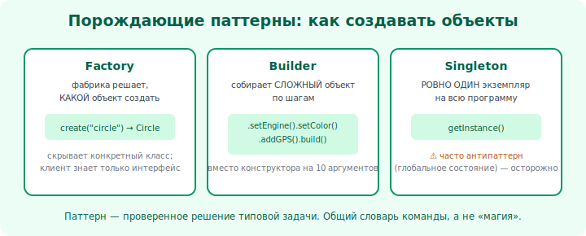

# 19 · Паттерны: зачем и порождающие 🖼️⭐

> 🎯 **Цель блока:** понять, что такое паттерны проектирования, и освоить порождающие — про
> создание объектов (Factory, Builder, Singleton).

---

## 📖 Что такое паттерн проектирования

**Паттерн** — типовое, проверенное решение часто встречающейся задачи проектирования. Это не код
для копирования, а **рецепт**: «вот проблема — вот проверенная структура классов, которая её
решает».

```
   проблема:  «нужно создавать объекты, не привязываясь к конкретным классам»
   паттерн:   Factory (фабрика)

   проблема:  «нужно подменять алгоритм в рантайме»
   паттерн:   Strategy (стратегия)
```



💡 Классика — 23 паттерна «банды четырёх» (GoF), делятся на три группы: **порождающие**
(создание), **структурные** (композиция), **поведенческие** (взаимодействие). Знание паттернов
даёт **общий язык**: сказал «это Observer» — и команда поняла дизайн.

⚠️ Паттерны — инструмент, не самоцель. Лепить паттерны везде = переусложнение (модуль 22). Применяй,
когда **узнал проблему**, которую паттерн решает.

---

## ⭐ Factory (Фабрика) — создание без привязки к классу

**Проблема:** код, создающий объекты через `new КонкретныйКласс()`, жёстко к ним привязан
(нарушение DIP).

```python
# ❌ привязка к конкретике
if тип == "карта": платёж = ОплатаКартой()
elif тип == "крипта": платёж = ОплатаКриптой()

# ✅ фабрика прячет создание
class ФабрикаПлатежей:
    def создать(self, тип) -> СпособОплаты:   # возвращает АБСТРАКЦИЮ
        return self._реестр[тип]()
```

💡 Фабрика **централизует** создание: остальной код просит «дай способ оплаты типа X» и получает
объект через интерфейс, не зная конкретный класс. Добавить новый тип — в одном месте (фабрике).
Связь с OCP/DIP (уровень 3).

---

## ⭐ Builder (Строитель) — пошаговая сборка сложного объекта

**Проблема:** объект с кучей параметров (часть опциональны) → конструктор-монстр с 10 аргументами.

```python
# ❌ конструктор-монстр: Пицца(тесто, размер, сыр, грибы, бекон, соус, ...)
# ✅ Builder — собираем по шагам, читаемо
пицца = (ПиццаBuilder()
         .тесто("тонкое").размер("L")
         .добавить("сыр").добавить("грибы")
         .собрать())
```

💡 Builder делает создание **читаемым** и позволяет собирать объект частями, с разумными
значениями по умолчанию. Особенно полезен для неизменяемых объектов с многими полями (вспомни
Builder из [Rust, Проекты и API](../../Rust/03b-projects-api/02-designing-api.md)).

---

## ⭐ Singleton — один экземпляр (с осторожностью!)

**Проблема:** нужен ровно **один** объект на всю программу (конфиг, пул соединений).

```python
class Конфиг:
    _инстанс = None
    @classmethod
    def получить(cls):
        if cls._инстанс is None: cls._инстанс = Конфиг()
        return cls._инстанс
```

💡 ⚠️ Singleton — **спорный** паттерн. Да, гарантирует один экземпляр, но:
- это, по сути, **глобальное состояние** (а оно усложняет тесты и порождает скрытые зависимости);
- мешает подмене на заглушку (нарушает DIP/тестируемость);
- проблемы в многопоточности (нужна синхронизация — трек ОС).

Часто лучше **внедрить** единственный объект через конструктор (DIP), чем делать его Singleton.
Знай паттерн, но применяй редко и осознанно.

---

## ⚠️ Ловушки

- ❌ Применять паттерны ради паттернов (переусложнение простой задачи).
- ❌ Злоупотреблять Singleton — это глобальное состояние под видом ООП.
- ❌ Builder для объекта из двух полей — избыточно (KISS).
- ❌ Учить паттерны как «магические заклинания» вместо понимания проблемы, которую они решают.

---

## 🛠️ Практика

1. Сделай `ФабрикуПлатежей` для способов оплаты из проекта уровня 2.
2. Реализуй Builder для объекта с многими опциональными полями (Пицца/Запрос/Отчёт).
3. Реализуй Singleton-конфиг, затем перепиши на внедрение через конструктор — сравни тестируемость.

---

## ✅ Задачи

1. **Объясни**, что такое паттерн и зачем он.
2. **Реализуй** Factory и объясни, как он помогает DIP/OCP.
3. **Реализуй** Builder и объясни, какую проблему он решает.
4. **Объясни**, почему Singleton спорный, и чем его заменить.

---

## ❓ Проверь себя

1. Что такое паттерн проектирования и какие три группы есть?
2. Какую проблему решает Factory?
3. Когда нужен Builder?
4. Почему Singleton применяют с осторожностью?

---

## ✅ Чек-лист

- [ ] Понимаю паттерны как рецепты под типовые задачи
- [ ] Умею Factory (создание через абстракцию)
- [ ] Умею Builder (пошаговая сборка)
- [ ] Понимаю риски Singleton и альтернативу (DI)

➡️ Следующий: [20 · Структурные паттерны](20-structural.md)
