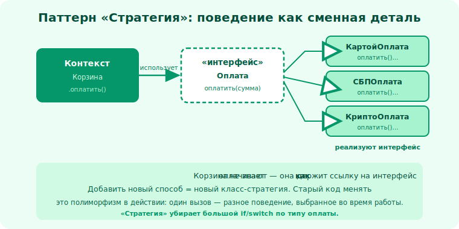

# 21 · Поведенческие паттерны 🖼️⭐

> 🎯 **Цель блока:** освоить поведенческие паттерны — как объекты **взаимодействуют** и
> распределяют обязанности: Strategy, Observer, Command, State.

---

## 📖 Поведенческие паттерны — про взаимодействие

Они отвечают «как объекты **общаются** и кто за что отвечает», чтобы поведение было гибким и
слабо связанным.

---

## ⭐⭐ Strategy (Стратегия) — подменяемый алгоритм

**Проблема:** один и тот же алгоритм нужен в разных вариантах, выбираемых в рантайме.

```
   ❌ if способ_доставки == "курьер": ... elif "почта": ... elif "самовывоз": ...

   ✅ Strategy — каждый алгоритм = отдельный объект с общим интерфейсом:
   class Доставка:
       def __init__(self, стратегия: СтратегияРасчёта):
           self._стратегия = стратегия            # подставляемый алгоритм
       def стоимость(self, заказ):
           return self._стратегия.посчитать(заказ)

   доставка = Доставка(КурьерскаяСтратегия())
   доставка._стратегия = ПочтоваяСтратегия()      # сменили в рантайме!
```



💡 ⭐⭐ Strategy — это **композиция вместо наследования** (модуль 16) и **OCP** (модуль 14) в виде
паттерна: алгоритм вынесен в подменяемый объект. Новый вариант = новая стратегия, без правки
существующего кода. Самый частый и полезный поведенческий паттерн.

---

## ⭐ Observer (Наблюдатель) — подписка на события

**Проблема:** одни объекты должны узнавать об изменениях другого, не привязываясь к нему жёстко.

```
   Издатель (Subject) хранит список Подписчиков.
   Изменилось состояние → издатель оповещает всех: подписчик.обновить(данные)

   YouTube-канал (издатель) → подписчики получают уведомление о новом видео
   ячейка таблицы изменилась → графики и формулы, подписанные на неё, пересчитались
```

🖼️
```
   Издатель ──уведомить()──► Подписчик1
            ──уведомить()──► Подписчик2   (издатель не знает, КТО они конкретно)
            ──уведомить()──► Подписчик3
```

💡 Observer = слабая связь «один-ко-многим». Издатель знает лишь интерфейс `Подписчик`, не
конкретные классы. Основа событийных систем, UI, реактивности. Подписался/отписался — динамически.

---

## ⭐ Command (Команда) — действие как объект

**Проблема:** нужно превратить **действие** в объект — чтобы хранить, передавать, отменять,
ставить в очередь.

```
   class КомандаУдалить(Команда):
       def выполнить(self): ...     def отменить(self): ...   # undo!

   история = [команда1, команда2]   # можно отменять по очереди (Ctrl+Z)
   очередь_задач.добавить(команда)  # отложенное выполнение
```

💡 Command «упаковывает» действие (что сделать + данные) в объект. Это даёт: **отмену** (undo/redo),
**очереди** задач, **логирование** команд, **макросы**. Кнопка не знает, что делает — она держит
объект-команду (развязка отправителя и получателя).

---

## ⭐ State (Состояние) — поведение зависит от состояния

**Проблема:** объект ведёт себя по-разному в разных состояниях, и это выливается в простыни `if
состояние == ...`.

```
   ❌ заказ.обработать(): if статус=="новый":... elif "оплачен":... elif "отправлен":...
   ✅ State — каждое состояние = объект со своим поведением:
      ЗаказНовый.оплатить() → переводит в ЗаказОплачен
      ЗаказОплачен.отправить() → ЗаказОтправлен
   объект делегирует поведение текущему объекту-состоянию
```

💡 State убирает `if по статусу`, вынося поведение каждого состояния в свой класс. Переходы между
состояниями становятся явными. Родственник Strategy (тоже подменяет объект поведения), но
смысл — про **смену состояния** и переходы.

---

## ⚠️ Ловушки

- ❌ Путать Strategy (выбор алгоритма) и State (поведение по состоянию + переходы).
- ❌ Observer с забытой отпиской → утечки/лишние вызовы (отписывайся!).
- ❌ Применять паттерн, где хватило бы простой функции (KISS/YAGNI).
- ❌ Учить названия, не понимая проблему за каждым.

---

## 🛠️ Практика

1. Сделай расчёт доставки через Strategy (3 стратегии), смени стратегию в рантайме.
2. Реализуй Observer: издатель и несколько подписчиков; добавь/убери подписчика динамически.
3. Реализуй Command с `выполнить/отменить` и историю для undo.
4. Перепиши `if по статусу заказа` на State с явными переходами.

---

## ✅ Задачи

1. **Объясни** Strategy и его связь с OCP/композицией.
2. **Объясни** Observer и где он применяется.
3. **Объясни** Command и что даёт «действие как объект».
4. **Разведи** Strategy и State.

---

## ❓ Проверь себя

1. Какую проблему решает Strategy?
2. Как Observer развязывает издателя и подписчиков?
3. Что даёт упаковка действия в Command (undo, очереди)?
4. Чем State отличается от Strategy?

---

## ✅ Чек-лист

- [ ] Понимаю Strategy (подменяемый алгоритм)
- [ ] Понимаю Observer (подписка на события)
- [ ] Понимаю Command (действие как объект, undo)
- [ ] Понимаю State и отличие от Strategy

➡️ Следующий: [22 · Антипаттерны и запахи кода](22-antipatterns.md)
