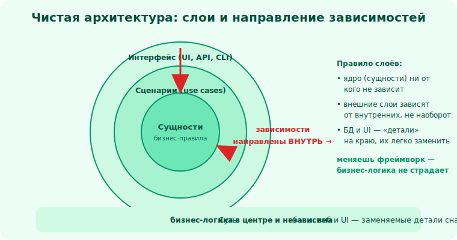

# 23 · Чистая архитектура и слои 🖼️⭐

> 🎯 **Цель блока:** подняться с уровня классов на уровень **архитектуры** — слои, направление
> зависимостей, отделение бизнес-логики от деталей.

---

## 📖 От классов к архитектуре

Принципы (SOLID) работают не только между классами, но и между **крупными частями** системы.
**Архитектура** — это как система разбита на большие блоки и как они зависят друг от друга.

💡 Главный вопрос архитектуры — тот же, что и всего трека: **управление зависимостями**, но в
большом масштабе. Плохая архитектура = «всё знает обо всём». Хорошая = чёткие слои с
контролируемыми зависимостями.

---

## ⭐ Слои: разделение по уровню абстракции

Классическое деление приложения на **слои**:

🖼️
```
   ┌─ Представление (UI / API)   ─┐ ← как пользователь взаимодействует
   ├─ Бизнес-логика (домен)      ─┤ ← ПРАВИЛА предметной области (ядро!)
   ├─ Доступ к данным            ─┤ ← работа с БД/файлами
   └─ Инфраструктура (БД, сеть)  ─┘ ← конкретные технологии
```

💡 Каждый слой про свой уровень абстракции (модуль 08). Верхние слои используют нижние через
**интерфейсы**. Смысл — **изолировать изменения**: поменялся UI — бизнес-логика цела; сменили БД
— домен не трогаем.

---

## ⭐⭐ Главное правило: зависимости направлены ВНУТРЬ, к бизнес-логике

**Чистая архитектура** (Clean Architecture / гексагональная / «порты и адаптеры») ставит в центр
**бизнес-логику**, а детали (БД, UI, фреймворки) — снаружи.

🖼️
```
              ┌──────────────────────────────┐
              │   Детали (БД, UI, сеть)       │  ← снаружи, изменчивое
              │   ┌────────────────────────┐  │
              │   │  Бизнес-логика (домен)  │  │  ← в центре, стабильное
              │   │  не знает про БД и UI!  │  │
              │   └────────────────────────┘  │
              │   зависимости идут ВНУТРЬ ──►  │
              └──────────────────────────────┘
```



💡 ⭐⭐ Ключ: **бизнес-логика не зависит от деталей** — наоборот, детали зависят от неё (через
интерфейсы — это DIP, модуль 15, на уровне архитектуры). Домен не знает, что данные в Postgres
и UI на React. Он знает интерфейс `Хранилище`, а конкретная БД его **реализует** снаружи.

Выгоды: можно сменить БД, UI, фреймворк, **не трогая** ядро бизнес-правил; ядро легко тестировать
(подставь заглушку-хранилище). Самое ценное в системе — бизнес-логика — защищено от изменчивых
деталей.

---

## 📖 Порты и адаптеры

```
   ПОРТ     — интерфейс, который объявляет домен («мне нужно Хранилище с методами save/load»)
   АДАПТЕР  — реализация порта для конкретной технологии (PostgresХранилище, ФайлХранилище)

   домен ──объявляет порт──► интерфейс Хранилище ◄──реализует адаптер── PostgresАдаптер
```

💡 Это та же связка «интерфейс + реализация снаружи» (DIP), названная архитектурно. Домен
определяет, **что** ему нужно (порт); инфраструктура поставляет **как** (адаптер). Сменить
технологию = написать новый адаптер, домен не трогаешь. (Связь с «Проекты и API» в языковых
треках — там ты учился проектировать чистые API/границы модулей.)

---

## ⚠️ Ловушки

- ❌ Бизнес-логика, напичканная SQL-запросами и деталями фреймворка (смешение слоёв).
- ❌ Зависимости «наружу» (домен импортирует конкретную БД) — инверсия нарушена.
- ❌ Слишком много слоёв для простого приложения (over-engineering, KISS/YAGNI).
- ❌ «Слои» только на бумаге, а в коде всё связано со всем.

---

## 🛠️ Практика

1. Возьми приложение и раздели его на слои; покажи, где бизнес-логика, где детали.
2. Сделай так, чтобы домен зависел от интерфейса `Хранилище`, а конкретная БД его реализовала
   (порт + адаптер). Подставь заглушку для теста.
3. Нарисуй схему зависимостей и проверь: все ли они направлены к ядру (внутрь)?

---

## ✅ Задачи

1. **Объясни** деление на слои и зачем оно.
2. **Сформулируй** главное правило чистой архитектуры (направление зависимостей).
3. **Объясни** порты и адаптеры и связь с DIP.
4. **Покажи**, как чистая архитектура защищает бизнес-логику и упрощает тесты.

---

## ❓ Проверь себя

1. На какие слои обычно делят приложение?
2. Куда должны быть направлены зависимости и почему?
3. Что такое порт и адаптер?
4. Почему бизнес-логику изолируют от деталей?

---

## ✅ Чек-лист

- [ ] Понимаю деление на слои по абстракции
- [ ] Знаю правило «зависимости — к бизнес-логике»
- [ ] Понимаю порты и адаптеры (DIP в архитектуре)
- [ ] Вижу выгоды: сменяемость деталей и тестируемость ядра

➡️ Следующий: [24 · Когда ООП не нужно](24-when-not-oop.md)
