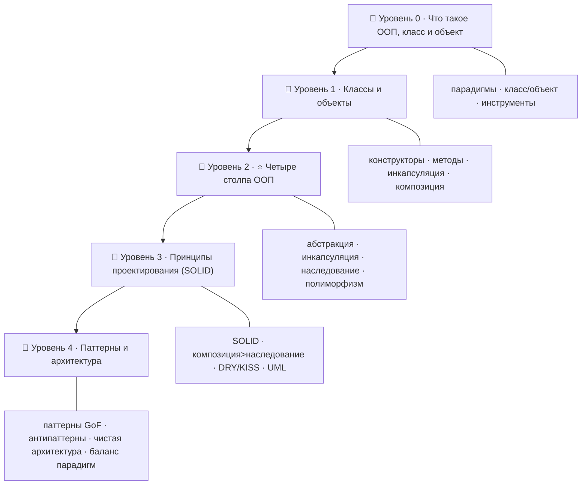

# 🏛️ Дорожная карта: ООП и проектирование — от новичка до Senior

> 🎯 **Цель трека:** научиться **проектировать** программы, а не просто писать код — через
> объектно-ориентированное мышление, классы, четыре столпа ООП, принципы SOLID и паттерны
> проектирования. Ядро трека — **четыре столпа ООП** (абстракция, инкапсуляция, наследование,
> полиморфизм).

Это трек про **классы и ООП** и про то, что отличает Senior: умение строить понятную,
гибкую, поддерживаемую архитектуру. Языки приходят и уходят — принципы проектирования
остаются.

🧩 **Связь с курсом.** В языковых треках ты учился управлять **памятью** и синтаксисом. Здесь —
учишься **структурировать** код: как разложить задачу на объекты, как спрятать сложность, как
сделать так, чтобы изменения не ломали половину системы. Это мост от «пишу работающий код» к
«проектирую систему».

---

## 🗺️ Карта трека

| Уровень | Папка | О чём |
|--------|-------|-------|
| 🥚 0 · Знакомство | `00-setup` | Что такое ООП, парадигмы, класс и объект, где практиковать. |
| 🐣 1 · Классы и объекты | `01-classes` | Конструкторы, методы, инкапсуляция, композиция, статические члены. |
| 🐥 2 · ⭐ Четыре столпа | `02-pillars` | **Абстракция, инкапсуляция, наследование, полиморфизм** + интерфейсы. |
| 🦅 3 · Проектирование | `03-design` | SOLID, композиция вместо наследования, DRY/KISS/YAGNI, связность/зацепление, UML. |
| 🚀 4 · Паттерны и архитектура | `04-patterns` | Паттерны GoF, антипаттерны, чистая архитектура, когда ООП не нужно. |

---

## 🎯 Чему ты научишься

- Мыслить **объектами**: раскладывать задачу на сущности с состоянием и поведением.
- Уверенно владеть **четырьмя столпами ООП** — ядром трека.
- Применять **SOLID** и принципы хорошего дизайна (DRY, KISS, YAGNI, low coupling).
- Выбирать **композицию вместо наследования** там, где это уместно.
- Знать и применять **паттерны проектирования** (порождающие, структурные, поведенческие).
- Распознавать **антипаттерны и запахи кода**, рефакторить.
- Понимать **чистую архитектуру** и когда ООП — не лучший выбор.

---

## 🧩 Как устроен каждый модуль

1. **📖 Теория** — простым языком, со схемами.
2. **🖼️ Схема** — отношения классов и объектов.
3. **🛠️ Практика** — код (примеры на читаемом псевдо/Python-стиле + отсылки к C++/Java).
4. **⚠️ Ловушки** — частые ошибки проектирования.
5. **✅ Задачи** и **❓ Проверка себя**.
6. **Чек-лист** «готов идти дальше».

➡️ Начать: [00 · Что такое ООП](00-setup/00-what-is-oop.md)

> 💡 Примеры даны на читаемом языке (в основном Python-стиль) — но принципы одинаковы в Java,
> C#, C++, Kotlin. Где есть нюанс языка — отмечено.
