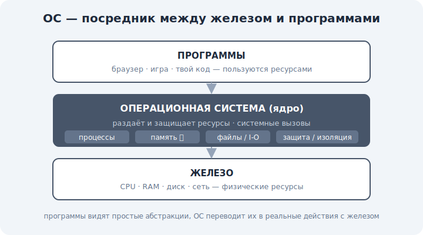

# 00 · Что такое операционная система 🖼️

> 🎯 **Цель блока:** понять, зачем нужна ОС, что она делает «между» железом и программами, и
> почему без неё каждая программа была бы кошмаром.

---

## 📖 ОС — управляющий между железом и программами

**Операционная система** (Windows, Linux, macOS) — это программа-посредник, которая управляет
железом и **раздаёт** его ресурсы другим программам. Без неё каждая программа должна была бы
сама знать про твой конкретный процессор, диск, сетевую карту.

🖼️


```
   ┌─────────────────────────────────────────┐
   │  ПРОГРАММЫ (браузер, игра, твой код)      │  ← пользуются ресурсами
   ├─────────────────────────────────────────┤
   │  ОПЕРАЦИОННАЯ СИСТЕМА (ядро)              │  ← раздаёт и защищает
   │  процессы · память · файлы · устройства  │
   ├─────────────────────────────────────────┤
   │  ЖЕЛЕЗО (CPU, RAM, диск, сеть)           │  ← физические ресурсы
   └─────────────────────────────────────────┘
```

💡 ОС даёт программам **простые абстракции** вместо сложного железа: «файл» вместо секторов
диска, «процесс» вместо ручного дележа CPU, «память» вместо физических микросхем. Программы
работают с абстракциями, а ОС переводит их в реальные действия с железом.

---

## ⭐ Четыре главные задачи ОС

```
   1. Управление ПРОЦЕССАМИ  — кто и когда выполняется на CPU (уровень 1)
   2. Управление ПАМЯТЬЮ      — кому сколько RAM, изоляция (уровень 2 ⭐ — ядро трека)
   3. Управление ФАЙЛАМИ/I-O  — диск, устройства, ввод-вывод (уровень 3)
   4. ЗАЩИТА и изоляция        — программы не мешают друг другу и системе
```

💡 Всё это происходит **незаметно**, пока ты пользуешься компьютером. Этот трек делает
невидимое видимым.

---

## 📖 Зачем нужна изоляция

Представь, что любая программа могла бы напрямую трогать любую память и любое устройство:

```
   - один баг в программе → крах всей системы;
   - вирус → полный контроль над машиной;
   - две программы пишут в одну память → хаос.
```

💡 ОС **изолирует** программы: каждая думает, что она одна на машине (своя память, свой «весь»
процессор). Это и безопасность, и удобство. Как именно достигается иллюзия «своей памяти» —
ядро уровня 2 (виртуальная память).

---

## 📖 Из чего состоит ОС

```
   ЯДРО (kernel)       — сердце ОС: процессы, память, драйверы, syscalls (модуль 01)
   системные службы    — фоновые сервисы (сеть, звук, логи)
   оболочка/интерфейс  — терминал, графический рабочий стол
   утилиты              — ls, ps, top и т.д.
```

💡 Главное — **ядро**. Оно работает с максимальными правами и управляет всем. Остальное —
надстройки. В этом треке мы в основном про ядро и его задачи.

---

## ⚠️ Частые заблуждения

- ❌ «ОС = рабочий стол/окна». Графика — лишь верхушка; суть ОС — управление ресурсами (ядро).
- ❌ «Программа работает напрямую с железом». Почти всегда — через ОС (системные вызовы).
- ❌ «ОС нужна только для удобства». Без изоляции один баг ронял бы всю систему.

---

## 🛠️ Практика

1. Открой диспетчер задач (Windows) / `top` или `htop` (Linux/macOS) — увидишь десятки
   процессов, которыми управляет ОС прямо сейчас.
2. Назови, какая ОС у тебя и какое у неё ядро (Windows NT / Linux / Darwin).
3. Перечисли 4 ресурса, которые ОС раздаёт твоим программам.

---

## ✅ Задачи

1. **Объясни** своими словами, зачем нужна ОС (что было бы без неё).
2. **Перечисли** 4 главные задачи ОС.
3. **Объясни**, зачем нужна изоляция программ.
4. **Назови** части ОС и роль ядра.

---

## ❓ Проверь себя

1. Что делает ОС между железом и программами?
2. Какие 4 ресурса она управляет?
3. Зачем нужна изоляция?
4. Что такое ядро и почему оно главное?

---

## ✅ Чек-лист

- [ ] Понимаю роль ОС как посредника и распределителя ресурсов
- [ ] Знаю 4 главные задачи ОС
- [ ] Понимаю смысл изоляции программ
- [ ] Понимаю, что ядро — сердце ОС

➡️ Следующий: [01 · Ядро, режимы и системные вызовы](01-kernel-syscalls.md)
