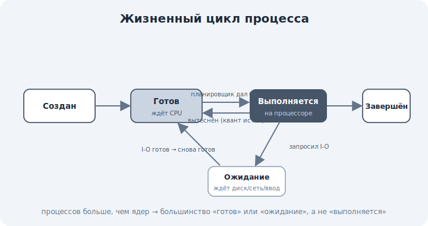

# 04 · Жизненный цикл процесса: fork и exec 🖼️⭐

> 🎯 **Цель блока:** понять состояния процесса и как процессы рождаются — через fork/exec — и
> почему процессы образуют дерево.

---

## ⭐ Состояния процесса

Процесс не всегда выполняется — он переходит между состояниями:

🖼️


```
   СОЗДАН ──► ГОТОВ ⇄ ВЫПОЛНЯЕТСЯ ──► ЗАВЕРШЁН
              ▲           │
              └─ ОЖИДАНИЕ ◄┘ (ждёт диск/сеть/ввод)
```

```
   Готов (ready)       — может выполняться, ждёт своей очереди на CPU
   Выполняется (running) — прямо сейчас на процессоре
   Ожидание (blocked)   — ждёт события (чтение с диска, сеть, ввод)
   Завершён (terminated) — закончил работу
```

💡 Ключевое: процессов **больше**, чем ядер CPU, поэтому большинство в состоянии «готов» или
«ожидание», а планировщик (модуль 06) по очереди даёт им процессор. Когда процесс ждёт диск —
он не занимает CPU, и ОС отдаёт его другому. Так достигается параллелизм даже на одном ядре.

---

## ⭐ Рождение процесса: fork

В Unix-системах новый процесс создаётся системным вызовом **fork** — он **копирует** текущий
процесс:

```
   процесс-РОДИТЕЛЬ
        │ fork()
        ├──────────► процесс-РОДИТЕЛЬ (продолжает)
        └──────────► процесс-ПОТОМОК (точная копия: та же память, файлы)
```

💡 После `fork` есть два почти одинаковых процесса. Различить их можно по возвращаемому
значению: родителю `fork` возвращает PID потомка, потомку — 0. Дальше они могут пойти разными
путями.

⚙️ Чтобы не копировать всю память сразу, ОС использует **copy-on-write**: память общая, пока
кто-то не начнёт писать — тогда копируется только нужная страница. (Связь с уровнем 2.)

---

## ⭐ Запуск другой программы: exec

`fork` создаёт копию, но часто нужно запустить **другую** программу. Для этого — **exec**: он
**заменяет** содержимое процесса новой программой.

```
   shell: хочешь запустить `ls`
        │ fork()      → создал копию себя (потомок)
        └─ потомок: exec("ls") → заменил себя программой ls → теперь это процесс ls
```

💡 Классическая связка **fork + exec**: «раздвоиться, потом одному из близнецов стать другой
программой». Так оболочка (shell) запускает любую команду. На Windows аналог — `CreateProcess`
(один вызов вместо двух).

---

## 📖 Дерево процессов и зомби

```
   процессы образуют ДЕРЕВО: у каждого есть родитель (кроме самого первого — init/systemd)
```

- **Сирота** — родитель умер раньше; процесс «усыновляет» init.
- **Зомби** — процесс завершился, но родитель ещё не забрал его код возврата (`wait`). Зомби
  не работает, но занимает запись в таблице процессов, пока родитель его не «похоронит».

💡 Поэтому хорошие родители делают `wait()` за детьми. Дерево процессов видно командой
`pstree` или в Process Explorer.

---

## ⚠️ Ловушки

- ❌ Думать, что после `fork` один процесс. Их два — родитель и копия.
- ❌ Путать `fork` (копия) и `exec` (замена программы). Часто идут вместе.
- ❌ Игнорировать `wait` — накапливаются зомби-процессы.
- ❌ Считать, что «выполняется» — нормальное состояние большинства. Чаще — «готов»/«ожидание».

---

## 🛠️ Практика

1. `pstree` (Linux) — увидь дерево процессов от init/systemd до твоего терминала.
2. В `top`/`htop` посмотри колонку состояния (R/S/D/Z) — найди процессы в разных состояниях.
3. Объясни на примере shell, как `fork`+`exec` запускают команду.

---

## ✅ Задачи

1. **Перечисли** состояния процесса и переходы между ними.
2. **Объясни**, что делает `fork` и чем потомок отличается от родителя.
3. **Объясни** связку `fork` + `exec`.
4. **Объясни**, что такое зомби и сирота.

---

## ❓ Проверь себя

1. Почему большинство процессов не «выполняется», а «готов»/«ожидание»?
2. Что создаёт `fork`?
3. Что делает `exec` и зачем он после `fork`?
4. Что такое зомби-процесс?

---

## ✅ Чек-лист

- [ ] Знаю состояния процесса и переходы
- [ ] Понимаю `fork` (копия) и copy-on-write
- [ ] Понимаю `exec` и связку fork+exec
- [ ] Понимаю дерево процессов, зомби/сироты

➡️ Следующий: [05 · Потоки и процессы](05-threads.md)
