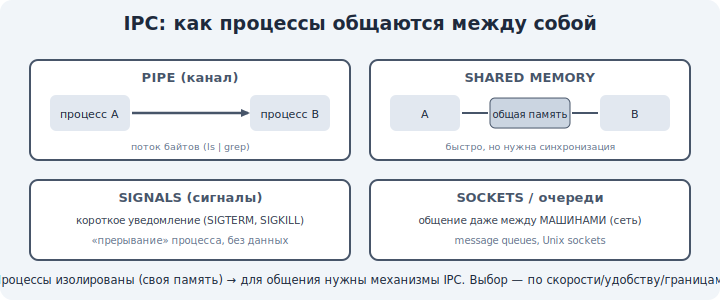

# 07 · Межпроцессное взаимодействие (IPC) 🖼️

> 🎯 **Цель блока:** понять, как изолированные процессы общаются друг с другом — каналы, сигналы,
> разделяемая память, очереди — раз уж они не делят память по умолчанию.

---

## 📖 Проблема: процессы изолированы, но им надо общаться

Процессы изолированы (модуль 03): один не видит память другого. Но часто им нужно
**сотрудничать** (например, `ls | grep` — один шлёт вывод другому). Для этого ОС даёт
механизмы **IPC** (Inter-Process Communication).

🖼️
```
   процесс A  ──[ механизм IPC от ОС ]──►  процесс B
              (канал / сигнал / общая память / сокет)
```



💡 Раз процессы не делят память, **посредником становится ядро**: оно предоставляет «канал»,
через который данные безопасно идут от одного к другому.

---

## ⭐ Основные механизмы IPC

```
   КАНАЛЫ (pipes)        — однонаправленный поток байт. Это `|` в shell: ls | grep
   СИГНАЛЫ (signals)     — короткое уведомление-прерывание (Ctrl+C = сигнал SIGINT)
   РАЗДЕЛЯЕМАЯ ПАМЯТЬ    — общий кусок памяти для нескольких процессов (быстро!)
   ОЧЕРЕДИ СООБЩЕНИЙ     — структурированные сообщения через ядро
   СОКЕТЫ                — даже между машинами по сети (трек Сети!)
```

💡 Выбор зависит от задачи: для потока данных — каналы, для уведомлений — сигналы, для большого
объёма быстро — разделяемая память, для сети — сокеты. Сокеты универсальны (работают и локально,
и между компьютерами).

---

## ⭐ Каналы (pipes) — основа shell

```
   ls -l | grep ".txt" | wc -l
   └ ls пишет в канал ─┘   └ grep читает из канала, пишет в следующий ─┘
```

💡 `|` (пайп) — это канал между процессами: вывод левой команды становится вводом правой. Так
маленькие программы соединяются в конвейеры — философия Unix «делай одно дело хорошо». Под
капотом — системный вызов `pipe()` и перенаправление stdout/stdin.

---

## ⭐ Сигналы — уведомления процессу

```
   Ctrl+C       → SIGINT  (прервать)
   Ctrl+Z       → SIGTSTP (приостановить)
   kill <PID>   → SIGTERM (вежливо завершить)
   kill -9 <PID>→ SIGKILL (убить немедленно, нельзя проигнорировать)
```

💡 Сигнал — это «стук в дверь» процессу. Процесс может на большинство сигналов **отреагировать**
(сохраниться и закрыться по SIGTERM), но SIGKILL обрывает безусловно. Поэтому `kill -9` — крайняя
мера (процесс не успеет прибраться).

---

## 📖 Разделяемая память — самый быстрый IPC

```
   процесс A ─┐
              ├─► общий участок памяти (его создаёт ОС, но дальше — напрямую)
   процесс B ─┘
```

💡 Разделяемая память — самый **быстрый** способ (нет копирования через ядро на каждый обмен),
но требует **синхронизации** (модуль 13–14): раз память общая, возможны гонки, как у потоков.
Это мостик к уровню 3.

---

## ⚠️ Ловушки

- ❌ Думать, что процессы могут просто читать память друг друга. Нужен механизм IPC.
- ❌ Использовать `kill -9` по привычке — процесс не приберётся (потеря данных). Сначала SIGTERM.
- ❌ Делить память между процессами без синхронизации — те же гонки, что у потоков.
- ❌ Путать сигнал (уведомление) и канал (поток данных).

---

## 🛠️ Практика

1. Построй конвейер: `ps aux | grep <что-то> | wc -l` — это процессы, общающиеся через каналы.
2. Запусти долгую команду и пошли ей сигналы: Ctrl+C, затем попробуй `kill <PID>` на другой.
3. Объясни разницу `kill` (SIGTERM) и `kill -9` (SIGKILL) на практике.

---

## ✅ Задачи

1. **Объясни**, зачем нужен IPC, если процессы изолированы.
2. **Перечисли** механизмы IPC и для чего каждый.
3. **Объясни**, как работает `|` в shell (каналы).
4. **Сравни** SIGTERM и SIGKILL.

---

## ❓ Проверь себя

1. Почему процессам нужен посредник для общения?
2. Какой IPC использует `|` в shell?
3. Что такое сигнал и чем SIGKILL особенный?
4. Почему разделяемая память быстрая, но требует синхронизации?

---

## ✅ Чек-лист

- [ ] Понимаю, зачем нужен IPC при изоляции процессов
- [ ] Знаю основные механизмы (каналы, сигналы, общая память, сокеты)
- [ ] Понимаю каналы как основу shell-конвейеров
- [ ] Понимаю сигналы и разницу SIGTERM/SIGKILL

➡️ Дальше: [Задачи уровня 1](TASKS.md) · затем [Пет-проект уровня 1](PROJECT.md)
