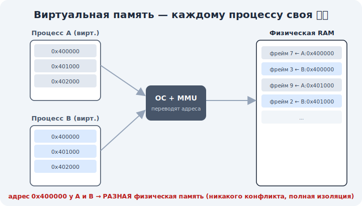

# 08 · Зачем виртуальная память 🖼️⭐⭐

> 🎯 **Цель блока (ЯДРО трека):** понять, что такое виртуальная память и зачем она — главное
> изобретение ОС, дающее каждому процессу иллюзию собственной, изолированной, большой памяти.

---

## 📖 Главная связь с темой курса

Весь курс — про память. Вот где этот трек её завершает:

```
   C         → стек, куча, указатели (память вручную)
   C++       → RAII, умные указатели (память с инструментами)
   Python    → ссылки, сборщик мусора (память автоматически)
   Rust      → владение, borrow checker (память без GC, доказано)
   Сети      → байты путешествуют пакетами
   ОС        → ВИРТУАЛЬНАЯ ПАМЯТЬ ⭐⭐ — кто СОЗДАЁТ и раздаёт эту память
```

🖼️


💡 В языках ты управлял памятью, но откуда берётся адрес `0x7fff...` и почему он не конфликтует
с другой программой? Потому что это **виртуальный** адрес, а ОС незаметно переводит его в
реальную физическую RAM. Виртуальная память — это и есть «магия под указателями».

---

## ⭐⭐ Что такое виртуальная память

Каждый процесс работает с **виртуальными** адресами. ОС (с помощью железа — MMU) переводит их в
**физические** адреса в RAM.

```
   виртуальный адрес процесса   →  [ ОС + MMU переводят ]  →  физический адрес в RAM

   процесс A: 0x400000 ─┐
                        ├─► разные ячейки реальной RAM (никакого конфликта)
   процесс B: 0x400000 ─┘
```

💡 Процесс **никогда** не видит реальную физическую память. Он видит свою личную «карту»
виртуальных адресов, а ОС держит таблицу перевода (модуль 09). Это уровень абстракции, как
«файл» вместо секторов диска.

---

## ⭐⭐ Зачем это нужно — три причины

```
   1. ИЗОЛЯЦИЯ — у каждого процесса своя карта; он физически не может залезть в чужую память
                 → безопасность и стабильность (баг не рушит соседей)

   2. УДОБСТВО — каждый процесс думает, что память его одного, и она «непрерывная»
                 → программисту не надо знать, где реально лежат данные

   3. БОЛЬШЕ, ЧЕМ ЕСТЬ RAM — можно дать процессам больше памяти, чем физически есть,
                 выгружая редкие страницы на диск (swap, модуль 10)
```

💡 Без виртуальной памяти программы напрямую делили бы физическую RAM: адреса конфликтовали бы,
один баг ронял бы всё, и нельзя было бы запустить больше, чем влезает в RAM. ВМ решает всё это
разом.

---

## ⭐ Откуда segfault

Теперь понятно, что такое **segmentation fault** из C-трека:

```
   программа обращается к виртуальному адресу, который ЕЙ НЕ ПРИНАДЛЕЖИТ
        ▼
   ОС/MMU: «этого адреса нет в твоей карте» → SIGSEGV → процесс падает
```

💡 ⭐ Segfault — это ОС, защищающая память: ты вышел за пределы своей виртуальной карты. Помнишь
[ошибки памяти в C](../../C/02-memory/12-memory-errors-tools.md)? Вот **механизм**, который их
ловит: виртуальная память + защита (модуль 11). Падение одной программы не трогает другие —
ровно ради этого ВМ и придумали.

---

## ⚠️ Ловушки

- ❌ Думать, что адреса в программе — это реальные адреса в RAM. Они **виртуальные**.
- ❌ Считать, что виртуальная память = swap-файл. Swap — лишь одна из её возможностей (модуль 10).
- ❌ Думать, что процесс может прочитать чужую память. ВМ это **физически** предотвращает.

---

## 🛠️ Практика

1. На Linux: `cat /proc/<PID>/maps` — это и есть виртуальная карта процесса (диапазоны
   виртуальных адресов). Заметь, у разных процессов похожие адреса — но память разная.
2. Напиши крошечную программу, которая разыменовывает `NULL` или дикий указатель — увидишь
   segfault. Объясни через ВМ, почему ОС её остановила.
3. Объясни, почему два процесса с адресом `0x400000` не мешают друг другу.

---

## ✅ Задачи

1. **Объясни** разницу виртуального и физического адреса.
2. **Назови** три причины существования виртуальной памяти.
3. **Объясни** через ВМ, что такое segfault.
4. **Покажи** на `/proc/<PID>/maps`, что у процесса своя карта.

---

## ❓ Проверь себя

1. Что переводит виртуальный адрес в физический?
2. Почему адрес `0x400000` у двух процессов — это разная RAM?
3. Какие 3 задачи решает виртуальная память?
4. Что такое segfault на уровне ОС?

---

## ✅ Чек-лист

- [ ] Понимаю виртуальный vs физический адрес
- [ ] Понимаю три причины ВМ (изоляция, удобство, больше RAM)
- [ ] Понимаю segfault как защиту ВМ
- [ ] Связал ВМ с памятью из языковых треков

➡️ Следующий (ядро): [09 · Страницы и таблицы страниц](09-paging.md)
