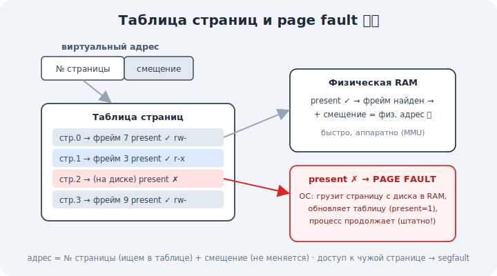

# 09 · Страницы и таблицы страниц 🖼️⭐⭐

> 🎯 **Цель блока (ЯДРО трека):** понять механику виртуальной памяти — деление на страницы,
> таблицы страниц и роль MMU, которые переводят виртуальные адреса в физические.

---

## ⭐⭐ Память делится на страницы

Чтобы управлять памятью, ОС режет её на блоки одинакового размера — **страницы** (обычно 4 КБ):

```
   виртуальная память процесса   физическая память (RAM)
   [ страница 0 ]──────────────► [ фрейм 7 ]
   [ страница 1 ]──────────────► [ фрейм 3 ]
   [ страница 2 ]──────────────► [ фрейм 9 ]
   [ страница 3 ]──► (на диске, swap)
```

💡 Виртуальная страница и физический **фрейм** (frame) — одного размера. ОС ведёт соответствие
«какая виртуальная страница → в каком физическом фрейме». Страницы одного процесса могут лежать
в RAM **вразброс** или вообще на диске — процесс этого не замечает.

---

## ⭐⭐ Таблица страниц (page table)

Соответствие «виртуальная страница → физический фрейм» хранится в **таблице страниц** — у
каждого процесса своя.

🖼️


```
   виртуальный адрес = [ номер страницы | смещение внутри страницы ]
                              │
                              ▼ ищем в таблице страниц
                       [ физический фрейм | те же права/флаги ]
                              │
                              ▼
   физический адрес = [ номер фрейма | то же смещение ]
```

💡 Адрес делится на две части: **номер страницы** (по нему ищем фрейм в таблице) и **смещение**
(позиция внутри страницы — не меняется). Таблица даёт физический фрейм → складываем со
смещением → готов физический адрес. Свой набор таблиц = своя изоляция (модуль 08).

---

## ⭐ MMU — железо, которое переводит

Перевод адреса происходит на **каждое** обращение к памяти — это должно быть очень быстро.
Поэтому им занимается специальный блок процессора — **MMU** (Memory Management Unit).

```
   CPU хочет прочитать вирт. адрес
        ▼
   MMU: смотрит таблицу страниц → получает физический адрес → читает RAM
        (всё аппаратно, за наносекунды)
```

💡 ОС **настраивает** таблицы страниц, а MMU **использует** их на лету. При контекстном
переключении (модуль 06) ОС переключает MMU на таблицы нового процесса — и тот же виртуальный
адрес начинает указывать на память другого процесса.

---

## 📖 Флаги страниц

В таблице у каждой страницы — не только фрейм, но и **флаги**:

```
   present   — страница сейчас в RAM? (если нет → page fault, модуль 10)
   R/W       — можно ли писать (или только читать)
   user/kernel — доступна ли из user space
   executable — можно ли исполнять код отсюда
```

💡 Эти флаги — основа **защиты памяти** (модуль 11): попытка записать в read-only страницу или
исполнить данные → ОС вмешивается. Код программы помечают «только чтение + исполняемый», а
данные — «чтение/запись, не исполняемый» (защита от атак).

---

## ⚠️ Ловушки

- ❌ Думать, что вся память процесса лежит в RAM непрерывно. Страницы разбросаны по фреймам и
  диску.
- ❌ Считать, что перевод адреса делает ОС на каждое обращение. Это **MMU** (железо); ОС лишь
  настраивает таблицы.
- ❌ Игнорировать флаги страниц — на них держится защита памяти.

---

## 🛠️ Практика

1. Узнай размер страницы: `getconf PAGE_SIZE` (Linux) — обычно 4096 байт.
2. Посмотри `/proc/<PID>/maps` — у каждой области есть права (r/w/x): это флаги страниц в
   действии (код `r-x`, данные `rw-`).
3. Объясни на адресе, как он делится на номер страницы и смещение (для 4 КБ — младшие 12 бит =
   смещение).

---

## ✅ Задачи

1. **Объясни**, зачем память делят на страницы.
2. **Опиши**, как таблица страниц переводит виртуальный адрес в физический.
3. **Объясни** роль MMU и почему перевод аппаратный.
4. **Перечисли** флаги страниц и зачем они.

---

## ❓ Проверь себя

1. Что такое страница и фрейм?
2. Как из виртуального адреса получается физический?
3. Что делает MMU, а что — ОС?
4. Какие флаги есть у страницы и зачем?

---

## ✅ Чек-лист

- [ ] Понимаю деление памяти на страницы/фреймы
- [ ] Понимаю таблицу страниц и перевод адреса
- [ ] Понимаю роль MMU (аппаратный перевод)
- [ ] Понимаю флаги страниц как основу защиты

➡️ Следующий (ядро): [10 · Page fault и подкачка (swap)](10-page-fault-swap.md)
