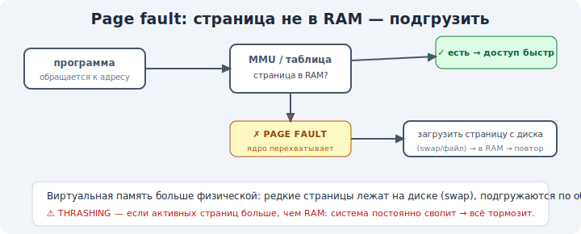

# 10 · Page fault и подкачка (swap) 🖼️⭐⭐

> 🎯 **Цель блока (ЯДРО трека):** понять, что происходит, когда нужной страницы нет в RAM —
> page fault, демандная подгрузка и swap — и почему это даёт «больше памяти, чем есть».

---

## ⭐⭐ Page fault — «страницы нет в RAM»

Помнишь флаг `present` (модуль 09)? Если процесс обращается к странице, которой **нет** в
физической памяти, MMU поднимает **page fault** — прерывание, и в дело вступает ОС:

🖼️
```
   процесс читает вирт. адрес
        ▼ MMU: present? НЕТ
   PAGE FAULT → управление переходит ядру
        ▼
   ОС: находит страницу (на диске / нужно создать) → грузит её в свободный фрейм RAM
        → обновляет таблицу страниц (теперь present=1)
        ▼
   процесс продолжает, как ни в чём не бывало (он даже «не заметил»)
```



💡 Page fault — это **не ошибка**, а штатный механизм! Большинство page fault'ов нормальны: так
ОС подгружает память «по требованию». А вот обращение к **чужому/несуществующему** адресу — это
уже фатальный fault → segfault (модуль 08).

---

## ⭐ Демандная подгрузка (demand paging)

Программа не грузится в RAM целиком при запуске. ОС загружает страницы **лениво**, по мере
обращения:

```
   запуск программы: почти ничего не в RAM
   обращение к коду строки 1 → page fault → грузим эту страницу
   обращение к другой функции → page fault → грузим её страницу
   → в RAM только то, что реально используется
```

💡 Это экономит память и ускоряет запуск: не нужно грузить мегабайты, которые, может, и не
понадобятся. Та же идея «лениво, по требованию», что прогрессивное раскрытие у Skills в треке
Claude Code — грузим только нужное.

---

## ⭐⭐ Swap — память больше, чем RAM

Что если RAM закончилась, а нужны новые страницы? ОС **выгружает** редко используемые страницы
на диск (в **swap**) и освобождает фреймы:

```
   RAM полная, нужен фрейм
        ▼
   ОС: выбирает «давно не нужную» страницу (алгоритм вытеснения, напр. LRU)
        → пишет её на диск (swap) → освобождает фрейм → даёт новой странице
        ▼
   позже понадобилась выгруженная? → page fault → грузим обратно с диска
```

💡 Так процессам можно дать **больше памяти, чем физической RAM** — иллюзия большого объёма
(причина №3 из модуля 08). Цена — скорость: диск в тысячи раз медленнее RAM.

---

## ⚠️ Thrashing — когда swap убивает скорость

```
   памяти сильно не хватает → ОС постоянно выгружает и подгружает страницы
        ▼
   система занята не работой, а «таской» страниц туда-сюда → всё ВИСНЕТ
```

💡 Это **thrashing** (пробуксовка): признак — диск «молотит», всё тормозит, CPU простаивает. Знак,
что нужно больше RAM или меньше нагрузки. Поэтому «не хватает памяти» = тормоза, а не просто
ошибка: ОС героически жонглирует страницами через медленный диск.

---

## ⚠️ Ловушки

- ❌ Думать, что page fault — это всегда ошибка. Большинство — штатная подгрузка.
- ❌ Считать, что программа грузится в RAM целиком при старте. Грузится лениво, по требованию.
- ❌ Путать «не хватает RAM → тормоза от swap/thrashing» с «программа сломалась».
- ❌ Думать, что swap бесплатен. Диск в тысячи раз медленнее RAM — отсюда тормоза.

---

## 🛠️ Практика

1. `free -h` — посмотри строку Swap: сколько есть и сколько используется.
2. На Linux: `/proc/<PID>/status` — поля `VmRSS` (сколько реально в RAM) vs `VmSize` (весь
   виртуальный размер). Заметь: виртуальный размер больше реального — это демандная подгрузка.
3. `vmstat 1` — колонки `si`/`so` (swap in/out): под нехваткой памяти увидишь активность.

---

## ✅ Задачи

1. **Объясни**, что такое page fault и почему он не всегда ошибка.
2. **Опиши** демандную подгрузку и зачем она.
3. **Объясни**, как swap даёт «памяти больше, чем RAM», и какова цена.
4. **Объясни** thrashing и его признаки.

---

## ❓ Проверь себя

1. Что делает ОС при page fault?
2. Чем штатный page fault отличается от segfault?
3. Как работает swap и почему он медленный?
4. Что такое thrashing?

---

## ✅ Чек-лист

- [ ] Понимаю page fault как штатный механизм
- [ ] Понимаю демандную подгрузку (лениво, по требованию)
- [ ] Понимаю swap и компромисс «объём vs скорость»
- [ ] Понимаю thrashing

➡️ Следующий: [11 · Защита памяти и адресное пространство](11-protection.md)
