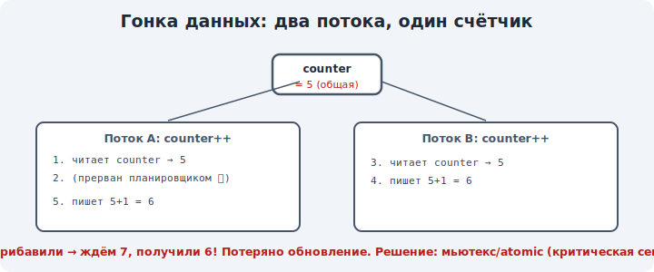

# 13 · Гонки данных и критические секции 🖼️⭐

> 🎯 **Цель блока:** понять, почему совместный доступ к данным ломается (гонки), что такое
> критическая секция и почему нужна синхронизация.

---

## 📖 Откуда берутся гонки

Из модуля 05: потоки делят память. Из модуля 07: процессы могут делить память (shared memory).
Когда **двое** одновременно меняют одни данные — результат непредсказуем. Это **гонка данных**
(race condition).

🖼️
```
   общая переменная счёт = 5

   поток A: читает 5 ─┐                  поток B: читает 5 ─┐
            +1 = 6    │                           +1 = 6    │
            пишет 6 ──┘                           пишет 6 ──┘
   итог: 6  (а должно быть 7! одно прибавление потеряно)
```



💡 Проблема в том, что «прочитать → изменить → записать» **не атомарно**: между шагами может
вклиниться другой поток (планировщик переключил, модуль 06). Результат зависит от случайного
порядка — отсюда «гонка». Баг **плавающий**: иногда работает, иногда нет.

---

## ⭐ Критическая секция

**Критическая секция** — участок кода, который работает с общими данными и должен выполняться
**только одним** потоком за раз.

```
   ┌─ критическая секция ──────────┐
   │  прочитать счёт                │   ← только ОДИН поток здесь одновременно
   │  изменить                      │
   │  записать                      │
   └────────────────────────────────┘
```

💡 Решение гонок: обеспечить **взаимное исключение** (mutual exclusion) — пока один в
критической секции, другие ждут. Инструменты для этого — мьютексы и семафоры (модуль 14).

---

## ⭐ Атомарность и почему «++» не атомарен

```
   счёт++  выглядит как одно действие, но на уровне процессора это ТРИ:
      1. загрузить счёт из памяти в регистр
      2. прибавить 1
      3. записать обратно в память
   между ними планировщик может переключить поток → гонка
```

💡 **Атомарная операция** — неделимая, её нельзя прервать на середине. Обычные операции
(`++`, присваивание сложных типов) атомарными **не являются**. Поэтому нужна синхронизация — или
специальные атомарные инструкции/типы (вспомни `atomic` из
[C](../../C/04-senior/21-concurrency.md)/[C++](../../Cpp/04-senior/21-concurrency.md)/[Rust](../../Rust/04-senior/20-concurrency.md)).

---

## 📖 Условия возникновения гонки

```
   1. есть ОБЩИЕ данные (память, файл, ресурс)
   2. есть ОДНОВРЕМЕННЫЙ доступ (несколько потоков/процессов)
   3. хотя бы один ПИШЕТ (только чтение гонок не создаёт)
   4. нет синхронизации
```

💡 Уберёшь любое условие — гонки не будет. Часто проще всего убрать «общие изменяемые данные»
(не делить, или делать неизменяемым) — этот подход проповедуют функциональный стиль и Rust
(владение + borrow checker не дают двум потокам писать одновременно на этапе компиляции!).

---

## ⚠️ Ловушки

- ❌ Думать, что `счёт++` атомарен. На уровне CPU это три операции.
- ❌ Считать гонку «редкой случайностью» — под нагрузкой она проявится, и баг плавающий.
- ❌ Думать, что только чтение создаёт гонки. Нужен хотя бы один писатель.
- ❌ «Уберу синхронизацию, и так работает» — работает до первого неудачного переключения.

---

## 🛠️ Практика

1. Мысленно (или в коде) смоделируй: два потока по 100000 раз делают `счёт++` без синхронизации —
   итог почти наверняка меньше 200000. Объясни почему.
2. Определи в этом примере критическую секцию.
3. Свяжи с языками курса: как `mutex`/`atomic` там решали именно эту проблему.

---

## ✅ Задачи

1. **Объясни** гонку данных на примере счётчика.
2. **Определи**, что такое критическая секция и взаимное исключение.
3. **Объясни**, почему `++` не атомарен.
4. **Перечисли** условия возникновения гонки и как их убрать.

---

## ❓ Проверь себя

1. Почему два потока могут «потерять» прибавление?
2. Что такое критическая секция?
3. Что значит «операция атомарна»?
4. Какие условия нужны для гонки и как её предотвратить?

---

## ✅ Чек-лист

- [ ] Понимаю причину гонок (неатомарность + общие данные)
- [ ] Понимаю критическую секцию и взаимное исключение
- [ ] Понимаю, что обычные операции не атомарны
- [ ] Знаю условия гонки и способы их убрать

➡️ Следующий: [14 · Мьютексы, семафоры, блокировки](14-mutex-semaphore.md)
