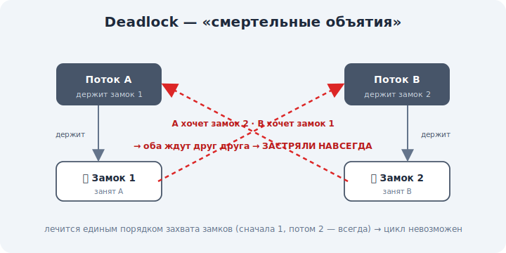

# 15 · Взаимоблокировки (deadlock) 🖼️⭐

> 🎯 **Цель блока:** понять, как синхронизация может «застрять» намертво — deadlock — его четыре
> условия и как его избегать.

---

## 📖 Deadlock — все ждут и никто не двигается

Синхронизация защищает от гонок, но создаёт новый риск: потоки могут **заблокировать друг
друга навсегда**. Это **deadlock** (взаимоблокировка).

🖼️


```
   поток A: захватил замок 1 🔒, хочет замок 2
   поток B: захватил замок 2 🔒, хочет замок 1
        ▼
   A ждёт B, B ждёт A → ОБА ЗАСТРЯЛИ НАВСЕГДА
```

💡 Классическая «смертельная объятия»: каждый держит то, что нужно другому, и ждёт того, что
держит другой. Никто не уступает — система (или часть её) виснет. Аналогия: две машины на узком
мосту едут навстречу и упёрлись.

---

## ⭐ Четыре условия deadlock (условия Коффмана)

Deadlock возможен, **только** если выполнены все четыре:

```
   1. ВЗАИМНОЕ ИСКЛЮЧЕНИЕ — ресурс держит один за раз (мьютекс)
   2. УДЕРЖАНИЕ И ОЖИДАНИЕ — держу один ресурс и жду другой, не отпуская
   3. НЕТ ВЫТЕСНЕНИЯ — нельзя отобрать ресурс силой, только владелец отпустит
   4. ЦИКЛИЧЕСКОЕ ОЖИДАНИЕ — A ждёт B, B ждёт A (цикл в графе ожиданий)
```

💡 Ключевая идея: убери **любое** из четырёх условий — deadlock невозможен. Это даёт стратегии
борьбы (ниже).

---

## ⭐ Как избегать deadlock

```
   🔢 ПОРЯДОК ЗАХВАТА — всегда брать замки в одном глобальном порядке
       (если оба берут замок 1, потом 2 — цикл невозможен) ← самый частый приём
   ⏱️ ТАЙМАУТ — не смог взять замок за N мс → отпусти всё и попробуй снова
   📦 ВСЁ СРАЗУ — захватывать все нужные замки разом, либо ничего (убирает «удержание+ожидание»)
   🚫 МЕНЬШЕ ЗАМКОВ — чем меньше общих ресурсов под замком, тем меньше риск
```

💡 На практике главное — **единый порядок захвата** замков. Большинство deadlock'ов — это два
куска кода, берущие два замка в **разном** порядке. Договорись о порядке — и цикл не возникнет.

---

## 📖 Голодание и livelock — родственные беды

```
   ГОЛОДАНИЕ (starvation) — поток никогда не получает ресурс (его всё время обходят)
   LIVELOCK — потоки не застряли, но бесконечно «вежливо уступают» друг другу и не работают
              (как двое в коридоре шагают в одну сторону, уступая, и не расходятся)
```

💡 Deadlock — «застряли молча», livelock — «суетятся, но без толку», голодание — «кому-то вечно
не достаётся». Все три — болезни синхронизации; справедливый дизайн (очереди, приоритеты) их
лечит.

---

## ⚠️ Ловушки

- ❌ Брать несколько замков в произвольном порядке в разных местах кода → классический deadlock.
- ❌ Держать замок и в этой же секции пытаться взять ещё один, не подумав о порядке.
- ❌ Считать, что deadlock «редкость» — под нагрузкой и параллелизмом он находит себя сам.
- ❌ Путать deadlock (застряли) и livelock (суетятся без прогресса).

---

## 🛠️ Практика

1. Нарисуй сценарий deadlock на двух замках и двух потоках (кто что держит и ждёт).
2. Покажи, как единый порядок захвата (сначала замок 1, потом 2 — всегда) ломает цикл.
3. Сопоставь сценарий с четырьмя условиями Коффмана: какое условие убирает каждый приём?

---

## ✅ Задачи

1. **Объясни** deadlock на примере двух замков.
2. **Перечисли** четыре условия Коффмана.
3. **Опиши** способы избегать deadlock (особенно порядок захвата).
4. **Разведи** deadlock, livelock и голодание.

---

## ❓ Проверь себя

1. Что такое deadlock и почему он «навсегда»?
2. Какие четыре условия нужны для deadlock?
3. Почему единый порядок захвата замков спасает?
4. Чем livelock отличается от deadlock?

---

## ✅ Чек-лист

- [ ] Понимаю deadlock как взаимную блокировку
- [ ] Знаю четыре условия Коффмана
- [ ] Знаю стратегии избегания (порядок захвата, таймаут)
- [ ] Различаю deadlock/livelock/голодание

➡️ Следующий: [16 · Файловые системы](16-filesystems.md)
