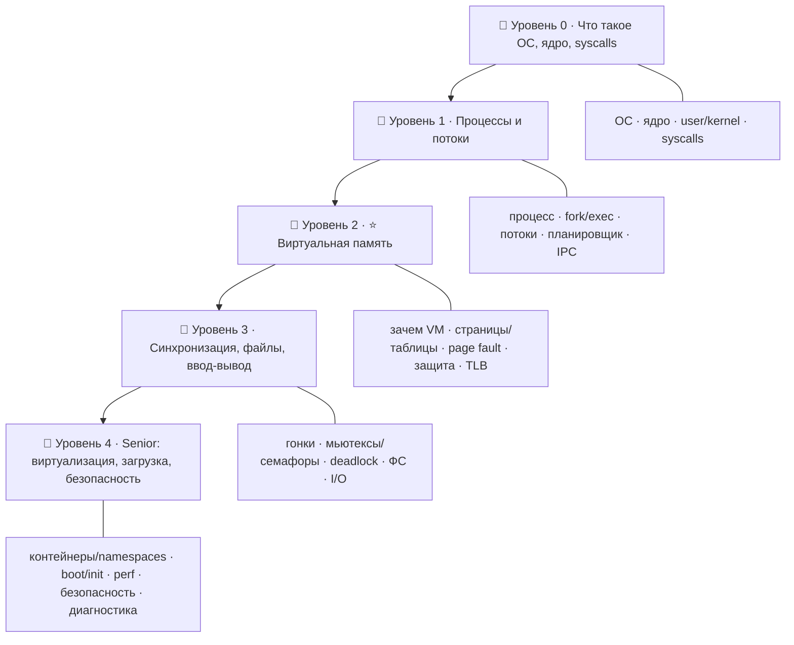

# 🖥️ Дорожная карта: Операционные системы — от новичка до Senior

> 🎯 **Цель трека:** понять, как работает **операционная система** — невидимый управляющий,
> который делит процессор, память и устройства между программами. Ядро трека —
> **виртуальная память**: как ОС создаёт каждому процессу иллюзию собственной памяти.

Это **девятый трек** курса. Он отвечает на вопрос «что происходит под программами»: кто даёт
твоему коду память, кто переключает процессы, кто защищает их друг от друга.

🧠 **Связь с темой курса.** В языках ты видел стек, кучу, указатели — но **откуда** берётся
эта память и почему `0x7fff...` у двух программ не конфликтуют? Ответ — **виртуальная память
ОС**. Этот трек показывает память «снизу», с точки зрения системы: страницы, таблицы страниц,
защита, подкачка. Это завершает картину: языки управляют памятью, а ОС эту память **создаёт и
раздаёт**.

---

## 🗺️ Карта трека

| Уровень | Папка | О чём |
|--------|-------|-------|
| 🥚 0 · Знакомство | `00-setup` | Что такое ОС, ядро, режимы user/kernel, системные вызовы, инструменты наблюдения. |
| 🐣 1 · Процессы | `01-processes` | Процесс и его адресное пространство, fork/exec, потоки vs процессы, планировщик, IPC. |
| 🐥 2 · ⭐ Виртуальная память | `02-memory` | **Зачем VM**, страницы и таблицы страниц, page fault и swap, защита памяти, TLB. |
| 🦅 3 · Синхронизация и ресурсы | `03-sync` | Гонки данных, мьютексы/семафоры, deadlock, файловые системы, ввод-вывод. |
| 🚀 4 · Senior | `04-advanced` | Виртуализация/контейнеры, загрузка системы, производительность, безопасность, диагностика. |

---

## 🎯 Чему ты научишься

- Понимать роль **ОС и ядра**: что такое user/kernel space и системные вызовы.
- Разбираться в **процессах и потоках**: fork/exec, состояния, планировщик.
- Глубоко понимать **виртуальную память** — ядро трека: страницы, защита, page fault, swap.
- Понимать **синхронизацию**: гонки данных, мьютексы, семафоры, deadlock.
- Знать, как устроены **файловые системы** и **ввод-вывод**.
- Понимать **контейнеры и виртуализацию** изнутри (namespaces, cgroups).
- **Диагностировать** систему: ps/top, strace, perf, /proc, dmesg.

---

## 🧩 Как устроен каждый модуль

1. **📖 Теория** — простым языком, со схемами.
2. **🖼️ Схема** — как это работает внутри ОС.
3. **🛠️ Практика** — реальные команды (ps, top, /proc, strace…).
4. **⚠️ Ловушки** — где обычно путаются.
5. **✅ Задачи** и **❓ Проверка себя**.
6. **Чек-лист** «готов идти дальше».

➡️ Начать: [00 · Что такое операционная система](00-setup/00-what-is-os.md)

> 💡 Большинство экспериментов — на Linux/WSL/macOS (там видно `/proc`, `strace`, `ps`). На
> Windows многое смотрится в Диспетчере задач и через PowerShell/Process Explorer.
