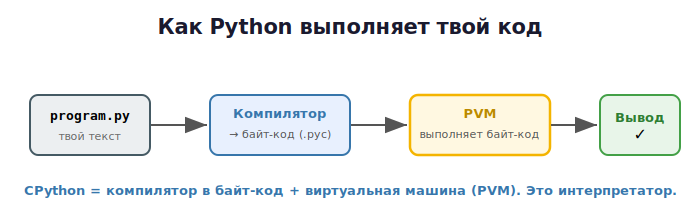

# 00 · Как работает Python и память 🖼️

> 🎯 **Цель блока:** понять, что Python делает с твоим кодом и как он хранит данные в
> памяти. Это фундамент, на котором держится весь курс.

---

## 📖 Python — это переводчик-интерпретатор

Когда ты пишешь программу на C, компилятор заранее переводит её в машинный код. Python
работает иначе — он **интерпретатор**: читает и выполняет код «на лету».

🖼️ Что происходит с твоим файлом `program.py`:



<details><summary>📝 та же схема текстом</summary>

```
  program.py
 (твой текст)
     │
     ▼
┌──────────────┐   1. КОМПИЛЯЦИЯ В БАЙТ-КОД
│  Python      │   Твой код → промежуточный байт-код (.pyc)
│  компилятор  │   Это НЕ машинный код, а инструкции для Python
└──────┬───────┘
       │
       ▼
┌──────────────┐   2. ВЫПОЛНЕНИЕ
│  Виртуальная │   Python Virtual Machine (PVM) читает байт-код
│  машина (PVM)│   инструкцию за инструкцией и выполняет
└──────────────┘
```

</details>

💡 Самая распространённая реализация Python называется **CPython** (написана на C).
Именно она у тебя установится. Есть и другие (PyPy, Jython), но мы про CPython.

> 💡 Можешь увидеть байт-код сам:
> ```python
> import dis
> dis.dis("x = 1 + 2")
> ```
> Python покажет внутренние инструкции, в которые превратился твой код.

---

## ⭐ Главное отличие памяти: всё — объект, имена — ярлыки

Вспомни (или представь) C: там переменная — это **именованная ячейка**, в которой лежит
значение. В Python всё устроено иначе.

> **В Python ВСЁ является объектом, а переменная — это лишь имя-ярлык, наклеенный на
> объект в памяти.**

🖼️ Сравни два мира:

```
   C:  int x = 5;                Python:  x = 5

   x ─► ┌─────┐                  x ──────►  ┌──────────────┐
        │  5  │  (5 лежит              ярлык │ объект int: 5 │  (объект живёт
        └─────┘   в самой x)                 └──────────────┘   в куче, x на него
                                                                 ссылается)
```

В Python число `5` — это **объект** в памяти. `x` — это просто **наклейка**, которая
указывает на этот объект. Сама по себе `x` не содержит `5`, она лишь «знает адрес».

💡 Это и есть ключ ко всему курсу. Когда ты напишешь `y = x`, ты не скопируешь `5` —
ты наклеишь **второй ярлык** на тот же объект. Мы разберём это подробно в Уровне 2.

---

## 🧠 Где живут данные: куча и автоматическая уборка

Все объекты Python живут в **куче** (heap) — большой области памяти. Тебе не нужно её
выделять или освобождать вручную, как в C. Python делает это сам:

- создаёшь объект → Python находит ему место в куче;
- на объект больше никто не ссылается → Python **сам удаляет** его (сборка мусора).

🖼️

```
   Ты пишешь код          Куча (heap) — Python управляет ею сам
  ┌──────────────┐       ┌────────────────────────────────────┐
  │ x = [1,2,3]  │ ────► │ [объект-список 1,2,3]  ◄── x        │
  │ name = "Кот" │ ────► │ [объект-строка "Кот"]  ◄── name     │
  └──────────────┘       └────────────────────────────────────┘
         удалил все ссылки → Python освобождает память автоматически
```

> 💡 Цена удобства: Python тратит больше памяти и работает медленнее C. Но писать на нём
> в разы быстрее и безопаснее — нет утечек и «висячих указателей». В этом весь смысл
> управляемых языков.

---

## 📖 Зачем тут вообще говорить о памяти

«Раз Python всё делает сам — зачем мне это?» Затем, что **непонимание модели памяти
рождает самые коварные баги новичков**:

```python
a = [1, 2, 3]
b = a            # это НЕ копия! b — второй ярлык на тот же список
b.append(4)
print(a)         # [1, 2, 3, 4] — "a" тоже изменился! Почему?!
```

Тот, кто понимает «имена — это ярлыки на объекты», никогда не попадётся. Тот, кто нет —
будет часами искать «призрачные» баги. Поэтому память — ядро этого курса.

---

## ❓ Проверь себя

1. Чем интерпретатор отличается от компилятора?
2. Что такое байт-код и PVM?
3. Как называется основная реализация Python?
4. Что такое переменная в Python — ячейка со значением или ярлык на объект?
5. Кто и когда освобождает память в Python?
6. Почему важно понимать модель памяти, даже если уборка автоматическая?

---

## ✅ Чек-лист

- [ ] Понимаю, что Python — интерпретатор с байт-кодом
- [ ] Усвоил главную идею: имена — ярлыки, всё — объекты
- [ ] Знаю, что память управляется автоматически (GC)
- [ ] Понимаю, зачем мне разбираться в памяти

➡️ Следующий: [01 · Установка Python и редактора](01-installation.md)
