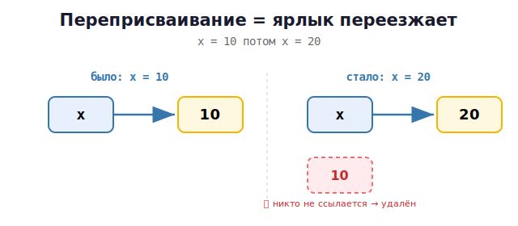

# 03 · Переменные как ссылки 🖼️⭐

> 🎯 **Цель блока:** с первого дня усвоить главную идею Python-памяти: **переменная — это
> ярлык на объект**. Это убережёт тебя от десятков будущих багов.

---

## 📖 Создаём переменную

```python
age = 25
name = "Гена"
pi = 3.14
```

В Python не нужно объявлять тип — Python сам понимает, что `25` это число, а `"Гена"`
строка. Тип определяется значением.

```python
print(type(age))   # <class 'int'>
print(type(name))  # <class 'str'>
print(type(pi))    # <class 'float'>
```

---

## ⭐ Что РЕАЛЬНО происходит в памяти

Запись `age = 25` делает **три вещи**:
1. создаёт **объект** `25` в памяти (куче);
2. создаёт **имя** `age`;
3. **связывает** имя с объектом (наклеивает ярлык).

🖼️

```
   age = 25

   age ──────────►  ┌──────────────┐
   (имя-ярлык)      │ объект int 25 │   живёт в куче
                    └──────────────┘
```

💡 Имя `age` **не содержит** число. Оно лишь **указывает** на объект `25`. Сам объект
живёт отдельно, в памяти.

---

## ⭐ Функция `id()` — увидеть «адрес» объекта

`id(x)` показывает уникальный идентификатор объекта (по сути его адрес в памяти):

```python
age = 25
print(id(age))     # например 140709...  — адрес объекта 25
```

Это твой главный инструмент для понимания памяти. Используй его в экспериментах ниже.

---

## ⭐⭐ Присваивание = новый ярлык, НЕ копия

Вот самый важный момент всего урока:

```python
a = 25
b = a            # b теперь указывает на ТОТ ЖЕ объект, что и a

print(id(a))     # одинаковые!
print(id(b))     # одинаковые!
print(a is b)    # True — это один и тот же объект
```

🖼️ `b = a` не копирует значение — оно вешает **второй ярлык** на тот же объект:

```
   a = 25
   b = a

   a ──────►  ┌──────────────┐
              │ объект int 25 │   ◄── оба имени указывают
   b ──────►  └──────────────┘       на ОДИН объект
```

> 💡 Запомни фразу: **«присваивание не копирует объект, оно копирует ссылку»**. Для
> чисел и строк это незаметно (они неизменяемы), но для списков это источник главных
> багов — разберём в Уровне 2.

---

## 📖 Переприсваивание = ярлык переезжает

```python
x = 10
print(id(x))     # адрес объекта 10
x = 20           # x теперь указывает на ДРУГОЙ объект (20)
print(id(x))     # другой адрес!
```



💡 Старый объект `10`, если на него больше нет ярлыков, будет удалён сборщиком мусора.
Ты не «изменил» десятку — ты **переклеил ярлык** на новый объект.

---

## 🧪 Эксперимент: докажи, что имена — ярлыки

Запусти и осмысли каждый вывод:

```python
a = 1000
b = a
print(a is b)      # True — один объект
print(id(a) == id(b))   # True

b = 2000           # переклеили b на новый объект
print(a is b)      # False — теперь разные
print(a, b)        # 1000 2000 — a не изменился
```

---

## 📖 Правила имён переменных

```python
user_name = "ок"      # ✅ snake_case — стандарт Python
age2 = 5              # ✅ цифры можно (но не в начале)
_hidden = 1          # ✅ можно с подчёркивания

2age = 5             # ❌ нельзя начинать с цифры
user-name = 1        # ❌ дефис нельзя (это минус)
class = 1            # ❌ зарезервированное слово
```

💡 Стиль Python — **snake_case** (слова через подчёркивание): `total_sum`, `user_age`.

---

## 📖 Множественное присваивание

```python
x, y, z = 1, 2, 3        # сразу три имени
a = b = c = 0            # все три указывают на один объект 0

x, y = y, x              # обмен значений в одну строку! (очень по-питоновски)
```

> 💡 Обмен `x, y = y, x` — элегантная замена «временной переменной» из C. Работает,
> потому что Python сначала вычисляет правую часть, потом раздаёт ярлыки.

---

## ✅ Задачи

1. **id-исследование.** Создай `a = 5`, `b = a`. Выведи `id` обоих и `a is b`. Затем
   переприсвой `b = 7` и снова проверь. Объясни своими словами.
2. **Обмен.** Считай два числа, поменяй их местами через `x, y = y, x`, выведи.
3. **Типы.** Создай переменные разных типов (int, float, str, bool), выведи `type()` каждой.
4. **Цепочка.** Сделай `a = b = c = 100`. Проверь `a is b is c`. Затем `b = 200` — что
   стало с `a` и `c`?
5. **Площадь.** Считай длину и ширину, посчитай площадь и периметр через несколько
   переменных.

---

## ❓ Проверь себя

1. Что физически создаётся при `x = 5` (сколько объектов, сколько имён)?
2. Содержит ли имя `x` само значение, или указывает на объект?
3. Что делает `id()`?
4. Что происходит при `b = a` — копируется объект или ссылка?
5. В чём разница между `is` и (забегая вперёд) сравнением значений?
6. Что случится со старым объектом после переприсваивания, если на него нет ссылок?

---

## ✅ Чек-лист

- [ ] Понимаю: имя — ярлык, значение — объект в памяти
- [ ] Использую `id()` и `is` для исследования
- [ ] Знаю, что `b = a` копирует ссылку, не объект
- [ ] Пишу имена в snake_case
- [ ] Умею обмен через `x, y = y, x`

➡️ Следующий: [04 · Числа и строки](04-numbers-strings.md)
