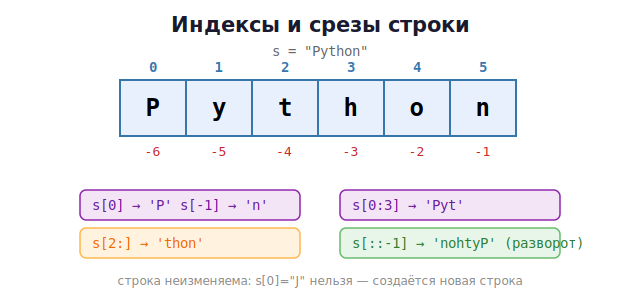

# 04 · Числа и строки

> 🎯 **Цель блока:** освоить основные типы данных — числа и строки — и операции над ними.

---

## 📖 Числа: int и float

```python
count = 42          # int — целое
price = 19.99       # float — дробное
big = 1_000_000     # подчёркивания для читаемости (= 1000000)
```

### Арифметика

| Оператор | Действие | Пример | Результат |
|----------|----------|--------|-----------|
| `+ - *` | плюс, минус, умножение | `3 * 4` | 12 |
| `/` | деление (всегда float!) | `7 / 2` | 3.5 |
| `//` | целочисленное деление | `7 // 2` | 3 |
| `%` | остаток | `7 % 2` | 1 |
| `**` | степень | `2 ** 10` | 1024 |

> 💡 В отличие от C, `/` в Python **всегда** даёт дробь: `4 / 2` → `2.0`. Для целого
> результата используй `//`.

```python
print(7 / 2)    # 3.5
print(7 // 2)   # 3
print(7 % 2)    # 1
print(2 ** 8)   # 256
print(abs(-5))  # 5
print(round(3.14159, 2))   # 3.14
```

### Превращение типов

```python
int("42")       # 42   (строка → число)
float("3.14")   # 3.14
str(100)        # "100" (число → строка)
int(3.9)        # 3    (отбрасывает дробь, НЕ округляет)
```

---

## 📖 Строки (str)

Строка — это текст в кавычках (одинарных или двойных, без разницы):

```python
name = "Гена"
city = 'Москва'
phrase = "Он сказал: \"Привет\""   # экранирование кавычки
multi = """Текст
на несколько
строк"""                           # тройные кавычки — многострочный
```

### Операции со строками

```python
a = "Привет"
b = "мир"

print(a + " " + b)     # склейка: "Привет мир"
print(a * 3)           # повтор: "ПриветПриветПривет"
print(len(a))          # длина: 6
print(a.upper())       # "ПРИВЕТ"
print(a.lower())       # "привет"
print("кот" in "котёнок")   # True — проверка вхождения
```

### ⭐ f-строки — лучший способ вставлять значения

```python
name = "Гена"
age = 30
print(f"Меня зовут {name}, мне {age} лет")
print(f"Через год будет {age + 1}")        # можно выражения внутри!
print(f"Цена: {19.999:.2f}")               # форматирование: 20.00
```

🖼️ Как работает f-строка:
```
   f"Привет, {name}!"
              └─┬─┘
          вставится значение переменной name
```

💡 `f"..."` (f перед кавычкой) — современный и читаемый способ. Используй его везде.

---

## ⭐ Индексы и срезы строк

Строка — это последовательность символов. К каждому есть доступ по **индексу** (с нуля):

```python
s = "Python"
#    012345    индексы
#   -654321... (отрицательные — с конца, -1 последний)

print(s[0])     # 'P'  — первый
print(s[-1])    # 'n'  — последний
print(s[1])     # 'y'
```



### Срезы `[начало:конец:шаг]`

```python
s = "Python"
print(s[0:3])    # 'Pyt'  — символы с 0 по 3 (не включая 3)
print(s[2:])     # 'thon' — со 2 до конца
print(s[:4])     # 'Pyth' — с начала по 4
print(s[::-1])   # 'nohtyP' — разворот строки!
print(s[::2])    # 'Pto'  — каждый второй
```

💡 Срез `[::-1]` — классический питоновский способ перевернуть строку.

> ⚠️ Строки **неизменяемы** (immutable)! Нельзя `s[0] = "J"` — будет ошибка. Чтобы
> «изменить» строку, создаёшь новую: `s = "J" + s[1:]`. Почему так — глубоко разберём в
> Уровне 2 (память).

---

## 📖 Полезные методы строк

```python
s = "  Привет, Мир  "
s.strip()                # "Привет, Мир" — убрать пробелы по краям
s.replace("Мир", "Кот")  # замена подстроки
s.split(",")             # ['  Привет', ' Мир  '] — разбить по разделителю
"-".join(["a","b","c"])  # "a-b-c" — склеить список в строку
"hello".capitalize()     # "Hello"
"Hello".startswith("He") # True
"file.txt".endswith(".txt")  # True
"123".isdigit()          # True — состоит ли из цифр
```

---

## ✅ Задачи

1. **Конвертер температур.** Считай Цельсии, выведи Фаренгейты (`C * 9/5 + 32`) через f-строку.
2. **Площадь круга.** Считай радиус, выведи площадь (`3.14159 * r ** 2`) с 2 знаками.
3. **Инициалы.** Считай имя и фамилию, выведи инициалы (`Г.П.`).
4. **Разворот.** Считай слово, выведи его задом наперёд через срез.
5. **Длина и регистр.** Считай фразу, выведи её длину, в верхнем и нижнем регистре.
6. **Время.** Считай число секунд, выведи в формате `ЧЧ:ММ:СС` (используй `//` и `%`).
7. **Проверка пароля.** Считай строку, скажи, длиннее ли она 8 символов и есть ли в ней цифры.
8. **Маскировка.** Из строки `"1234567890"` сделай `"******7890"` (срезы + повтор).

---

## ❓ Проверь себя

1. Чем `/` отличается от `//`? Что вернёт `5 / 2`?
2. Как возвести 2 в степень 10?
3. Что такое f-строка и чем она удобна?
4. Как получить последний символ строки? Перевернуть строку?
5. Что значит «строки неизменяемы»? Можно ли `s[0] = "x"`?
6. Что делает `"a,b,c".split(",")`?

➡️ Следующий: [05 · Ввод и вывод](05-io.md)
