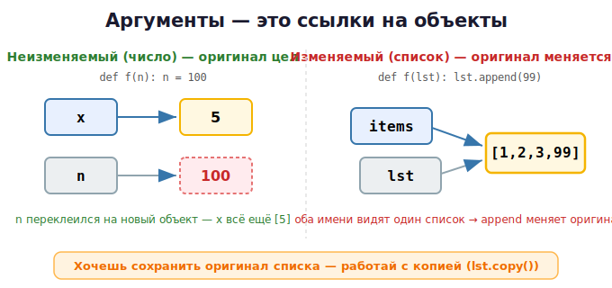

# 08 · Функции 🖼️

> 🎯 **Цель блока:** научиться создавать функции и понять, как Python **передаёт
> аргументы** (через ссылки на объекты) — это снова про память.

---

## 📖 Создаём функцию

```python
def greet(name):              # def, имя, параметры, двоеточие
    print(f"Привет, {name}!")

greet("Гена")                 # вызов
```

С возвращаемым значением:
```python
def square(x):
    return x * x              # вернуть результат

result = square(5)            # 25
```

🖼️
```
   def square(x):
        │      └─ параметр (вход)
     имя функции
   return → отдаёт значение наружу
```

> 💡 В Python не указывают тип результата (хотя можно — аннотации типов, см. Senior).
> Функция без `return` возвращает `None`.

---

## 📖 Параметры: разные способы

```python
# Позиционные
def add(a, b):
    return a + b
add(2, 3)

# Значения по умолчанию
def greet(name, greeting="Привет"):
    print(f"{greeting}, {name}!")
greet("Гена")                 # Привет, Гена!
greet("Гена", "Здравствуй")   # Здравствуй, Гена!

# Именованные аргументы (по имени, в любом порядке)
greet(greeting="Хай", name="Кот")

# Произвольное число аргументов
def total(*numbers):          # *args — кортеж всех позиционных
    return sum(numbers)
total(1, 2, 3, 4)             # 10

def info(**kwargs):           # **kwargs — словарь именованных
    for key, value in kwargs.items():
        print(key, value)
info(name="Гена", age=30)
```

---

## ⭐ Как передаются аргументы: ссылки на объекты

Помнишь из урока 03: имена — ярлыки. При вызове функции параметр получает **ссылку на
тот же объект**, что и аргумент. Поведение зависит от того, **изменяемый** объект или нет.

### С неизменяемыми (числа, строки) — оригинал не меняется

```python
def try_change(n):
    n = 100               # переклеили локальный ярлык на новый объект
    print("внутри:", n)   # 100

x = 5
try_change(x)
print("снаружи:", x)      # 5 — оригинал не тронут!
```

🖼️
```
   x ──► [5]          вызов: n тоже ──► [5]
   внутри n = 100:    n ──► [100]   (новый объект, x всё ещё [5])
```

### С изменяемыми (списки) — оригинал МОЖЕТ измениться!

```python
def add_item(lst):
    lst.append(99)        # МЕНЯЕМ сам объект, на который ссылаются оба!

items = [1, 2, 3]
add_item(items)
print(items)              # [1, 2, 3, 99] — изменился!
```



> ⚠️ Это критично! Функция может **испортить** переданный список. Если не хочешь —
> работай с копией (`lst.copy()`) или возвращай новый объект. Подробно про
> изменяемость — Уровень 2.

---

## ⚠️⚠️ Знаменитая ловушка: изменяемый аргумент по умолчанию

```python
def add_to(item, target=[]):      # ⚠️ ОПАСНО! список создаётся ОДИН раз
    target.append(item)
    return target

print(add_to(1))     # [1]
print(add_to(2))     # [1, 2] — ?! откуда 1?!
print(add_to(3))     # [1, 2, 3] — список общий между вызовами!
```

🖼️ Значение по умолчанию создаётся **один раз** при определении функции, и все вызовы
делят **один и тот же** объект-список.

✅ **Правильно:**
```python
def add_to(item, target=None):
    if target is None:
        target = []               # новый список на КАЖДЫЙ вызов
    target.append(item)
    return target
```

💡 Эта ловушка — классический вопрос на собеседованиях. Запомни: **не используй
изменяемые объекты (`[]`, `{}`) как значения по умолчанию**.

---

## 📖 Несколько возвращаемых значений

```python
def min_max(numbers):
    return min(numbers), max(numbers)    # вернуть кортеж

low, high = min_max([3, 1, 4, 1, 5])    # распаковка
print(low, high)                        # 1 5
```

---

## 📖 Область видимости (scope)

```python
x = 10              # глобальная

def func():
    y = 5           # локальная — видна только внутри функции
    print(x)        # читать глобальную можно
    
func()
# print(y)          # ❌ ошибка — y не существует снаружи
```

Чтобы изменить глобальную внутри функции — `global` (но лучше избегать):
```python
counter = 0
def increment():
    global counter
    counter += 1
```

💡 Хороший стиль: функция получает данные через параметры и возвращает результат через
`return`, не трогая глобальные переменные.

---

## ✅ Задачи

1. **min/max/avg.** Функции для трёх чисел.
2. **Степень.** `power(base, exp)` через цикл (без `**`).
3. **Факториал** двумя способами: циклом и рекурсией.
4. **Простое число.** `is_prime(n)`. Выведи все простые до 100, используя её.
5. **Фибоначчи.** Рекурсивная `fib(n)`.
6. **Ловушка по умолчанию.** Воспроизведи баг с `target=[]`, потом почини через `None`.
7. **Изменяемость.** Напиши функцию, которая добавляет элемент в список, и убедись, что
   оригинал меняется. Затем сделай версию, которая НЕ меняет оригинал.
8. **Калькулятор на функциях.** Каждую операцию — отдельной функцией, вызывай по выбору.

---

## ❓ Проверь себя

1. Как объявить функцию? Что возвращает функция без `return`?
2. Что такое `*args` и `**kwargs`?
3. Почему изменение числа внутри функции не влияет на оригинал, а изменение списка — влияет?
4. В чём ловушка `def f(x, lst=[])` и как её избежать?
5. Как вернуть несколько значений?
6. Что такое локальная и глобальная область видимости?

---

## ✅ Чек-лист «Уровень 1 пройден»

- [ ] Понимаю переменные как ссылки, умею `id()`/`is`
- [ ] Свободно работаю с числами, строками, f-строками, срезами
- [ ] Ввожу/вывожу данные, помню про `int(input())`
- [ ] Пишу условия и циклы
- [ ] Создаю функции, понимаю передачу аргументов и ловушку с `[]`

🎉 Уровень 1 позади! Закрепи на задачах и проекте:

➡️ ✅ [Задачи уровня 1](TASKS.md) → 🚀 [Пет-проект: текстовая игра](PROJECT.md)
