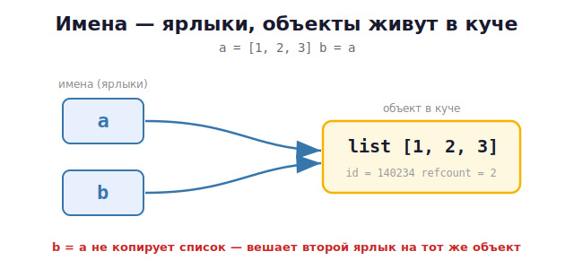

# 09 · Объекты и ссылки: is vs == 🖼️⭐

> 🎯 **Цель блока:** до конца понять модель «имена → объекты». Это самый важный модуль
> курса. Здесь ты раз и навсегда разберёшься с `is`, `==`, `id` и интернированием.

---

## 📖 Всё в Python — объект

Число, строка, список, функция, даже сам класс — **всё это объекты** в памяти. У каждого
объекта есть три вещи:

| Свойство | Что это | Как узнать |
|----------|---------|-----------|
| **Идентичность** | «адрес» в памяти, уникален | `id(obj)` |
| **Тип** | что это за объект | `type(obj)` |
| **Значение** | содержимое | сам `obj` |

```python
x = 42
print(id(x))     # 140234... — идентичность (адрес)
print(type(x))   # <class 'int'> — тип
print(x)         # 42 — значение
```

---

## ⭐ Имя — это ярлык, объект живёт отдельно

```python
a = [1, 2, 3]
b = a
```



Два имени, **один объект**. Это доказывается через `id`:

```python
print(id(a) == id(b))   # True — один и тот же объект
print(a is b)           # True
```

---

## ⭐⭐ `is` против `==` — ключевое различие

```python
a = [1, 2, 3]
b = [1, 2, 3]      # ДРУГОЙ список с таким же содержимым
c = a              # тот же объект, что a

print(a == b)      # True  — РАВНЫ по значению (содержимое одинаково)
print(a is b)      # False — это РАЗНЫЕ объекты в памяти
print(a == c)      # True  — равны по значению
print(a is c)      # True  — это ОДИН объект
```

🖼️
```
   a ──► [список #1: 1,2,3]  ◄── c      (a и c — один объект)
   b ──► [список #2: 1,2,3]             (b — отдельный объект)

   a == b  → True  (содержимое совпадает)
   a is b  → False (объекты разные)
```

> 💡 **Правило на всю жизнь:**
> - `==` спрашивает: «**одинаковое ли значение**?»
> - `is` спрашивает: «**это буквально один и тот же объект**?»
>
> Для сравнения значений используй `==`. `is` применяй **только** с `None`:
> `if result is None:`.

---

## ⭐ Интернирование — почему маленькие числа «is» совпадают

Странность, которая всех путает:

```python
a = 100
b = 100
print(a is b)      # True  — ?!

x = 1000
y = 1000
print(x is y)      # False (часто) — ?!
```

🖼️ Python для **экономии памяти** заранее создаёт объекты для маленьких целых чисел
(от −5 до 256) и переиспользует их:

```
   a = 100 ──┐
              ├──►  [кэшированный объект 100]   (Python создал его заранее)
   b = 100 ──┘

   x = 1000 ──►  [новый объект 1000]
   y = 1000 ──►  [другой новый объект 1000]     (не кэшируются)
```

То же с короткими строками — они «интернируются»:
```python
s1 = "hello"
s2 = "hello"
print(s1 is s2)    # часто True (интернирование строк)
```

> ⚠️ **Вывод:** никогда не сравнивай числа/строки через `is`! Результат зависит от
> внутренней оптимизации Python. Для значений — всегда `==`. Это понимание уберегает от
> очень коварных багов.

---

## 🧪 Эксперименты (запусти все!)

```python
# 1. Один объект или разные?
a = [1, 2]
b = a
c = [1, 2]
print(a is b, a is c, a == c)    # True False True

# 2. Кэш маленьких чисел
print(256 is 256)     # True
print(257 is 257)     # зависит / часто False в отдельных переменных

# 3. None всегда один объект
x = None
y = None
print(x is y)         # True — None существует в единственном экземпляре
```

---

## 📖 `None` — особый объект «ничего»

`None` — это специальный объект, означающий «значения нет». Он существует в памяти в
**единственном экземпляре** (синглтон):

```python
result = None
if result is None:        # ✅ правильно: проверка через is
    print("нет результата")
```

💡 Функция без `return` возвращает `None`. Проверяй его всегда через `is None`, не `== None`.

---

## ✅ Задачи

1. **id-детектив.** Создай `a = [1,2,3]`, `b = a`, `c = [1,2,3]`. Предскажи результаты
   `a is b`, `a is c`, `a == c`, потом проверь.
2. **Кэш чисел.** Найди опытным путём границу, где `is` для одинаковых чисел перестаёт
   давать `True` (подсказка: проверяй 256 и 257).
3. **Строки.** Проверь `is` для двух одинаковых коротких и двух длинных строк.
4. **None.** Напиши функцию, которая иногда возвращает число, иногда ничего. Проверь
   результат через `is None`.
5. **Объясни баг.** Почему `if x is 5:` — плохая идея? Перепиши правильно.
6. **Тройка свойств.** Для объекта выведи его `id`, `type` и значение.

---

## ❓ Проверь себя

1. Какие три свойства есть у любого объекта?
2. В чём разница между `is` и `==`?
3. Когда уместно использовать `is`?
4. Почему `100 is 100` → True, а `1000 is 1000` может быть False?
5. Что такое интернирование и зачем оно?
6. Почему `None` стоит проверять через `is`?

---

## ✅ Чек-лист

- [ ] Понимаю: объект, его id/type/значение
- [ ] Чётко различаю `is` и `==`
- [ ] Знаю про кэш маленьких чисел и интернирование строк
- [ ] Использую `is` только с `None`
- [ ] Никогда не сравниваю значения через `is`

➡️ Следующий: [10 · Изменяемые и неизменяемые](10-mutable-immutable.md)
