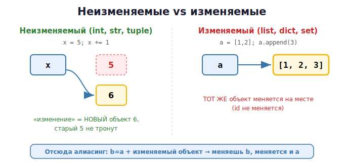

# 10 · Изменяемые и неизменяемые 🖼️⭐

> 🎯 **Цель блока:** понять разделение объектов на **изменяемые** и **неизменяемые** —
> это объясняет 90% «странного» поведения Python и большинство багов новичков.

---

## 📖 Два мира объектов

| Неизменяемые (immutable) | Изменяемые (mutable) |
|--------------------------|----------------------|
| `int`, `float`, `bool` | `list` |
| `str` (строка) | `dict` (словарь) |
| `tuple` (кортеж) | `set` (множество) |
| `frozenset` | объекты твоих классов |

- **Неизменяемый** объект **нельзя поменять** после создания. «Изменение» создаёт **новый** объект.
- **Изменяемый** объект можно менять **на месте** — он остаётся тем же объектом в памяти.



---

## ⭐ Неизменяемые: «изменение» = новый объект

```python
x = 5
print(id(x))     # адрес объекта 5
x += 1           # это НЕ изменение 5! Создаётся новый объект 6
print(id(x))     # ДРУГОЙ адрес
```

🖼️
```
   x ──► [5]          x += 1
   x ──► [6]          объект 5 не изменился — x переклеился на новый объект 6
```

То же со строками:
```python
s = "Привет"
print(id(s))
s += "!"         # новая строка "Привет!", старая не тронута
print(id(s))     # другой адрес
```

> ⚠️ Поэтому `s[0] = "x"` для строки — **ошибка**: строку нельзя менять на месте.

---

## ⭐ Изменяемые: меняются на месте (тот же объект)

```python
lst = [1, 2, 3]
print(id(lst))   # адрес списка
lst.append(4)    # меняем САМ объект
print(id(lst))   # ТОТ ЖЕ адрес! Объект не пересоздавался
print(lst)       # [1, 2, 3, 4]
```

🖼️
```
   lst ──► [список 1,2,3]
   lst.append(4):
   lst ──► [список 1,2,3,4]   тот же объект, изменённый внутри
```

---

## ⭐⭐ Главное следствие: алиасинг (два ярлыка на один список)

Вот баг, на котором спотыкается каждый новичок:

```python
a = [1, 2, 3]
b = a            # b — ВТОРОЙ ярлык на тот же список (не копия!)
b.append(4)

print(a)         # [1, 2, 3, 4]  — "a" тоже изменился!!!
print(b)         # [1, 2, 3, 4]
print(a is b)    # True — это один объект
```

🖼️
```
   a ───┐
        ├──►  [список 1,2,3,4]      b.append(4) меняет объект,
   b ───┘                           который ВИДЯТ ОБА имени
```

💡 Это прямое следствие двух фактов: «`b = a` копирует ссылку» + «список изменяемый».
С неизменяемыми (числа) такого не бывает, потому что их нельзя изменить на месте.

### С числами «баг» не воспроизводится

```python
a = 5
b = a
b += 1           # создался новый объект 6, b переклеился
print(a, b)      # 5 6 — a не тронут
```

---

## ⭐ Кортеж (tuple) — неизменяемый «список»

```python
point = (10, 20)       # кортеж — как список, но изменить нельзя
print(point[0])        # 10 — читать можно
# point[0] = 99        # ❌ ошибка! tuple неизменяем

coords = 1, 2, 3       # скобки не обязательны
x, y, z = coords       # распаковка
```

💡 Кортежи используют для данных, которые **не должны меняться** (координаты, ключи
словаря, возврат нескольких значений). Они быстрее и безопаснее списков.

> ⚠️ Тонкость: кортеж неизменяем, но если внутри лежит список — этот **список** менять
> можно: `t = (1, [2, 3]); t[1].append(4)` сработает. Неизменяемость кортежа — про его
> «ярлыки», а не про содержимое вложенных объектов.

---

## 🧪 Эксперименты

```python
# 1. Алиасинг списков
a = [1, 2, 3]
b = a
b[0] = 99
print(a)             # [99, 2, 3] — изменился!

# 2. Числа не алиасятся опасно
a = 10
b = a
b = 20
print(a)             # 10

# 3. Проверь id до и после
s = "hi"
print(id(s)); s += "!"; print(id(s))   # разные (новый объект)
lst = [1]
print(id(lst)); lst.append(2); print(id(lst))   # одинаковые (тот же объект)
```

---

## 📖 Как избежать неприятностей

```python
# Хочешь независимую копию списка:
b = a.copy()         # или b = a[:]  или  b = list(a)
b.append(4)
print(a)             # не изменился

# Хочешь защитить данные — используй кортеж
config = (800, 600)  # нельзя случайно изменить
```

---

## ✅ Задачи

1. **Воспроизведи алиасинг.** Создай список, второй ярлык, измени через второй, покажи,
   что первый тоже изменился. Объясни через `id`.
2. **Сделай копию.** Повтори задачу 1, но через `.copy()` — докажи, что оригинал цел.
3. **Числа vs списки.** Покажи, что для чисел «баг» алиасинга не возникает, и объясни почему.
4. **Кортеж.** Создай кортеж, попробуй изменить элемент — поймай ошибку. Затем создай
   кортеж со списком внутри и измени список.
5. **id-трекер.** Для строки и для списка выведи `id` до и после «изменения». Объясни разницу.
6. **Функция-ловушка.** Напиши функцию, которая случайно портит переданный список, и
   версию, которая работает с копией.

---

## ❓ Проверь себя

1. Назови 3 неизменяемых и 3 изменяемых типа.
2. Что происходит в памяти при `x += 1` для числа? А при `lst.append(x)` для списка?
3. Почему `b = a; b.append(4)` меняет и `a`, если это список?
4. Почему та же запись с числами не «портит» `a`?
5. Чем кортеж отличается от списка? Когда он удобен?
6. Можно ли изменить список, лежащий внутри кортежа?

---

## ✅ Чек-лист

- [ ] Знаю деление на mutable / immutable
- [ ] Понимаю, что «изменение» неизменяемого = новый объект
- [ ] Понимаю алиасинг и его опасность
- [ ] Умею делать настоящую копию списка
- [ ] Понимаю роль кортежей

➡️ Следующий: [11 · Подсчёт ссылок и сборщик мусора](11-refcount-gc.md)
