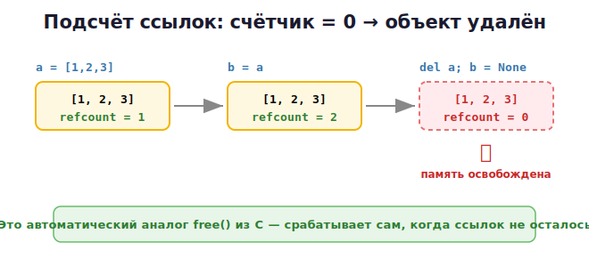

# 11 · Подсчёт ссылок и сборщик мусора 🖼️⭐

> 🎯 **Цель блока:** понять, **как именно** Python освобождает память автоматически. После
> ручного `free()` из C это особенно интересно: тут «free» происходит сам.

---

## 📖 Главный механизм: подсчёт ссылок (reference counting)

Каждый объект в памяти хранит **счётчик ссылок** — сколько имён (и других объектов) на
него указывают. Когда счётчик падает до **нуля** — объект удаляется немедленно.



💡 Это и есть автоматический аналог `free()`: как только на объект никто не ссылается,
Python сам возвращает память.

---

## 🧪 Увидеть счётчик ссылок

```python
import sys

a = [1, 2, 3]
print(sys.getrefcount(a))    # например 2

b = a
print(sys.getrefcount(a))    # стало больше на 1

del b
print(sys.getrefcount(a))    # уменьшилось обратно
```

> 💡 `getrefcount` всегда показывает на 1 больше, чем ты ожидаешь — потому что сам вызов
> функции временно создаёт ещё одну ссылку. Это нормально.

---

## 📖 Что увеличивает и уменьшает счётчик

**Увеличивают (+1):**
```python
a = obj            # присваивание имени
lst.append(obj)    # добавление в коллекцию
func(obj)          # передача в функцию (на время вызова)
b = a              # новый ярлык
```

**Уменьшают (−1):**
```python
del a              # удаление имени
a = something_else # переприсваивание (ярлык ушёл с объекта)
# выход из функции — локальные имена исчезают
lst.remove(obj)    # удаление из коллекции
```

> ⚠️ `del a` удаляет **имя**, а не обязательно объект! Объект удалится, только если это
> была **последняя** ссылка (счётчик стал 0).

---

## ⭐ Проблема: циклические ссылки

Подсчёта ссылок недостаточно в одном случае — когда объекты ссылаются **друг на друга**:

```python
a = {}
b = {}
a["partner"] = b      # a ссылается на b
b["partner"] = a      # b ссылается на a

del a
del b                 # имена удалены, НО...
```

🖼️
```
   После del a, del b:

   [словарь A] ──partner──► [словарь B]
       ▲                         │
       └─────────partner─────────┘

   Имён больше нет, но объекты ссылаются друг на друга →
   счётчик каждого = 1 (не ноль!) → подсчёт ссылок их НЕ удалит!
```

Это была бы **утечка памяти**. Чтобы её не было, в Python есть второй механизм.

---

## ⭐ Второй механизм: сборщик мусора (garbage collector)

Помимо подсчёта ссылок, Python периодически запускает **сборщик мусора** (модуль `gc`),
который находит такие «острова» взаимно ссылающихся объектов, до которых нельзя
добраться из работающей программы, и удаляет их.

🖼️
```
   Достижимо из программы          Недостижимый "остров"
   (нельзя удалять)                (взаимные ссылки, но никто извне
                                    на них не смотрит → GC удалит)
   корни ──► obj ──► obj           [A] ⇄ [B]
```

```python
import gc

gc.collect()          # запустить сборку вручную (обычно не нужно)
print(gc.get_count()) # статистика
```

💡 **Итого: память Python чистят ДВА механизма:**
1. **Подсчёт ссылок** — мгновенно, когда счётчик = 0 (основной).
2. **Сборщик мусора** — периодически, для циклических ссылок (дополнительный).

---

## 📖 `del` — что он делает на самом деле

```python
x = [1, 2, 3]
y = x
del x              # удалили ИМЯ x (счётчик объекта −1, но он жив — есть y)
print(y)           # [1, 2, 3] — объект цел
del y              # последняя ссылка убрана → объект удалён
```

> 💡 `del` ≠ освобождение памяти. `del` убирает **имя**. Память освобождается, когда
> исчезает **последняя** ссылка. Это важное отличие от C, где `free()` напрямую
> освобождает.

---

## 📖 Зачем это знать практически

- **Долгоживущие программы** (серверы, боты): циклические ссылки + ссылки в глобальных
  кэшах могут «держать» объекты живыми → рост памяти. Понимание помогает находить причину.
- **`__del__`** (финализатор объекта) и циклы могут конфликтовать — лучше не полагаться на него.
- В Уровне 4 ты узнаешь про `weakref` — «слабые ссылки», которые **не** увеличивают
  счётчик и помогают избегать циклов.

---

## ✅ Задачи

1. **Счётчик.** Через `sys.getrefcount` понаблюдай, как меняется счётчик при добавлении
   и удалении ссылок (`b = a`, `del b`, добавление в список).
2. **del-эксперимент.** Создай объект, два имени на него. Удали одно имя — объект жив?
   Удали второе.
3. **Цикл.** Создай два словаря, ссылающихся друг на друга. Удали имена. Объясни, почему
   подсчёта ссылок мало. Запусти `gc.collect()`.
4. **Список в функции.** Передай список в функцию, посмотри, как счётчик меняется во
   время и после вызова.
5. **Наблюдение за gc.** Выведи `gc.get_count()` до и после создания множества объектов.

---

## ❓ Проверь себя

1. Как Python узнаёт, что объект больше не нужен?
2. Что происходит, когда счётчик ссылок объекта достигает нуля?
3. Что увеличивает и что уменьшает счётчик ссылок?
4. Почему подсчёта ссылок недостаточно? Приведи пример.
5. Что делает сборщик мусора (`gc`)?
6. Что на самом деле делает `del x`?

---

## ✅ Чек-лист

- [ ] Понимаю подсчёт ссылок как основной механизм очистки
- [ ] Умею смотреть счётчик через `sys.getrefcount`
- [ ] Понимаю проблему циклических ссылок
- [ ] Знаю про сборщик мусора (`gc`)
- [ ] Понимаю, что `del` убирает имя, а не память напрямую

➡️ Следующий: [12 · Копирование объектов](12-copying.md)
