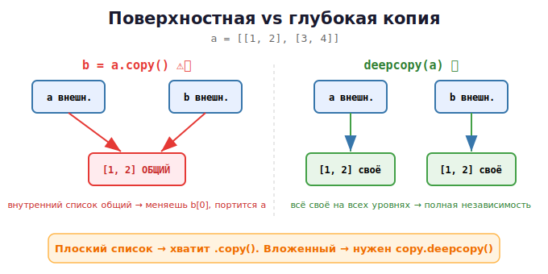

# 12 · Копирование объектов: shallow и deep 🖼️⭐

> 🎯 **Цель блока:** научиться **правильно копировать** изменяемые объекты. Здесь живёт
> один из самых коварных багов Python — поверхностное копирование вложенных структур.

---

## 📖 Три уровня «копирования»

```python
import copy

original = [1, 2, 3]

a = original             # 1. НЕ копия — второй ярлык (алиас)
b = original.copy()      # 2. ПОВЕРХНОСТНАЯ копия (shallow)
c = copy.deepcopy(original)  # 3. ГЛУБОКАЯ копия (deep)
```

Разберём каждый.

---

## ⭐ 1. Присваивание — не копия вообще

```python
a = [1, 2, 3]
b = a
b.append(4)
print(a)         # [1, 2, 3, 4] — оба изменились (один объект)
```

🖼️ `a` и `b` — два ярлыка на один объект. (Подробно — модуль 10.)

---

## ⭐ 2. Поверхностная копия (shallow copy)

Создаёт **новый** объект, но **вложенные** объекты — те же (копируются ссылки на них).

```python
a = [1, 2, 3]
b = a.copy()         # или a[:] или list(a)
b.append(4)
print(a)             # [1, 2, 3] — оригинал ЦЕЛ!
print(b)             # [1, 2, 3, 4]
print(a is b)        # False — разные объекты
```

✅ Для плоского списка (числа, строки) shallow copy работает идеально.

🖼️
```
   a ──► [новый список #1]:  1   2   3
   b ──► [новый список #2]:  1   2   3
         (для чисел всё ок — они неизменяемы)
```

### ⚠️ Но с ВЛОЖЕННЫМИ объектами — ловушка!

```python
a = [[1, 2], [3, 4]]      # список списков
b = a.copy()              # поверхностная копия
b[0].append(99)           # меняем ВЛОЖЕННЫЙ список

print(a)                  # [[1, 2, 99], [3, 4]] — оригинал тоже изменился!!!
print(b)                  # [[1, 2, 99], [3, 4]]
```

🖼️ Почему: shallow copy скопировал **внешний** список, но внутренние списки — **общие**:



> ⚠️ Это классический баг. Поверхностная копия копирует только верхний уровень.
> Вложенные изменяемые объекты остаются общими между копией и оригиналом.

---

## ⭐ 3. Глубокая копия (deep copy) — полностью независимая

`copy.deepcopy` рекурсивно копирует **всё** на всех уровнях:

```python
import copy

a = [[1, 2], [3, 4]]
b = copy.deepcopy(a)
b[0].append(99)

print(a)             # [[1, 2], [3, 4]] — оригинал НЕ тронут!
print(b)             # [[1, 2, 99], [3, 4]]
```

🖼️
```
   a ──► [внешний #1] ──► [внутр. 1,2]      [внутр. 3,4]
   b ──► [внешний #2] ──► [внутр. 1,2,99]   [внутр. 3,4]
         всё своё, на всех уровнях — полная независимость
```

---

## 📋 Сводка способов копирования списка

| Способ | Тип | Вложенные |
|--------|-----|-----------|
| `b = a` | не копия (алиас) | общие |
| `a.copy()` | поверхностная | **общие** ⚠️ |
| `a[:]` | поверхностная | **общие** ⚠️ |
| `list(a)` | поверхностная | **общие** ⚠️ |
| `copy.deepcopy(a)` | глубокая | свои ✅ |

> 💡 Правило: **плоская структура** → хватит `.copy()`. **Вложенная** (списки в списках,
> словари со списками) → нужен `copy.deepcopy()`.

---

## ⭐ Возвращаемся к ловушке аргумента по умолчанию

Помнишь из урока 08? Теперь ты понимаешь её до конца:

```python
def add(item, target=[]):     # ⚠️ список создан ОДИН раз при определении функции
    target.append(item)
    return target

add(1)    # [1]
add(2)    # [1, 2] — тот же объект между вызовами!
```

Это память: значение по умолчанию — **один объект**, живущий всё время. Решение —
неизменяемый `None` как сигнал «создай новый»:

```python
def add(item, target=None):
    if target is None:
        target = []           # новый список каждый вызов
    target.append(item)
    return target
```

---

## 🧪 Эксперименты

```python
import copy

# Плоский — copy достаточно
a = [1, 2, 3]
b = a.copy()
b.append(4)
print(a, b)               # [1,2,3] [1,2,3,4]

# Вложенный — copy НЕ достаточно
a = [[1], [2]]
b = a.copy()
b[0].append(99)
print(a)                  # [[1, 99], [2]] — попался!

# deepcopy спасает
a = [[1], [2]]
b = copy.deepcopy(a)
b[0].append(99)
print(a)                  # [[1], [2]] — цел
```

---

## ✅ Задачи

1. **Три способа.** Создай список, сделай алиас, shallow и deep копию. Измени каждую,
   покажи, что происходит с оригиналом.
2. **Вложенный баг.** Воспроизведи баг с `[[...]]` и `.copy()`, потом почини через `deepcopy`.
3. **Матрица.** Создай матрицу `3×3` (список списков). Скопируй её так, чтобы изменение
   копии не влияло на оригинал.
4. **Словарь со списками.** Создай `{"a": [1,2], "b": [3,4]}`, скопируй поверхностно и
   глубоко, измени вложенный список, сравни.
5. **Почини функцию.** Дана функция с `data={}` по умолчанию — найди и устрани проблему.
6. **Своя deepcopy.** Напиши функцию, которая глубоко копирует вложенный список вручную
   (рекурсия), без `copy`.

---

## ❓ Проверь себя

1. Чем `b = a`, `a.copy()` и `deepcopy(a)` отличаются?
2. Что копирует поверхностная копия, а что оставляет общим?
3. В каком случае `.copy()` приведёт к багу?
4. Когда нужен `deepcopy`?
5. Как связана ловушка `def f(x, lst=[])` с темой памяти?
6. Какие способы поверхностного копирования списка ты знаешь?

---

## ✅ Чек-лист

- [ ] Различаю алиас, shallow и deep копию
- [ ] Понимаю ловушку вложенных объектов при shallow copy
- [ ] Умею выбрать `.copy()` или `deepcopy()`
- [ ] До конца понял ловушку аргумента по умолчанию
- [ ] Могу скопировать матрицу безопасно

➡️ Следующий: [13 · Коллекции в памяти](13-collections-memory.md)
