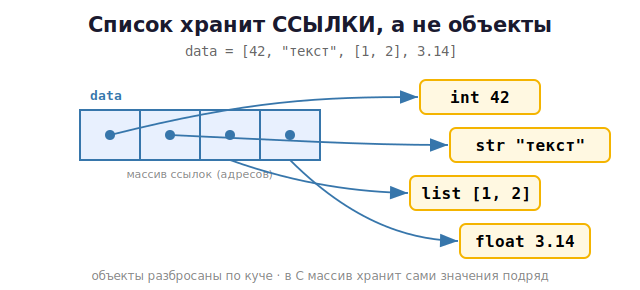

# 13 · Коллекции в памяти 🖼️⭐

> 🎯 **Цель блока:** познакомиться с главными коллекциями (list, tuple, dict, set) и
> понять, **как они устроены в памяти** и сколько её занимают.

---

## 📖 Четыре главные коллекции

| Тип | Синтаксис | Изменяемый | Упорядоченный | Дубликаты |
|-----|-----------|------------|---------------|-----------|
| **list** | `[1, 2, 3]` | да | да | да |
| **tuple** | `(1, 2, 3)` | нет | да | да |
| **dict** | `{"a": 1}` | да | да* | ключи уникальны |
| **set** | `{1, 2, 3}` | да | нет | нет (уникальны) |

\* словари сохраняют порядок вставки начиная с Python 3.7.

---

## ⭐ list (список) — массив ссылок

Список хранит **не сами объекты, а ссылки на них**. Поэтому список может содержать что
угодно вперемешку.

```python
data = [42, "текст", [1, 2], 3.14]
```



> 💡 Это отличается от массива в C, где элементы лежат подряд физически. В Python список —
> это массив **указателей** на объекты. Отсюда гибкость, но и больший расход памяти.

```python
data.append(5)        # добавить в конец
data[0] = 100         # изменить по индексу
data.insert(1, "x")   # вставить
data.remove("текст")  # удалить по значению
data.pop()            # снять последний
len(data)             # длина
```

### Список тоже растёт с запасом (как vector в C!)

Если ты делал пет-проект «Vector» в курсе C — Python-список работает так же: при
заполнении он перевыделяет память с запасом (примерно ×1.125), чтобы `append` был быстрым
в среднем. Под капотом — `realloc`.

---

## ⭐ dict (словарь) — пары ключ→значение на хеш-таблице

```python
user = {"name": "Гена", "age": 30}
print(user["name"])       # Гена
user["city"] = "Москва"   # добавить
user["age"] = 31          # изменить
"name" in user            # True — проверка ключа (быстрая!)
```

🖼️ Словарь — это **хеш-таблица**: ключ превращается в число (хеш), которое указывает,
куда положить значение. Поэтому поиск по ключу почти мгновенный — O(1):

```
   ключ "name" ──hash()──► позиция 3 ──► значение "Гена"
   ключ "age"  ──hash()──► позиция 7 ──► значение 30
```

> 💡 Поэтому проверка `key in dict` молниеносна, а `value in list` — медленная (перебор).
> Внутреннее устройство хеш-таблиц подробно разберём в Уровне 3.

> ⚠️ Ключами словаря могут быть только **неизменяемые** объекты (строки, числа, кортежи),
> потому что для них считается стабильный хеш. Список ключом быть не может!

---

## ⭐ set (множество) — уникальные элементы

```python
nums = {1, 2, 3, 3, 2}
print(nums)              # {1, 2, 3} — дубликаты убраны автоматически

nums.add(4)
nums.discard(1)
print(2 in nums)         # True — быстрая проверка (хеш-таблица, как dict)

a = {1, 2, 3}
b = {2, 3, 4}
print(a & b)             # {2, 3} — пересечение
print(a | b)             # {1, 2, 3, 4} — объединение
print(a - b)             # {1} — разность
```

💡 set построен на хеш-таблице (как dict, но без значений). Идеален для удаления
дубликатов и быстрой проверки принадлежности.

---

## 📖 Сколько памяти занимают коллекции

```python
import sys

print(sys.getsizeof([]))        # пустой список ~56 байт
print(sys.getsizeof([1,2,3]))   # больше
print(sys.getsizeof(()))        # пустой кортеж ~40 байт (меньше списка!)
print(sys.getsizeof({}))        # пустой словарь ~64 байта
print(sys.getsizeof(set()))     # множество
```

> 💡 Кортеж легче списка (он неизменяем — не нужен запас под рост). Если данные не
> меняются — кортеж экономит память. Это пригодится в оптимизации (Уровень 4).

---

## 📖 Когда что использовать

| Нужно | Бери |
|-------|------|
| упорядоченный изменяемый набор | **list** |
| неизменяемый набор (координаты, ключи) | **tuple** |
| соответствие ключ→значение, быстрый поиск | **dict** |
| уникальные элементы, быстрая проверка «есть ли» | **set** |

---

## 🧪 Эксперименты

```python
import sys

# 1. Список хранит ссылки — можно класть разное
mixed = [1, "два", [3], {"4": 4}]
print(mixed)

# 2. set убирает дубликаты
print(len(set([1,1,1,2,2,3])))     # 3

# 3. dict-поиск vs list-поиск (скорость)
import time
big_list = list(range(1_000_000))
big_set = set(big_list)
# проверь "999999 in big_list" vs "999999 in big_set" — set намного быстрее

# 4. tuple легче list
print(sys.getsizeof([1,2,3]), sys.getsizeof((1,2,3)))
```

---

## ✅ Задачи

1. **Уникальные слова.** Из текста выведи количество уникальных слов (через `set`).
2. **Частоты.** Посчитай, сколько раз каждое слово встречается (через `dict`).
3. **Телефонная книга.** Словарь имя→номер: добавить, найти, удалить, вывести всех.
4. **Пересечение интересов.** Два множества хобби, найди общие, уникальные у каждого.
5. **Список ссылок.** Создай список со вложенным списком, покажи через `id`, что
   элемент — это ссылка (измени вложенный через другой ярлык).
6. **Память.** Сравни `getsizeof` для list и tuple одинакового содержимого. Сделай вывод.
7. ⭐ **Скорость поиска.** Замерь время `x in list` vs `x in set` на миллионе элементов.

---

## ❓ Проверь себя

1. Чем list отличается от tuple? А dict от set?
2. Что физически хранит список — объекты или ссылки на них?
3. Почему поиск по ключу в dict быстрый, а по значению в list медленный?
4. Какие объекты могут быть ключами словаря и почему?
5. Зачем нужен set?
6. Почему кортеж занимает меньше памяти, чем список?

---

## ✅ Чек-лист «Уровень 2 — ПАМЯТЬ — пройден» 🎉

- [ ] Понимаю объекты, id, `is` vs `==`, интернирование
- [ ] Различаю изменяемые/неизменяемые, понимаю алиасинг
- [ ] Знаю про подсчёт ссылок и сборщик мусора
- [ ] Правильно копирую (shallow vs deep)
- [ ] Знаю 4 коллекции и как они устроены в памяти

> 🏆 Это был самый важный уровень. Теперь ты понимаешь Python-память глубже большинства!

➡️ ✅ [Задачи уровня 2](TASKS.md) → 🚀 [Пет-проект: визуализатор ссылок](PROJECT.md)
