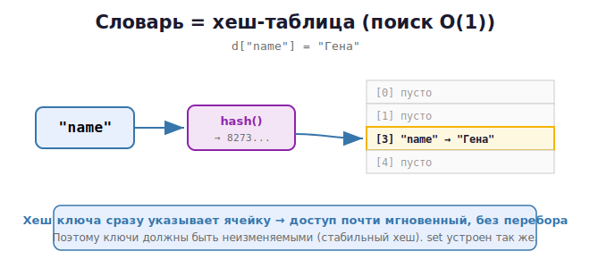

# 14 · dict и set: хеш-таблицы внутри 🖼️

> 🎯 **Цель блока:** понять, **как устроены словари и множества** изнутри (хеш-таблицы) —
> почему они такие быстрые и какие у этого ограничения.

---

## 📖 Зачем понимать устройство

Словарь — самая используемая структура в Python (на нём построены даже атрибуты
объектов!). Зная, как он работает, ты пишешь быстрый код и избегаешь ошибок.

---

## ⭐ Хеш-функция — сердце словаря

**Хеш** — это число, которое функция `hash()` вычисляет из объекта. Одинаковые объекты
дают одинаковый хеш, разные — почти всегда разный.

```python
print(hash("кот"))      # какое-то большое число
print(hash(42))         # для чисел хеш = само число
print(hash((1, 2)))     # кортежи хешируются
# hash([1, 2])          # ❌ ошибка! список нехешируем (изменяемый)
```

🖼️ Как словарь кладёт пару ключ→значение:



При чтении `d["кот"]` Python снова считает хеш, идёт сразу в ячейку №3 — **без перебора**.
Поэтому доступ O(1) (почти мгновенный).

---

## ⭐ Почему ключи должны быть неизменяемыми

```python
d = {}
d["строка"] = 1        # ✅ str неизменяема — хеш стабилен
d[(1, 2)] = 2          # ✅ tuple неизменяем
d[42] = 3              # ✅ число
# d[[1, 2]] = 4        # ❌ TypeError: unhashable type: 'list'
```

> ⚠️ Если бы ключ был изменяемым списком и ты бы его изменил — его хеш поменялся бы,
> и Python больше не нашёл бы значение (оно «потерялось» бы в другой ячейке). Поэтому
> ключами могут быть только **неизменяемые** (хешируемые) объекты. Снова важность темы
> mutable/immutable из Уровня 2!

---

## 📖 Работа со словарём

```python
user = {"name": "Гена", "age": 30}

# Доступ
user["name"]              # "Гена"
user.get("city")          # None (без ошибки, если ключа нет)
user.get("city", "—")     # "—" (значение по умолчанию)

# Изменение
user["age"] = 31
user.setdefault("city", "Москва")   # добавить, если ключа нет

# Перебор
for key in user:                    # по ключам
    print(key, user[key])
for key, value in user.items():     # по парам
    print(key, value)
for value in user.values():         # по значениям
    print(value)

# Удаление
del user["age"]
user.pop("name", None)

# Проверка
"name" in user            # True — быстро!
```

### Частые приёмы

```python
# Подсчёт частот
from collections import Counter
words = ["a", "b", "a", "c", "a"]
print(Counter(words))     # Counter({'a': 3, 'b': 1, 'c': 1})

# Группировка / накопление
freq = {}
for w in words:
    freq[w] = freq.get(w, 0) + 1

# defaultdict — словарь с автозначением
from collections import defaultdict
groups = defaultdict(list)
groups["чётные"].append(2)    # ключ создастся сам со списком
```

---

## 📖 Множества (set) подробнее

```python
a = {1, 2, 3, 4}
b = {3, 4, 5, 6}

a & b        # {3, 4}      пересечение
a | b        # {1,2,3,4,5,6} объединение
a - b        # {1, 2}      разность
a ^ b        # {1,2,5,6}   симметричная разность
a <= b       # подмножество?
```

💡 set — это «dict без значений», построенный на той же хеш-таблице. Используй для:
- удаления дубликатов: `list(set(data))`;
- быстрой проверки принадлежности: `if x in big_set`.

---

## 📖 Словарные и множественные comprehensions

```python
# dict comprehension
squares = {x: x**2 for x in range(5)}      # {0:0, 1:1, 2:4, 3:9, 4:16}

# set comprehension
unique_lengths = {len(w) for w in ["a", "bb", "cc", "ddd"]}   # {1, 2, 3}

# инвертировать словарь
inverted = {v: k for k, v in squares.items()}
```

---

## 🧪 Эксперименты

```python
# 1. Хеш одинаковых объектов
print(hash("кот") == hash("кот"))    # True

# 2. Скорость dict vs list
import time
data_list = list(range(1_000_000))
data_set = set(data_list)

t = time.time(); _ = 999_999 in data_list; print("list:", time.time()-t)
t = time.time(); _ = 999_999 in data_set;  print("set: ", time.time()-t)   # намного быстрее

# 3. Нехешируемый ключ
try:
    d = {[1,2]: "x"}
except TypeError as e:
    print("Ошибка:", e)
```

---

## ✅ Задачи

1. **Частота символов.** Посчитай, сколько раз каждый символ встречается в строке.
2. **Анаграммы.** Проверь, являются ли два слова анаграммами (через сортировку или Counter).
3. **Уникальные с сохранением порядка.** Убери дубликаты из списка, сохранив порядок.
4. **Группировка.** Раздели список слов по их первой букве (`defaultdict`).
5. **Пересечение друзей.** Два множества друзей — найди общих, уникальных у каждого.
6. **Инверсия словаря.** Поменяй местами ключи и значения.
7. ⭐ **Топ-N слов.** Найди N самых частых слов в тексте (`Counter.most_common`).
8. ⭐ **Кэш через словарь.** Сделай функцию, которая запоминает уже посчитанные результаты
   в словаре (мемоизация факториала/фибоначчи).

---

## ❓ Проверь себя

1. Что такое хеш и зачем он словарю?
2. Почему доступ по ключу — O(1)?
3. Почему ключами могут быть только неизменяемые объекты?
4. Чем `dict.get(k)` лучше `dict[k]`?
5. Что такое `Counter` и `defaultdict`?
6. Чем set похож на dict внутри?

---

## ✅ Чек-лист

- [ ] Понимаю хеш-таблицу как основу dict и set
- [ ] Знаю, почему ключи неизменяемы
- [ ] Свободно работаю со словарём (get, items, setdefault)
- [ ] Использую Counter и defaultdict
- [ ] Применяю операции над множествами

➡️ Следующий: [15 · Генераторы и итераторы](15-generators-iterators.md)
