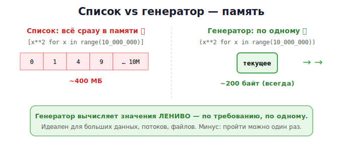

# 15 · Генераторы и итераторы 🖼️⭐

> 🎯 **Цель блока:** освоить ленивые вычисления — генераторы. Это прямой инструмент
> **экономии памяти**: обрабатывать миллионы элементов, не загружая их все сразу.

---

## 📖 Проблема: список всего в памяти

```python
numbers = [x ** 2 for x in range(10_000_000)]   # ⚠️ 10 млн чисел СРАЗУ в памяти!
total = sum(numbers)
```

Этот список занимает сотни мегабайт. А что, если нам нужна только сумма? Мы храним всё
зря. Решение — **генератор**.

---

## ⭐ Генераторное выражение — ленивая версия

Замени квадратные скобки на круглые — и список превратится в **генератор**:

```python
numbers = (x ** 2 for x in range(10_000_000))   # ✅ почти НОЛЬ памяти
total = sum(numbers)                             # числа создаются по одному
```

🖼️ Разница:



💡 Генератор не хранит значения — он **вычисляет их по одному** по требованию (лениво).
Идеально для больших данных, потоков, файлов.

---

## ⭐ Функция-генератор с `yield`

`yield` превращает функцию в генератор. Она «выдаёт» значения по одному, **запоминая
своё состояние** между вызовами:

```python
def countdown(n):
    while n > 0:
        yield n          # выдать значение и "заморозиться" здесь
        n -= 1

for x in countdown(5):
    print(x)             # 5 4 3 2 1
```

🖼️ Как работает `yield`:

```
   вызов next() → функция работает до yield → отдаёт значение → ЗАМИРАЕТ
   следующий next() → продолжает С ТОГО ЖЕ МЕСТА (n помнится!)
```

> 💡 Обычная функция при `return` завершается и забывает всё. Генератор при `yield`
> **приостанавливается** и помнит все свои переменные до следующего обращения. Состояние
> хранится в самом объекте-генераторе.

### Бесконечный генератор (с list это невозможно!)

```python
def naturals():
    n = 1
    while True:          # бесконечно!
        yield n
        n += 1

gen = naturals()
print(next(gen))         # 1
print(next(gen))         # 2  — берём по одному, памяти не растёт
```

---

## 📖 Итераторы: что под капотом у `for`

`for x in something` работает так:
1. `iter(something)` — получить итератор;
2. многократно `next(итератор)` — брать следующий элемент;
3. при `StopIteration` — цикл заканчивается.

```python
nums = [10, 20, 30]
it = iter(nums)
print(next(it))     # 10
print(next(it))     # 20
print(next(it))     # 30
# next(it)          # StopIteration
```

🖼️
```
   for x in nums:   ≡   it = iter(nums)
                        while True:
                            x = next(it)   # пока не StopIteration
                            ...тело...
```

💡 Генераторы — это и есть итераторы. Списки, строки, словари, файлы — все «итерируемые».

---

## 📖 Ленивые инструменты: itertools

Модуль `itertools` — набор готовых ленивых генераторов:

```python
import itertools

# Бесконечные
itertools.count(0, 2)       # 0, 2, 4, 6, ...
itertools.cycle("AB")       # A, B, A, B, ...
itertools.repeat(7, 3)      # 7, 7, 7

# Комбинаторика
itertools.permutations([1,2,3])     # все перестановки
itertools.combinations([1,2,3], 2)  # все пары

# Обработка
itertools.chain([1,2], [3,4])       # 1,2,3,4 (склейка)
itertools.islice(naturals(), 5)     # первые 5 из бесконечного
```

---

## 📖 Когда что использовать

| Нужно | Бери |
|-------|------|
| данные нужны много раз / по индексу | **список** |
| обработать один раз большой/бесконечный поток | **генератор** |
| прочитать огромный файл построчно | **генератор** (файл итерируемый) |
| сэкономить память | **генератор** |

```python
# Обработка большого файла БЕЗ загрузки целиком — файл это генератор строк!
def count_lines(filename):
    with open(filename) as f:
        return sum(1 for _ in f)       # по строке за раз, память не растёт
```

---

## 🧪 Эксперименты

```python
import sys

# 1. Память: список vs генератор
lst = [x for x in range(100000)]
gen = (x for x in range(100000))
print(sys.getsizeof(lst))    # сотни тысяч байт
print(sys.getsizeof(gen))    # ~100-200 байт всегда!

# 2. yield помнит состояние
def gen_func():
    print("старт"); yield 1
    print("дальше"); yield 2
g = gen_func()
print(next(g))    # "старт", потом 1
print(next(g))    # "дальше", потом 2

# 3. Генератор одноразовый
g = (x for x in range(3))
print(list(g))    # [0, 1, 2]
print(list(g))    # [] — уже исчерпан!
```

---

## ✅ Задачи

1. **Генератор квадратов.** Напиши генератор-функцию, выдающую квадраты до N. Сравни
   `getsizeof` с обычным списком.
2. **Чётные бесконечно.** Бесконечный генератор чётных чисел, возьми первые 10 через
   `itertools.islice`.
3. **Фибоначчи-генератор.** Генератор бесконечной последовательности Фибоначчи.
4. **Чтение файла лениво.** Посчитай строки/слова в большом файле, не загружая его целиком.
5. **Свой range.** Реализуй генератор `my_range(start, stop, step)`.
6. **Конвейер.** Цепочка генераторов: числа → только чётные → их квадраты → сумма первых 100.
7. ⭐ **Бесконечные простые.** Генератор, выдающий простые числа по одному бесконечно.

---

## ❓ Проверь себя

1. Чем генераторное выражение `(...)` отличается от списочного `[...]` по памяти?
2. Что делает `yield` и чем функция-генератор отличается от обычной?
3. Как `for` работает «под капотом» (iter/next)?
4. Почему генератор можно пройти только один раз?
5. Когда выбрать генератор, а когда список?
6. Как обработать огромный файл, не загружая его в память?

---

## ✅ Чек-лист

- [ ] Понимаю ленивость генераторов и экономию памяти
- [ ] Пишу функции-генераторы с `yield`
- [ ] Понимаю протокол итератора (iter/next/StopIteration)
- [ ] Умею делать бесконечные генераторы
- [ ] Использую itertools и ленивое чтение файлов

➡️ Следующий: [16 · ООП и __slots__](16-oop-slots.md)
