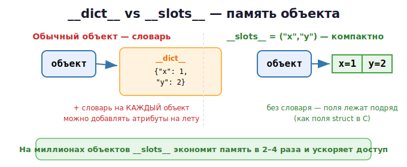

# 16 · ООП и __slots__ 🖼️

> 🎯 **Цель блока:** освоить классы и объекты, понять, как атрибуты хранятся в памяти
> (через словарь `__dict__`), и как `__slots__` экономит память.

---

## 📖 Класс — чертёж, объект — экземпляр

```python
class Dog:
    def __init__(self, name, age):   # конструктор: вызывается при создании
        self.name = name             # атрибут объекта
        self.age = age

    def bark(self):                  # метод
        print(f"{self.name}: Гав!")

rex = Dog("Рекс", 3)                 # создаём объект (экземпляр)
rex.bark()                           # Рекс: Гав!
print(rex.name)                      # Рекс
```

🖼️
```
   class Dog  ──►  чертёж (что умеет любая собака)

   rex  = Dog("Рекс", 3)   ──►  объект #1: {name:"Рекс", age:3}
   bobik = Dog("Бобик", 5) ──►  объект #2: {name:"Бобик", age:5}
   Один класс — много объектов, у каждого свои данные
```

- `self` — ссылка на **сам объект** (как `this` в других языках). Через него методы
  обращаются к данным конкретного экземпляра.
- `__init__` — «конструктор», задаёт начальные атрибуты.

---

## ⭐ Где живут атрибуты: словарь `__dict__`

По умолчанию атрибуты каждого объекта хранятся в **скрытом словаре** `__dict__`:

```python
rex = Dog("Рекс", 3)
print(rex.__dict__)        # {'name': 'Рекс', 'age': 3}
rex.color = "рыжий"        # можно добавить атрибут на лету!
print(rex.__dict__)        # {'name': 'Рекс', 'age': 3, 'color': 'рыжий'}
```

🖼️
```
   rex ──► объект ──► __dict__ = {"name": "Рекс", "age": 3}
                       (обычный словарь — снова хеш-таблица!)
```

💡 Поэтому в Python можно динамически добавлять атрибуты объекту. Гибко, но словарь на
**каждый** объект расходует память. Для миллионов объектов это много.

---

## ⭐ `__slots__` — экономия памяти

Если объектов очень много и набор атрибутов фиксирован — `__slots__` убирает `__dict__`
и хранит атрибуты компактно (как поля структуры в C):

```python
class Point:
    __slots__ = ("x", "y")        # фиксированный набор атрибутов

    def __init__(self, x, y):
        self.x = x
        self.y = y

p = Point(1, 2)
# p.z = 3           # ❌ ошибка! новых атрибутов добавить нельзя
# print(p.__dict__) # ❌ его больше нет
```



> 💡 `__slots__` может сократить память объекта в **2–4 раза** и ускорить доступ к
> атрибутам. Используй, когда создаёшь **миллионы** мелких объектов (точки, узлы, записи).
> Замерь через `sys.getsizeof`. Это прямой инструмент оптимизации памяти (Уровень 4).

---

## 📖 Наследование

```python
class Animal:
    def __init__(self, name):
        self.name = name
    def speak(self):
        print(f"{self.name} издаёт звук")

class Cat(Animal):                  # Cat наследует Animal
    def speak(self):                # переопределение метода
        print(f"{self.name}: Мяу!")

class Dog(Animal):
    def speak(self):
        super().speak()            # доступ к родителю через super() (со скобками!)
        print(f"{self.name}: Гав!")

for animal in [Cat("Барсик"), Dog("Рекс")]:
    animal.speak()                  # каждый по-своему — полиморфизм
```

---

## 📖 Магические методы (dunder)

Методы с `__` управляют поведением объекта в операциях:

```python
class Money:
    def __init__(self, amount):
        self.amount = amount

    def __repr__(self):                    # как объект печатается
        return f"Money({self.amount})"

    def __add__(self, other):              # поведение оператора +
        return Money(self.amount + other.amount)

    def __eq__(self, other):               # поведение ==
        return self.amount == other.amount

a = Money(100)
b = Money(50)
print(a + b)          # Money(150)
print(a == Money(100))# True
```

| Метод | Управляет |
|-------|-----------|
| `__init__` | создание объекта |
| `__repr__` / `__str__` | печать/отображение |
| `__len__` | `len(obj)` |
| `__eq__`, `__lt__` | `==`, `<` |
| `__add__`, `__mul__` | `+`, `*` |
| `__getitem__` | `obj[key]` |

---

## 📖 @dataclass — классы без шаблонного кода

Для классов-«контейнеров данных» есть удобный декоратор:

```python
from dataclasses import dataclass

@dataclass
class Point:
    x: int
    y: int

p = Point(1, 2)
print(p)              # Point(x=1, y=2) — __repr__ сгенерирован
print(p == Point(1, 2))  # True — __eq__ сгенерирован

@dataclass(slots=True)   # можно сразу со slots для экономии памяти!
class FastPoint:
    x: int
    y: int
```

---

## ✅ Задачи

1. **Класс BankAccount.** Атрибуты: владелец, баланс. Методы: пополнить, снять (с
   проверкой), показать баланс.
2. **Класс Rectangle.** Методы площади, периметра, `__repr__`. Сравнение по площади (`__lt__`).
3. **Наследование.** Базовый `Shape` и потомки `Circle`, `Square` со своими `area()`.
4. **Vector с операторами.** Класс 2D-вектора с `__add__`, `__sub__`, `__eq__`, `__repr__`.
5. **__slots__.** Создай класс `Point` со `__slots__` и без. Создай по 1 млн объектов
   каждого, сравни память (`sys.getsizeof` или общий расход). Сделай вывод.
6. **dataclass.** Перепиши любой свой класс через `@dataclass`.
7. ⭐ **Связный список ООП.** Класс `Node` и `LinkedList` с методами добавления, печати,
   поиска (вспомни структуры данных из курса C!).

---

## ❓ Проверь себя

1. Что такое класс, объект, `self`, `__init__`?
2. Где по умолчанию хранятся атрибуты объекта?
3. Что делает `__slots__` и когда его применять?
4. Что такое наследование и полиморфизм?
5. Зачем нужны магические методы (`__add__`, `__repr__`)?
6. Чем удобен `@dataclass`?

---

## ✅ Чек-лист

- [ ] Создаю классы с атрибутами и методами
- [ ] Понимаю `__dict__` как хранилище атрибутов
- [ ] Знаю, как и зачем `__slots__` экономит память
- [ ] Применяю наследование и переопределение
- [ ] Использую магические методы и `@dataclass`

> 🏛️ **Хочешь ООП глубже?** Это были основы. Инкапсуляция и `@property`, `super()`/MRO,
> абстракция (ABC/Protocol), полиморфизм и перегрузка операторов — в разделе
> [🏛️ Углублённое ООП](../03c-oop/README.md). А про **проектирование** объектами (четыре
> столпа, SOLID, паттерны) — в отдельном треке [🏛️ ООП](../../OOP/README.md).

➡️ Следующий: [17 · Исключения](17-exceptions.md)
