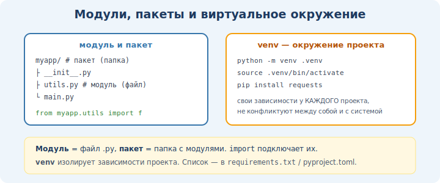

# 18 · Модули, пакеты и виртуальные окружения 🛠️

> 🎯 **Цель блока:** научиться разбивать код на файлы, подключать чужие библиотеки и
> изолировать зависимости проектов через виртуальные окружения. Так пишут реальные
> Python-проекты.

---

## 📖 Модуль — это просто файл .py

Любой `.py` файл — это модуль. Его можно подключить в другом файле.

**mymath.py:**
```python
PI = 3.14159

def square(x):
    return x * x

def circle_area(r):
    return PI * r * r
```

**main.py:**
```python
import mymath                      # подключить весь модуль
print(mymath.square(5))            # обращение через имя модуля
print(mymath.PI)

from mymath import square, PI      # подключить конкретное
print(square(5))

from mymath import circle_area as area   # с переименованием
import mymath as mm                # модуль под коротким именем
```

🖼️
```
   main.py  ──import──►  mymath.py
   использует функции и переменные из подключённого модуля
```

---

## ⭐ `if __name__ == "__main__"`

Часто в модулях видишь эту строку. Она отделяет «код для запуска» от «кода для импорта»:

```python
# mymath.py
def square(x):
    return x * x

if __name__ == "__main__":         # выполнится ТОЛЬКО при прямом запуске файла
    print("Тестируем:", square(5)) # при import этот блок НЕ выполнится
```

💡 Когда файл **запускают** напрямую (`python mymath.py`) — `__name__` равно `"__main__"`.
Когда его **импортируют** — `__name__` равно имени модуля. Эта проверка не даёт
тестовому/демо-коду выполняться при импорте.

---

## 📖 Встроенные модули (батарейки в комплекте)

Python поставляется с огромной стандартной библиотекой:

```python
import math
math.sqrt(16)          # 4.0
math.pi                # 3.14159...

import random
random.randint(1, 6)   # случайное от 1 до 6
random.choice([1,2,3]) # случайный элемент

import os
os.getcwd()            # текущая папка
os.listdir(".")        # файлы в папке

import datetime
datetime.date.today()  # сегодняшняя дата

import json
json.dumps({"a": 1})   # объект → JSON-строка
json.loads('{"a": 1}') # JSON-строка → объект

import sys
sys.argv               # аргументы командной строки
```

---

## ⭐ pip — установка чужих библиотек

`pip` ставит пакеты из репозитория **PyPI** (миллионы готовых библиотек):

```powershell
pip install requests        # установить
pip install requests==2.31.0  # конкретная версия
pip list                    # что установлено
pip uninstall requests      # удалить
pip freeze > requirements.txt  # сохранить список зависимостей
pip install -r requirements.txt  # установить из списка
```

```python
import requests             # после установки можно использовать
response = requests.get("https://api.github.com")
print(response.status_code)
```

---

## ⭐⭐ Виртуальные окружения — изоляция проектов



> ⚠️ **Проблема:** проект A нужна `requests 2.0`, проекту B — `requests 3.0`. Если ставить
> глобально, они конфликтуют. Решение — **виртуальное окружение**: отдельная «песочница»
> с библиотеками для каждого проекта.

🖼️
```
   Проект A ──► venv-A (requests 2.0, pandas 1.5)
   Проект B ──► venv-B (requests 3.0, django 5.0)
   Окружения изолированы — библиотеки не конфликтуют
```

### Создание и активация (Windows)

```powershell
# 1. Создать окружение (папка .venv в проекте)
python -m venv .venv

# 2. Активировать
.venv\Scripts\Activate

# (в начале строки терминала появится (.venv) — значит активно)

# 3. Ставить пакеты — теперь они только в этом окружении
pip install requests

# 4. Деактивировать
deactivate
```

### macOS / Linux
```bash
python3 -m venv .venv
source .venv/bin/activate
pip install requests
deactivate
```

> 💡 **Правило профи:** каждый новый проект начинай с создания venv. Добавь `.venv/` в
> `.gitignore`, а зависимости фиксируй в `requirements.txt`. В VS Code выбери интерпретатор
> из `.venv` (Ctrl+Shift+P → Python: Select Interpreter).

---

## 📖 Пакет — папка с модулями

Когда модулей много, их группируют в **пакет** — папку (раньше требовался файл
`__init__.py`):

```
myproject/
├── main.py
└── utils/              ← пакет
    ├── __init__.py
    ├── math_tools.py
    └── text_tools.py
```

```python
from utils.math_tools import square
from utils import text_tools
```

---

## ✅ Задачи

1. **Свой модуль.** Вынеси математические функции из прошлых задач в `mymath.py`,
   подключи из `main.py` тремя разными способами импорта.
2. **`__main__`.** Добавь в свой модуль тестовый блок под `if __name__ == "__main__"`,
   убедись, что при импорте он не выполняется.
3. **Стандартная библиотека.** Напиши программу, использующую `random`, `datetime` и
   `math` вместе (например генератор «гороскопа» по дате).
4. **venv.** Создай виртуальное окружение, активируй, установи `requests`, напиши
   программу, которая получает данные с любого открытого API.
5. **requirements.** Зафиксируй зависимости в `requirements.txt`, удали venv, пересоздай
   и восстанови из файла.
6. ⭐ **Пакет.** Организуй мини-проект из пакета с 2–3 модулями и `main.py`.

---

## ❓ Проверь себя

1. Что такое модуль? Как его подключить?
2. Зачем нужен `if __name__ == "__main__"`?
3. Что делает `pip` и откуда он берёт пакеты?
4. Какую проблему решают виртуальные окружения?
5. Как создать и активировать venv?
6. Зачем нужен `requirements.txt`?

---

## ✅ Чек-лист

- [ ] Разбиваю код на модули, импортирую разными способами
- [ ] Использую `if __name__ == "__main__"`
- [ ] Знаю полезные модули стандартной библиотеки
- [ ] Ставлю пакеты через pip
- [ ] Создаю и использую виртуальные окружения
- [ ] Фиксирую зависимости в requirements.txt

➡️ Следующий: [19 · Файлы и контекстные менеджеры](19-files-context.md)
