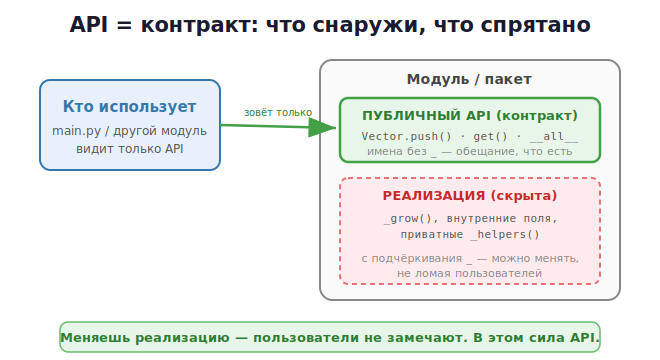

# 2 · Проектирование API модуля 🖼️⭐

> 🎯 **Цель блока:** научиться проектировать **API** — публичное «лицо» твоего модуля или
> класса, которым удобно пользоваться, не зная внутренностей.

---

## 📖 Что такое API в Python

**API** твоего модуля — это публичные функции, классы и их методы, через которые с ним
работают. Это **контракт**: «вот что я умею, а как — моё дело».



💡 Публичное (имена без `_`, перечисленные в `__all__`) — это API. Всё с подчёркивания —
скрытая реализация, которую можно менять, не ломая пользователей.

---

## ⭐ Принцип №1: скрывай реализацию

### ❌ Плохо: пользователь лезет во внутренности
```python
cache = {}                          # глобальный словарь наружу
def get_user(login):
    if login in cache:              # пользователь может испортить cache напрямую
        return cache[login]
    ...
```

### ✅ Хорошо: внутреннее спрятано
```python
class UserClient:
    def __init__(self):
        self._cache = {}            # _ → приватное, деталь реализации

    def get_user(self, login):      # публичный API
        if login in self._cache:
            return self._cache[login]
        user = self._fetch(login)   # _fetch тоже приватный
        self._cache[login] = user
        return user

    def _fetch(self, login):        # внутренний помощник — можно переписать
        ...
```

🖼️ Пользователь зовёт `client.get_user("x")` и не знает про `_cache`/`_fetch`. Ты
свободно меняешь кэширование — публичный API не меняется.

---

## ⭐ Принцип №2: понятные имена и сигнатуры

```python
# ✅ говорящие имена, явные аргументы
def get_user(login: str) -> User: ...
def send_email(to: str, subject: str, body: str) -> bool: ...

# ❌ непонятно
def proc(x, y, z, flag): ...
```

- глагол + существительное: `get_user`, `save_config`, `parse_line`;
- именованные аргументы для ясности: `send_email(to=..., subject=...)`;
- не больше 3–4 позиционных аргументов; много параметров → передавай объект/`dataclass`.

---

## ⭐ Принцип №3: аннотации типов = документация API

Типы (из [Senior · 25](../04-senior/25-typing-testing.md)) делают API понятным и
проверяемым:

```python
from dataclasses import dataclass

@dataclass
class User:
    login: str
    name: str
    repos: int

def get_user(login: str) -> User:        # сразу видно: вход str, выход User
    ...

def find(key: str) -> User | None:       # может вернуть None — честно сказано в типе
    ...
```

💡 По типам IDE даёт точные подсказки, а `mypy` ловит ошибки до запуска. Хороший API —
типизированный.

---

## ⭐ Принцип №4: docstring — встроенная документация

```python
def get_user(login: str) -> User:
    """Получить пользователя по логину.

    Args:
        login: логин на GitHub (например "torvalds").

    Returns:
        Объект User с данными профиля.

    Raises:
        UserNotFound: если пользователя нет (404).
    """
    ...
```

💡 `help(get_user)` и IDE покажут этот docstring. Документируй: что делает, аргументы, что
возвращает, какие исключения бросает. Это часть контракта API.

---

## ⭐ Принцип №5: предсказуемые ошибки

API должен честно сигналить о проблемах — через **исключения** (модуль 17), а не молча
возвращать `None` или печатать в консоль.

```python
class UserNotFound(Exception):
    """Пользователь не найден."""

def get_user(login: str) -> User:
    data = _fetch(login)
    if data is None:
        raise UserNotFound(f"Нет пользователя {login}")   # явная, ловимая ошибка
    return User(**data)
```

> ⚠️ Плохой API «глотает» ошибки (`except: pass`) или печатает `print("ошибка")`. Хороший —
> бросает понятное исключение, а решение, что делать, оставляет вызывающему.

---

## ⭐ Принцип №6: стабильность и версии

Когда твоим модулем пользуются — ломать API больно. Поэтому **семантическое
версионирование** `MAJOR.MINOR.PATCH`:

- PATCH (1.0.**1**) — починка, API не меняется;
- MINOR (1.**1**.0) — добавили возможности, старое работает;
- MAJOR (**2**.0.0) — сломали совместимость.

```python
__version__ = "1.2.0"   # в __init__.py
```

💡 Поэтому и важно прятать реализацию: пока публичные имена стабильны, ты свободно меняешь
внутренности и выпускаешь MINOR/PATCH.

---

## 📋 Чек-лист хорошего API

```
   ✅ Реализация скрыта (_приватное, __all__ для публичного)
   ✅ Говорящие имена, явные аргументы, dataclass для сложных данных
   ✅ Аннотации типов на всех публичных функциях
   ✅ Docstring: что делает, аргументы, возврат, исключения
   ✅ Ошибки — через исключения, а не None/print
   ✅ Версионирование, стабильный публичный интерфейс
   ✅ Минимум публичных имён — «маленькая дверь, большой дом»
```

---

## ✅ Задачи

1. **Класс-клиент.** Спроектируй класс с публичными методами и `_приватными` помощниками;
   скрой внутреннее состояние за `_`.
2. **Типы + docstring.** Добавь аннотации типов и docstring ко всем публичным функциям
   своего модуля. Проверь `help(...)` и `mypy`.
3. **Свои исключения.** Замени в своём API возврат `None`/печать на понятные исключения.
4. **dataclass-результат.** Возвращай из функции `@dataclass` вместо словаря/кортежа.
5. **__all__ и версия.** Настрой публичный API пакета через `__all__`, задай `__version__`.
6. ⭐ **API-ревью.** Перечитай свой модуль через день: понятно ли пользоваться только по
   именам, типам и docstring, не открывая реализацию?

---

## ❓ Проверь себя

1. Что такое API модуля в Python и из чего он состоит?
2. Как обозначить приватное? Что делает `__all__`?
3. Зачем аннотации типов в API?
4. Что должен описывать docstring?
5. Почему ошибки лучше отдавать исключениями, а не `None`/`print`?
6. Что такое семантическое версионирование?

---

## ✅ Чек-лист

- [ ] Прячу реализацию за `_` и `__all__`
- [ ] Даю говорящие имена и явные сигнатуры
- [ ] Типизирую и документирую публичный API
- [ ] Сообщаю об ошибках через исключения
- [ ] Понимаю версионирование и стабильность

➡️ Следующий: [3 · Работа с веб-API (HTTP/REST/JSON)](03-web-api.md)
