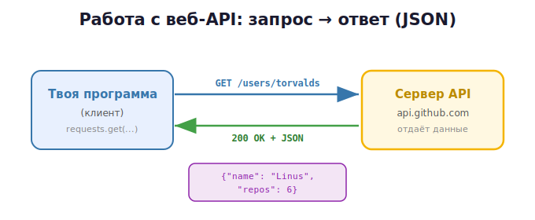

# 3 · Работа с веб-API (HTTP/REST/JSON) 🖼️⭐

> 🎯 **Цель блока:** научиться обращаться к **чужим сервисам по сети** — погоде, GitHub,
> любым REST API. Это одна из самых востребованных практических навыков Python.

---

## 📖 Что такое веб-API

Если раньше «API» был интерфейсом твоего модуля, то **веб-API** — это интерфейс **чужого
сервиса в интернете**: ты шлёшь HTTP-запрос на URL, он отвечает данными (обычно JSON).



У погоды, карт, банков, GitHub, нейросетей — у всех есть веб-API. Python с библиотекой
**requests** делает работу с ними очень простой.

---

## ⭐ Первый запрос: requests

```python
import requests

response = requests.get("https://api.github.com/users/torvalds")
print(response.status_code)        # 200
data = response.json()             # JSON → словарь Python!
print(data["name"])                # Linus Torvalds
print(data["public_repos"])        # 6
```

🖼️ Всё в трёх шагах: запрос → проверка статуса → `.json()` превращает ответ в словарь
(вспомни модуль про коллекции — это обычный dict).

> 🛠️ Установка: `pip install requests` (в активированном venv!).

---

## 📖 HTTP-методы

```python
requests.get(url)                          # получить данные
requests.post(url, json={"name": "Гена"})  # отправить/создать
requests.put(url, json={...})              # заменить
requests.patch(url, json={...})            # изменить часть
requests.delete(url)                       # удалить
```

| Метод | Зачем |
|-------|-------|
| GET | читать |
| POST | создавать/отправлять |
| PUT/PATCH | изменять |
| DELETE | удалять |

---

## ⭐ Параметры, заголовки, ключи

```python
# Параметры запроса (?q=python&per_page=5)
response = requests.get(
    "https://api.github.com/search/repositories",
    params={"q": "python", "per_page": 5},      # requests сам соберёт URL
)

# Заголовки (например авторизация ключом)
headers = {"Authorization": "Bearer ТВОЙ_ТОКЕН", "User-Agent": "my-app"}
response = requests.get(url, headers=headers)

# Таймаут — ВСЕГДА ставь, иначе можешь зависнуть навечно
response = requests.get(url, timeout=10)
```

> ⚠️ **Никогда не пиши API-ключи прямо в коде** (и не коммить в git!). Храни в переменных
> окружения:
> ```python
> import os
> token = os.environ["GITHUB_TOKEN"]    # ключ берётся из окружения, не из кода
> ```

---

## ⭐ Коды ответа — всегда проверяй

```python
response = requests.get(url, timeout=10)

if response.status_code == 200:
    data = response.json()
elif response.status_code == 404:
    print("Не найдено")
elif response.status_code == 429:
    print("Слишком много запросов — подожди")
else:
    print(f"Ошибка: {response.status_code}")

# или короче — бросить исключение при ошибочном коде:
response.raise_for_status()        # выбросит исключение, если код 4xx/5xx
```

**Коды:** `200` OK · `201` создано · `400` плохой запрос · `401` нет авторизации ·
`404` не найдено · `429` лимит · `500` ошибка сервера.

---

## ⭐ Обработка ошибок сети

Сеть ненадёжна: нет интернета, таймаут, сервер упал. Оборачивай в `try/except` (модуль 17):

```python
import requests

try:
    response = requests.get(url, timeout=10)
    response.raise_for_status()
    data = response.json()
except requests.exceptions.Timeout:
    print("Сервер не ответил вовремя")
except requests.exceptions.ConnectionError:
    print("Нет соединения")
except requests.exceptions.HTTPError as e:
    print(f"Ошибка HTTP: {e}")
```

---

## 📖 JSON туда и обратно

```python
# Ответ JSON → объект Python
data = response.json()             # dict/list
name = data["name"]

# Отправить объект Python как JSON
requests.post(url, json={"title": "Привет", "done": False})   # сам сериализует
```

💡 `response.json()` = `json.loads(response.text)`. JSON-объект становится словарём,
JSON-массив — списком. Дальше работаешь как с обычными коллекциями (модуль 13).

---

## 📖 Пагинация и лимиты

Большие списки API отдаёт **по страницам**:

```python
all_items = []
page = 1
while True:
    r = requests.get(url, params={"page": page, "per_page": 100}, timeout=10)
    items = r.json()
    if not items:            # пустая страница → конец
        break
    all_items.extend(items)
    page += 1
```

> ⚠️ Уважай **rate limit** (лимит запросов). Не шли тысячи запросов подряд — сервер
> ответит `429` и может забанить. При больших объёмах делай паузы (`time.sleep`) или
> используй asyncio (Senior · 23) аккуратно.

---

## ⭐ Хороший тон: оберни API в свой клиент

Не разбрасывай `requests.get` по всему коду — спрячь за **своим API** (модуль 2!):

```python
class GitHubClient:
    BASE = "https://api.github.com"

    def __init__(self, token: str | None = None, timeout: int = 10):
        self._session = requests.Session()       # переиспользует соединение
        self._timeout = timeout
        if token:
            self._session.headers["Authorization"] = f"Bearer {token}"

    def get_user(self, login: str) -> dict:
        r = self._session.get(f"{self.BASE}/users/{login}", timeout=self._timeout)
        r.raise_for_status()
        return r.json()

# Пользователь не знает про requests, сессии, заголовки — только чистый API:
client = GitHubClient()
user = client.get_user("torvalds")
```

💡 Это соединяет обе грани раздела: ты **используешь** чужой веб-API и **проектируешь
свой** поверх него. Так устроены все нормальные SDK.

---

## ✅ Задачи

1. **Первый запрос.** Получи данные пользователя GitHub, выведи имя и число репозиториев.
2. **Параметры.** Через GitHub Search найди 5 репозиториев по слову «python».
3. **Коды и ошибки.** Запроси несуществующего пользователя, обработай 404 и ошибки сети.
4. **Погода.** Возьми любой открытый weather API (например open-meteo без ключа), выведи
   температуру по координатам.
5. **Ключ из окружения.** Используй API с ключом, храня ключ в переменной окружения, а не
   в коде.
6. **Пагинация.** Собери все репозитории пользователя постранично.
7. ⭐ **Свой клиент.** Оберни выбранный API в класс-клиент с чистым типизированным API
   (методы, исключения, таймауты, сессия).

---

## ❓ Проверь себя

1. Чем веб-API отличается от API твоего модуля?
2. Как сделать GET-запрос и превратить ответ в словарь?
3. Зачем `timeout` и `raise_for_status`?
4. Где хранить API-ключи и почему не в коде?
5. Что значат коды 200/404/429/500?
6. Зачем оборачивать `requests` в свой класс-клиент?

---

## ✅ Чек-лист «раздел Проекты и API пройден» 🎉

- [ ] Раскладываю проект по пакетам и модулям
- [ ] Проектирую чистый типизированный API со скрытой реализацией
- [ ] Делаю запросы к веб-API через requests
- [ ] Проверяю коды ответа и обрабатываю ошибки сети
- [ ] Храню ключи в окружении, ставлю таймауты
- [ ] Оборачиваю чужой API в свой клиент

➡️ ✅ [Задачи раздела](TASKS.md) → 🚀 [Мини-проект: CLI-клиент для веб-API](PROJECT.md)
