# 🐍 Дорожная карта по языку Python

Путь от «никогда не программировал» до «понимаю память Python как Senior».

> 💡 **Если ты прошёл курс по C** — тебе будет вдвойне интересно. В C ты управлял памятью
> **вручную** (malloc/free). В Python память управляется **автоматически** (сборщик мусора),
> но это не магия. Здесь ты поймёшь, что происходит за кулисами: ссылки, объекты,
> подсчёт ссылок. А кто не знает C — ничего страшного, начнём с азов.

---

## 🧠 Чем «память» в Python отличается от C

| | **C** | **Python** |
|--|-------|-----------|
| Переменная | именованная ячейка с **значением** | **имя-ярлык**, ссылающееся на объект |
| Память | выделяешь/освобождаешь сам | управляется автоматически (GC) |
| Указатели | явные (`*`, `&`) | скрыты (всё — ссылки) |
| Объект | его нет, есть байты | **всё** является объектом |
| Очистка | `free()` вручную | подсчёт ссылок + сборщик мусора |

🎯 Главная идея курса: **переменная в Python — это не коробка со значением, а ярлык,
наклеенный на объект в памяти**. Понять это — значит понять Python.

---

## 🗺️ Карта курса

```mermaid
flowchart TD
    Start([🥚 Старт: я ничего не умею]) --> S0

    subgraph LVL0 [🥚 Уровень 0 — Подготовка]
        S0[00 · Как работает Python и память]
        S1[01 · Установка Python и редактора]
        S2[02 · Первая программа, REPL]
    end

    subgraph LVL1 [🐣 Уровень 1 — Junior: основы]
        B1[03 · Переменные как ссылки]
        B2[04 · Числа и строки]
        B3[05 · Ввод-вывод]
        B4[06 · Операторы и условия]
        B5[07 · Циклы]
        B6[08 · Функции]
    end

    subgraph LVL2 [🐥 Уровень 2 — ПАМЯТЬ ⭐ ядро курса]
        M1[09 · Объекты и ссылки: is vs ==]
        M2[10 · Изменяемые и неизменяемые]
        M3[11 · Подсчёт ссылок и сборщик мусора]
        M4[12 · Копирование: shallow / deep]
        M5[13 · Коллекции в памяти]
    end

    subgraph LVL3 [🐥 Уровень 3 — Middle]
        D1[14 · dict и set: хеш-таблицы внутри]
        D2[15 · Генераторы и итераторы]
        D3[16 · ООП и __slots__]
        D4[17 · Исключения]
        D5[18 · Модули, пакеты, venv]
        D6[19 · Файлы и контекстные менеджеры]
    end

    subgraph OOP [🏛️ Раздел — Углублённое ООП]
        O1[1 · Инкапсуляция и @property]
        O2[2 · Наследование, super, MRO]
        O3[3 · Абстракция и полиморфизм]
        O4[4 · Магические методы]
    end

    subgraph LVL4 [🦅 Уровень 4 — Senior]
        Z1[20 · Память глубоко: gc, weakref, tracemalloc]
        Z2[21 · Декораторы и замыкания]
        Z3[22 · Профилирование памяти и скорости]
        Z4[23 · GIL, потоки, процессы, asyncio]
        Z5[24 · Производительность и numpy]
        Z6[25 · Типизация, тесты, инструменты]
    end

    S0-->S1-->S2-->B1
    B1-->B2-->B3-->B4-->B5-->B6-->M1
    M1-->M2-->M3-->M4-->M5-->D1
    D1-->D2-->D3-->D4-->D5-->D6-->O1
    O1-->O2-->O3-->O4-->Z1
    Z1-->Z2-->Z3-->Z4-->Z5-->Z6-->Done
    Done([🦅 Senior Python developer])
```

---

## 📂 Содержание

### 🥚 Уровень 0 — Подготовка
- [00 · Как работает Python и память](00-setup/00-how-python-works.md)
- [01 · Установка Python и редактора](00-setup/01-installation.md)
- [02 · Первая программа и REPL](00-setup/02-first-program.md)

### 🐣 Уровень 1 — Junior (основы)
- [03 · Переменные как ссылки](01-basics/03-variables-references.md)
- [04 · Числа и строки](01-basics/04-numbers-strings.md)
- [05 · Ввод и вывод](01-basics/05-io.md)
- [06 · Операторы и условия](01-basics/06-operators-conditions.md)
- [07 · Циклы](01-basics/07-loops.md)
- [08 · Функции](01-basics/08-functions.md)
- ✅ [Задачи уровня 1](01-basics/TASKS.md)
- 🚀 [Пет-проект: текстовая игра](01-basics/PROJECT.md)

### 🐥 Уровень 2 — ПАМЯТЬ ⭐
- [09 · Объекты и ссылки](02-memory/09-objects-references.md)
- [10 · Изменяемые и неизменяемые](02-memory/10-mutable-immutable.md)
- [11 · Подсчёт ссылок и сборщик мусора](02-memory/11-refcount-gc.md)
- [12 · Копирование объектов](02-memory/12-copying.md)
- [13 · Коллекции в памяти](02-memory/13-collections-memory.md)
- ✅ [Задачи уровня 2](02-memory/TASKS.md)
- 🚀 [Пет-проект: визуализатор ссылок](02-memory/PROJECT.md)

### 🐥 Уровень 3 — Middle
- [14 · dict и set: хеш-таблицы](03-middle/14-dict-set-hashing.md)
- [15 · Генераторы и итераторы](03-middle/15-generators-iterators.md)
- [16 · ООП и __slots__](03-middle/16-oop-slots.md)
- [17 · Исключения](03-middle/17-exceptions.md)
- [18 · Модули, пакеты, venv](03-middle/18-modules-venv.md)
- [19 · Файлы и контекстные менеджеры](03-middle/19-files-context.md)
- ✅ [Задачи уровня 3](03-middle/TASKS.md)
- 🚀 [Пет-проект: ООП-приложение](03-middle/PROJECT.md)

### 🧩 Раздел — Проекты и API
- [1 · Структура проекта: пакеты и модули](03b-projects-api/01-project-structure.md)
- [2 · Проектирование API модуля](03b-projects-api/02-designing-api.md)
- [3 · Работа с веб-API (HTTP/REST/JSON)](03b-projects-api/03-web-api.md)
- ✅ [Задачи раздела](03b-projects-api/TASKS.md)
- 🚀 [Мини-проект: CLI-клиент для веб-API](03b-projects-api/PROJECT.md)

### 🏛️ Раздел — Углублённое ООП
- [1 · Инкапсуляция и свойства (@property, дескрипторы)](03c-oop/01-encapsulation-properties.md)
- [2 · Наследование, super() и MRO](03c-oop/02-inheritance-mro.md)
- [3 · Абстракция и полиморфизм (ABC, Protocol, duck typing)](03c-oop/03-abstraction-polymorphism.md)
- [4 · Магические методы: операторы, контекст, протоколы](03c-oop/04-magic-methods.md)
- ✅ [Задачи раздела](03c-oop/TASKS.md)
- 🚀 [Мини-проект: библиотека фигур](03c-oop/PROJECT.md)

> 💡 Это «как писать ООП на Python». А «как **проектировать** объектами» (четыре столпа, SOLID,
> паттерны) — отдельный трек [🏛️ ООП](../OOP/README.md).

### 🦅 Уровень 4 — Senior
- [20 · Память глубоко: gc, weakref, tracemalloc](04-senior/20-memory-deep.md)
- [21 · Декораторы и замыкания](04-senior/21-decorators-closures.md)
- [22 · Профилирование](04-senior/22-profiling.md)
- [23 · GIL, потоки, процессы, asyncio](04-senior/23-concurrency.md)
- [24 · Производительность и numpy](04-senior/24-performance.md)
- [25 · Типизация, тесты, инструменты](04-senior/25-typing-testing.md)
- ✅ [Задачи уровня 4](04-senior/TASKS.md)
- 🚀 [Финальные пет-проекты](04-senior/PROJECT.md)

---

## 🧭 Легенда значков

📖 теория · 🖼️ схема памяти · 🛠️ практика · 💡 мысль · ⚠️ опасность · ✅ задача · 🚀 проект · ❓ самопроверка

Начни здесь 👉 [00 · Как работает Python и память](00-setup/00-how-python-works.md)
