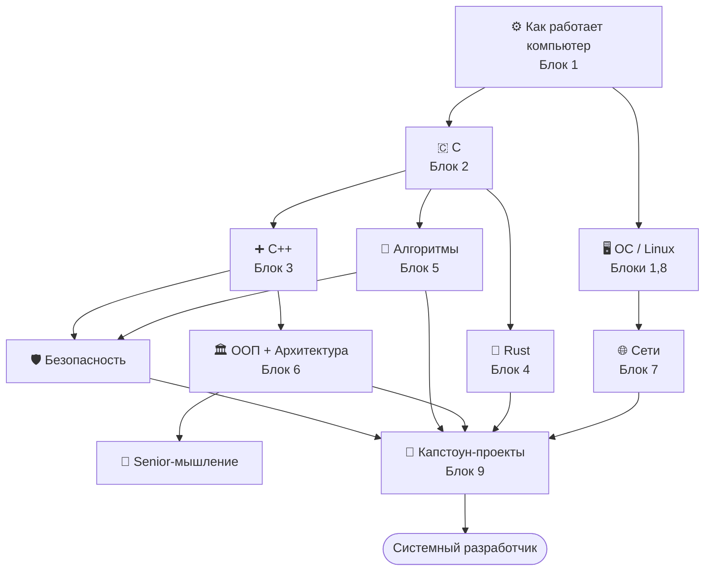

# 🧭 Roadmap · Путь системного разработчика

> **Цель:** стать разработчиком, который понимает устройство компьютера и ОС, пишет быстрый и
> безопасный код, проектирует архитектуру и создаёт большие проекты.

Хорошая новость: **бо́льшая часть этого пути уже есть в курсе** — нужно просто пройти треки в
правильном порядке. Ниже твой роадмап (9 блоков) разложен по трекам курса + капстоун-проекты.

---

## 🗺️ Карта: твои блоки → треки курса

| Блок (твоя цель) | Трек(и) курса | Статус |
|---|---|---|
| **1. Computer Science** (CPU, RAM, кэш, MMU, компиляция, ассемблер, линковка, ELF/PE, ABI, calling convention) | [⚙️ Как работает компьютер](ComputerScience/README.md) (+ виртуальная память/процессы — [🖥️ ОС](OS/README.md)) | ✅ |
| **2. Язык C** (синтаксис, указатели, память, структуры данных, файлы, POSIX) | [🇨 C](C/README.md) (+ [🧮 Алгоритмы](Algorithms/README.md) для структур данных) | ✅ |
| **3. Modern C++** (классы, ООП, шаблоны, STL, RAII, smart pointers, многопоточность, C++17/20) | [➕ C++](Cpp/README.md) (+ [🏛️ ООП](OOP/README.md)) | ✅ |
| **4. Rust** (ownership, borrowing, lifetimes, traits, smart pointers, async/Tokio) | [🦀 Rust](Rust/README.md) | ✅ |
| **5. Алгоритмы** (сортировки, поиск, деревья, графы, DP) | [🧮 Алгоритмы](Algorithms/README.md) | ✅ |
| **6. Архитектура** (SOLID, DRY/KISS/YAGNI, Clean/Hexagonal/Event-Driven) | [🏛️ ООП](OOP/README.md) (+ [🧭 Senior-мышление](Senior/README.md)) | ✅ |
| **7. Сети** (TCP/UDP/HTTP/HTTPS/TLS/WebSocket/DNS + свой сервер) | [🌐 Сети](Network/README.md) | ✅ |
| **8. Linux** (процессы, потоки, сигналы, epoll/io_uring, systemd, bash) | [🖥️ ОС](OS/README.md) (+ [⚙️ CS](ComputerScience/README.md) для тулчейна) | ✅ |
| **9. Senior-проекты** (свой vector/allocator/smart pointer/hash map, HTTP/TCP-сервер, движок, БД, Redis-подобное, компилятор) | [🔨 Капстоун-проекты](Capstone/README.md) | ✅ |
| **+ Безопасный код** (бонус-цель) | [🛡️ Этичный хакинг/AppSec](Security/README.md) (+ [🎭 Соц. инженерия](SocialEng/README.md)) | ✅ |

> Итог: **все 9 блоков и «безопасный код» теперь покрыты полными треками.** Блок 9 — трек
> [🔨 Капстоун-проекты](Capstone/README.md) с пошаговыми гайдами по всем перечисленным проектам.

---

## 📅 Рекомендуемый порядок прохождения

Не обязательно строго линейно, но такой порядок даёт фундамент раньше зависимостей:

**Фазы:**
1. **Фундамент:** ⚙️ CS → 🇨 C → 🧮 Алгоритмы (понять машину + язык близко к железу + базовые структуры).
2. **Глубина в языки:** ➕ C++ и 🦀 Rust (контроль + безопасность; на выбор/параллельно).
3. **Системное:** 🖥️ ОС/Linux + 🌐 Сети (процессы, память, сеть — основа серверов).
4. **Проектирование:** 🏛️ ООП/Архитектура + 🧭 Senior-мышление (как строить большое).
5. **Безопасность:** 🛡️ AppSec (быстрый код, который ещё и безопасен).
6. **Синтез:** 🔨 Капстоун-проекты (Блок 9).

---

## 🔨 Блок 9 · Капстоун-проекты (порядок по сложности)

Эти проекты синтезируют всё. У каждого — **пошаговый гайд** в треке [🔨 Капстоун-проекты](Capstone/README.md).

| Проект | Какие треки синтезирует | Пошаговый гайд |
|---|---|---|
| **Свой `std::vector`** | C++, память, ⚙️ раскладка памяти | [🔨 03 · dynamic array](Capstone/01-data-structures/03-dynamic-array.md) |
| **Свой allocator** | C/C++, куча, ⚙️ выравнивание/кэш | [🔨 07 · аллокатор](Capstone/01-data-structures/07-allocator.md) |
| **Свой smart pointer** | C++ RAII/move, владение | [🔨 06 · smart pointer](Capstone/01-data-structures/06-smart-pointer.md) |
| **Свой hash map** | Алгоритмы (хеш-таблицы), ⚙️ локальность | [🔨 05 · hash map](Capstone/01-data-structures/05-hash-map.md) |
| **TCP / HTTP-сервер** | Сети, ОС (сокеты, epoll), конкурентность | [🔨 Уровень 2 · сервер](Capstone/02-server/08-architecture-sockets.md) |
| **Redis-подобное / База данных** | структуры данных, сеть, память, I-O, надёжность | [🔨 Уровень 3 · хранилище](Capstone/03-storage/13-kv-store.md) |
| **Компилятор / интерпретатор** | весь тулчейн ⚙️, структуры данных, рекурсия | [🔨 Уровень 4 · язык](Capstone/04-language/18-lexer.md) |
| **Игровой движок** | C++/архитектура, ⚙️ производительность/кэш (ECS) | [🔨 22 · движок](Capstone/04-language/22-game-engine.md) |

**Стратегия:** начни с малого (vector → smart pointer → allocator → hash map), потом сетевое
(TCP → HTTP), потом большое (Redis-подобное → БД → компилятор/движок). Каждый проект — применение
нескольких треков сразу. Полные гайды с milestones — в треке 🔨 Капстоун-проекты.

---

## ✅ Как понять, что готов (критерии системного разработчика)

- [ ] **Понимаю компьютер:** объясню путь `исходник → ассемблер → ELF → процесс → CPU+кэш` (⚙️ CS).
- [ ] **Понимаю ОС:** процессы, потоки, виртуальная память, syscalls, планировщик (🖥️ ОС).
- [ ] **Быстрый код:** профилирую, понимаю кэш/ветвления, оптимизирую узкое место (⚙️ Ур.4 + 🧮).
- [ ] **Безопасный код:** знаю OWASP, пишу защищённо, понимаю уязвимости памяти (🛡️ + 🇨/🦀).
- [ ] **Проектирование:** SOLID, чистая архитектура, trade-offs (🏛️ + 🧭).
- [ ] **Большие проекты:** довёл капстоун (свой контейнер/сервер/БД/компилятор) до результата (Блок 9).

---

> 🧭 Открывай любой трек через переключатель вверху панели слева. Этот roadmap — твоя карта; иди
> фазами, строй проекты, измеряй прогресс по чек-листу. Путь длинный, но каждый трек — реальный шаг.
