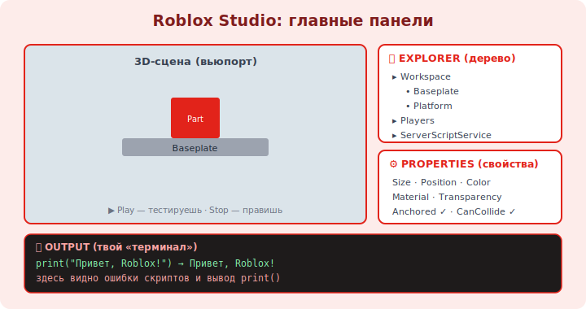

# 02 · Explorer, Properties и первый Part 🖼️⭐

> 🎯 **Цель блока:** освоить два главных окна Studio — **Explorer** (дерево объектов) и **Properties**
> (свойства) — и создать свою первую деталь (Part). Это рабочее место, в котором ты проведёшь всё время.

---

## ⭐ Главные панели Studio

```
   📦 EXPLORER — ДЕРЕВО всех объектов игры (Workspace, Players, Lighting, ...). Сердце Studio:
                 всё в игре — узел этого дерева. (View → Explorer, если скрыта.)
   ⚙️ PROPERTIES — СВОЙСТВА выбранного объекта (размер, цвет, позиция, имя...). Меняешь — мир меняется.
   📜 OUTPUT — сообщения скриптов: ошибки и print() (View → Output). Твой «терминал».
   🧰 TOOLBOX — готовые ассеты (модели/картинки) от сообщества (модуль 07).

   обязательно открой Explorer + Properties + Output — без них работать вслепую.
```

🖼️
```
   типичная раскладка Studio:
   ┌──────────────┬───────────────────────────┬──────────────┐
   │  3D-сцена    │                           │  EXPLORER    │
   │  (вьюпорт)   │     здесь ты строишь      │  Workspace   │
   │              │       и двигаешь          │   ├ Part     │
   │              │       объекты             │   └ Baseplate│
   │              │                           ├──────────────┤
   │              │                           │  PROPERTIES  │
   ├──────────────┴───────────────────────────┤  Size, Color │
   │  OUTPUT — ошибки и print()                │  Position... │
   └───────────────────────────────────────────┴──────────────┘
```



💡 ⭐ **Explorer** — это и есть «дерево объектов» (Instances), о котором весь скриптинг. Привыкай:
кликнул объект в Explorer → видишь его свойства в Properties. Из кода ты будешь обращаться к этим же
объектам и менять эти же свойства (модуль 09).

---

## ⭐ Workspace — видимый мир

```
   WORKSPACE — особый контейнер в Explorer: всё, что физически ЕСТЬ в 3D-мире, лежит здесь
   (Parts, модели, ландшафт, персонажи игроков во время игры).

   другие важные контейнеры (модуль 04, 11):
   • Players — игроки. • Lighting — освещение. • ReplicatedStorage — общее для клиента/сервера.
   • ServerScriptService — серверные скрипты. • StarterGui / StarterPlayer — что выдаётся игроку.
```

---

## ⭐⭐ Создаём первый Part

```
   PART — базовый строительный кубик (деталь). Из Parts собирается почти всё.

   1. вкладка Home (или Model) → кнопка Part → вставится кубик в сцену.
   2. он появился в Explorer внутри Workspace, выделен.
   3. инструменты трансформации (вкладка Model): Move (двигать), Scale (масштаб), Rotate (вращать).
   4. в Properties поменяй:
      • Size — размер (X,Y,Z).
      • Position — где стоит.
      • Color / BrickColor — цвет.
      • Material — материал (Plastic, Neon, Wood...).
      • Anchored — закреплён ли (✓ = не падает; модуль 03 объяснит важность).
   5. переименуй (двойной клик по имени в Explorer): дай осмысленное имя, напр. "Platform".
```

💡 ⭐⭐ Поставь **Anchored = true** для статичных деталей (пол, платформы) — иначе физика уронит их при
запуске. Осмысленные имена в Explorer (не «Part», «Part1») критичны: из скриптов ты будешь искать
объекты ПО ИМЕНИ (`workspace.Platform`), как по переменным.

---

## ⚠️ Ловушки

- ❌ Закрыть/не открыть Explorer и Properties → не понимаешь, что в игре есть.
- ❌ Оставить детали не-Anchored → при Play они падают/разлетаются.
- ❌ Безымянные «Part», «Part1» → потом не найти их в коде по имени.
- ❌ Искать объект глазами в сцене вместо Explorer (в дереве — точнее).

---

## ✅ Задачи

1. Открой Explorer, Properties, Output. Найди Workspace и Baseplate в дереве.
2. Вставь Part. Переименуй в `Platform`. Поставь `Anchored = true`.
3. Поменяй Size, Position, Color, Material. Сделай из него платформу побольше.
4. Создай 3 разноцветные детали, дай каждой осмысленное имя.
5. ⭐ Нажми Play — стоят ли детали? Сними Anchored с одной, снова Play — что произошло?

---

## ❓ Проверь себя

1. Что показывают Explorer и Properties?
2. Что такое Workspace?
3. Что такое Part и зачем свойство Anchored?
4. Почему важны осмысленные имена объектов?

---

## ✅ Чек-лист

- [ ] Открыл и понимаю Explorer / Properties / Output
- [ ] Создаю и трансформирую Parts (Move/Scale/Rotate)
- [ ] Меняю ключевые свойства (Size/Position/Color/Material/Anchored)
- [ ] Даю объектам осмысленные имена

➡️ Следующий: [03 · Parts: свойства, материалы, якорь](../01-studio/03-parts-properties.md)
