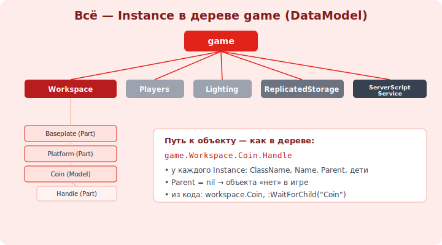

# 04 · Instances: дерево объектов 🖼️⭐⭐

> 🎯 **Цель блока:** понять главную модель Roblox — **всё есть Instance в дереве** (DataModel). Это
> фундамент скриптинга: из кода ты ходишь по этому дереву и меняешь объекты.

---

## ⭐⭐ Всё — это Instance

```
   INSTANCE — любой объект в игре: Part, Model, Script, игрок, звук, GUI — всё это Instances.
   у каждого: ClassName (тип: "Part", "Script"...), Name (имя), Parent (родитель), свойства, дети.

   объекты образуют ДЕРЕВО (иерархию) — то, что ты видишь в Explorer. корень — game (DataModel).
```

🖼️
```
   game (DataModel) — корень всего:
   ├── Workspace            ← видимый 3D-мир (Parts, модели, персонажи)
   │   ├── Baseplate (Part)
   │   ├── Platform (Part)
   │   └── Coin (Model)
   │       └── Handle (Part)
   ├── Players              ← подключённые игроки
   ├── Lighting             ← освещение/атмосфера
   ├── ReplicatedStorage    ← общее для клиента и сервера (RemoteEvents, модули)
   ├── ServerScriptService  ← серверные скрипты (модуль 11)
   ├── ServerStorage        ← серверное хранилище (невидимо клиенту)
   ├── StarterGui           ← GUI, выдаётся каждому игроку
   └── StarterPlayer        ← настройки/скрипты игрока
```



💡 ⭐⭐ Эта иерархия — **DataModel**, и она же доступна из кода через `game`. Понять «всё — Instance в
дереве `game`» = понять, как скрипты управляют игрой. Каждый контейнер имеет назначение (Workspace —
видимое, ServerScriptService — серверная логика, ReplicatedStorage — общее). Класть объекты в
правильное место — половина грамотной игры.

---

## ⭐ Parent и путь к объекту

```
   PARENT — родитель в дереве. объект «существует в игре», только когда у него есть Parent
   (Parent = nil → объект нигде, как будто удалён).

   ПУТЬ к объекту (точечная нотация) — как добраться от game до нужного:
   game.Workspace.Platform
   game.Workspace.Coin.Handle
   game.Players            (короткий доступ: workspace == game.Workspace)

   в Explorer перетаскивание объекта = смена его Parent.
```

💡 ⭐ Путь `game.Workspace.Platform` читается как «дерево вниз»: из game → в Workspace → к ребёнку с
именем Platform. Поэтому ИМЕНА важны (модуль 02): по ним строится путь. Из скрипта это твой способ
«дотянуться» до любого объекта (модуль 09).

---

## ⭐ Свойства, дети, поиск

```
   у Instance есть:
   • свойства — Name, Parent, и специфичные (у Part — Size/Color; у Script — нет таких).
   • дети (children) — вложенные объекты.

   методы навигации (понадобятся в коде, модуль 09):
   :GetChildren()           — список прямых детей.
   :FindFirstChild("имя")   — найти ребёнка по имени (nil, если нет).
   :WaitForChild("имя")     — дождаться появления ребёнка (важно при загрузке).
   :GetDescendants()        — все потомки (вглубь).
   .Parent                  — подняться к родителю.
```

---

## 📖 Зачем разные контейнеры

```
   • Workspace — то, что игроки ВИДЯТ и трогают. сюда — мир.
   • ServerScriptService — серверная логика (защищено, клиент не видит). сюда — Script'ы.
   • ReplicatedStorage — доступно И серверу, И клиенту. сюда — RemoteEvents (модуль 15), общие модули.
   • ServerStorage — только сервер (заготовки, которые не нужны клиенту сразу).
   • StarterGui / StarterPlayer — «стартовый набор» каждого игрока (GUI, локальные скрипты).
   класть в правильный контейнер = правильно с точки зрения безопасности и репликации (модули 15, 19).
```

> 🧭 Дерево объектов Roblox — близкий аналог дерева DOM в вебе или файловой системы: иерархия
> именованных узлов, к которым обращаешься по пути.

---

## ⚠️ Ловушки

- ❌ Думать о Parts отдельно от дерева — всё связано через Parent/children.
- ❌ Класть серверный скрипт в Workspace (виден/уязвим) вместо ServerScriptService.
- ❌ Обращаться к объекту, который ещё не загрузился (нужен `:WaitForChild`, модуль 09).
- ❌ Оставить Parent = nil и удивляться, что объекта «нет» в игре.
- ❌ Путать game.Workspace (видимое) и ReplicatedStorage/ServerStorage (хранилища).

---

## ✅ Задачи

1. Изучи дерево в Explorer: найди Workspace, Players, Lighting, ReplicatedStorage, ServerScriptService.
2. Создай Model `Coin` с ребёнком `Handle` (Part). Запиши путь к Handle от game.
3. Перетащи объект между контейнерами — как меняется Parent? Где он «исчезает» из мира?
4. ⭐ Создай объект, в Properties выставь Parent = ReplicatedStorage. Виден ли он в Workspace? Почему?
5. Нарисуй дерево своего места (game → ... → твои объекты).

---

## ❓ Проверь себя

1. Что такое Instance и DataModel (`game`)?
2. Что значит Parent и как строится путь к объекту?
3. Зачем нужны разные контейнеры (Workspace/ServerScriptService/ReplicatedStorage)?
4. Что делают `:FindFirstChild` и `:WaitForChild`?

---

## ✅ Чек-лист

- [ ] Понимаю «всё — Instance в дереве game (DataModel)»
- [ ] Строю путь к объекту через Parent/имена
- [ ] Знаю назначение основных контейнеров
- [ ] Кладу объекты в правильные контейнеры

➡️ Следующий: [05 · Terrain, освещение, атмосфера](05-terrain-lighting.md)
