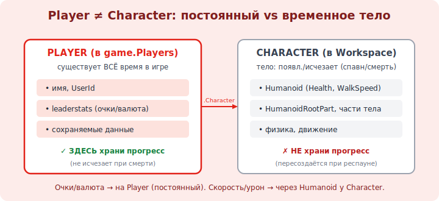

# 06 · Спавн игрока и персонаж 🖼️⭐

> 🎯 **Цель блока:** понять, как игрок появляется в мире (SpawnLocation) и из чего состоит его
> персонаж (Character, Humanoid). Это связь между «миром» и «игроком», важная для всего геймплея.

---

## ⭐ SpawnLocation — где появляется игрок

```
   SpawnLocation — особый Part: точка, где спавнятся (появляются) игроки.
   вставь: Home → Spawn (или Model → SpawnLocation). без неё игроки падают в случайном месте.

   полезные свойства:
   • Neutral / TeamColor — для командных игр (спавн по командам).
   • Duration — время неуязвимости (ForceField) после спавна.
   • Enabled — активна ли точка.

   несколько SpawnLocation → игрок появляется на одной из них (по командам/случайно).
```

💡 ⭐ Поставь SpawnLocation на стартовую платформу — это «вход» игрока в твой мир. В симуляторе спавн
обычно у базы/магазина, откуда игрок идёт собирать ресурсы. После респауна (смерти) игрок снова
появляется здесь.

---

## ⭐⭐ Player и Character — две разные вещи

```
   важно различать:
   • PLAYER — объект игрока (в game.Players). существует всё время, пока человек в игре.
     хранит: имя, UserId, настройки, leaderstats (очки — модуль 17), данные.
   • CHARACTER — физическое ТЕЛО игрока в Workspace (модель с частями тела).
     появляется при спавне, ИСЧЕЗАЕТ при смерти, создаётся заново при респауне.

   связь: player.Character → его текущее тело (или nil, если мёртв/не загрузился).
```

🖼️
```
   game.Players
   └── Player1 (Player)              ← «аккаунт» в игре: имя, очки, данные (постоянно)
            │ .Character
            ▼
   game.Workspace
   └── Player1 (Model = Character)   ← тело: появляется/исчезает (спавн/смерть/респаун)
       ├── Humanoid                  ← «мозг» тела: здоровье, скорость, состояние
       ├── HumanoidRootPart          ← опорная часть (двигать персонажа — через неё)
       ├── Head, Torso/UpperTorso...
       └── Animate (скрипт анимаций)
```



💡 ⭐⭐ **Player ≠ Character.** Player — постоянный (очки, данные живут тут), Character — временное тело
(пересоздаётся при респауне). Это частый источник путаницы: данные игрока вешай на Player (он не
исчезает), а на Character влияй для физики/движения. При смерти Character уничтожается — нельзя на нём
хранить прогресс.

---

## ⭐ Humanoid — управление телом

```
   HUMANOID — компонент персонажа, делающий его «живым»:
   • Health / MaxHealth — здоровье (0 → смерть → респаун).
   • WalkSpeed — скорость ходьбы (по умолч. 16).   • JumpPower / JumpHeight — прыжок.
   • состояния: ходит, прыгает, плавает, упал.
   • события: Humanoid.Died, и т.д. (модуль 10).

   изменяя Humanoid из скрипта (модуль 09), ты влияешь на игрока: ускорить, дать прыжок выше,
   нанести урон (уменьшить Health), вылечить.
```

💡 ⭐ Humanoid — «ручка управления» персонажем: меняешь WalkSpeed → игрок быстрее (часто апгрейд в
симуляторе!), уменьшаешь Health → урон. Большинство механик с игроком идут через Humanoid (модуль 17).

---

## ⚠️ Ловушки

- ❌ Нет SpawnLocation → игроки появляются хаотично/падают.
- ❌ Путать Player и Character (хранить очки на Character → потеряются при смерти).
- ❌ Обращаться к Character сразу при входе игрока — он ещё не загрузился (нужен `CharacterAdded`, модуль 11).
- ❌ Двигать персонажа за случайную часть тела вместо HumanoidRootPart.
- ❌ Забыть, что при респауне Character — НОВЫЙ объект (старые ссылки не работают).

---

## ✅ Задачи

1. Поставь SpawnLocation на стартовую платформу. Проверь спавн в Play.
2. В Play открой Explorer (во время игры) → найди свой Player в Players И Character в Workspace.
3. Найди Humanoid в своём Character. Поменяй WalkSpeed на 50 прямо в Play — что чувствуешь?
4. Уменьши Health до 0 в Play — что происходит? Где появляешься снова?
5. ⭐ Объясни своими словами, почему очки игрока нельзя хранить на Character.

---

## ❓ Проверь себя

1. Зачем нужен SpawnLocation?
2. В чём разница между Player и Character?
3. Что такое Humanoid и что им можно управлять?
4. Что происходит с Character при смерти и респауне?

---

## ✅ Чек-лист

- [ ] Ставлю SpawnLocation для появления игроков
- [ ] Чётко различаю Player (постоянный) и Character (временное тело)
- [ ] Понимаю Humanoid (Health/WalkSpeed/JumpPower) как ручку управления
- [ ] Знаю, что Character пересоздаётся при респауне

➡️ Следующий: [07 · Toolbox, ассеты, импорт](07-toolbox-assets.md)
