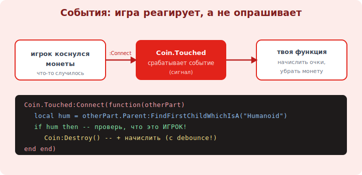

# 10 · События (Events) ⭐⭐ 🖼️

> 🎯 **Цель блока:** освоить события — то, как игра реагирует на происходящее (касание, нажатие,
> вход игрока). Игра — это код, который ОТВЕЧАЕТ на события. Это сердце геймплея.

---

## ⭐⭐ Что такое событие

```
   СОБЫТИЕ (Event) — сигнал «что-то случилось»: игрок коснулся детали, нажал кнопку, зашёл в игру.
   ты ПОДПИСЫВАЕШЬСЯ на событие функцией, и Roblox вызывает её КАЖДЫЙ РАЗ, когда событие происходит.

   подписка: объект.Событие:Connect(функция)

   игра не «идёт сверху вниз» — она ЖДЁТ события и реагирует. это событийная модель (event-driven).
```

🖼️
```
   событие Touched у детали:

   игрок коснулся монеты ──► срабатывает Coin.Touched ──► вызывается твоя функция(hit)
                                                          └─► начислить очки, удалить монету

   Coin.Touched:Connect(function(hit) ... end)
              ▲         ▲              ▲
           событие   подписка    функция-обработчик (получает, КТО коснулся)
```



💡 ⭐⭐ Модель «событие → обработчик» — основа всех игр Roblox. Ты не пишешь «проверяй каждый кадр,
коснулись ли монеты» — ты **подписываешься** на `Touched`, и движок сам вызовет твою функцию при
касании. Это та же идея, что [события/коллбэки в вебе](../../Network/03-application/13-http.md) и
GUI везде: реакция вместо опроса.

---

## ⭐⭐ Touched — касание (главное событие)

```lua
   local coin = workspace:WaitForChild("Coin")

   coin.Touched:Connect(function(otherPart)
       -- otherPart — деталь, что коснулась монеты (часть тела игрока или что угодно)
       -- найдём игрока: у тела игрока есть Humanoid
       local character = otherPart.Parent
       local humanoid = character:FindFirstChildWhichIsA("Humanoid")
       if humanoid then                          -- коснулся именно персонаж
           print("Монету собрал игрок!")
           coin:Destroy()                        -- убрать монету
       end
   end)
```

💡 ⭐⭐ `Touched` срабатывает на ЛЮБОЕ касание (другая деталь, пол, игрок) — поэтому **всегда проверяй,
что коснулся именно игрок** (ищем `Humanoid` у `otherPart.Parent`). Без проверки монета «соберётся»
от случайной детали. Это самый частый шаблон: коснулся → проверил, что игрок → действие.

---

## ⭐ Другие важные события

```lua
   -- ВХОД/ВЫХОД игрока (на сервисе Players, модуль 11):
   local Players = game:GetService("Players")
   Players.PlayerAdded:Connect(function(player)
       print(player.Name .. " зашёл в игру")
   end)
   Players.PlayerRemoving:Connect(function(player)
       print(player.Name .. " вышел")            -- здесь сохраняют прогресс (модуль 16)
   end)

   -- СМЕРТЬ персонажа:
   -- humanoid.Died:Connect(function() ... end)

   -- НАЖАТИЕ кнопки в GUI (модуль 14):
   -- button.MouseButton1Click:Connect(function() ... end)

   -- ИЗМЕНЕНИЕ свойства:
   -- part:GetPropertyChangedSignal("Position"):Connect(function() ... end)
```

💡 ⭐ Набор событий покрывает геймплей: `PlayerAdded` (настроить нового игрока — очки, данные),
`Touched` (собрать/нанести урон), `Died` (респаун/штраф), `MouseButton1Click` (кнопки магазина). Учись
видеть «что должно случиться» → «на какое событие подписаться».

---

## 📖 Отписка и debounce

```lua
   -- Connect возвращает соединение — можно ОТПИСАТЬСЯ:
   local conn = coin.Touched:Connect(onTouch)
   conn:Disconnect()                             -- перестать слушать

   -- DEBOUNCE — защита от многократного срабатывания (Touched стреляет пачкой!):
   local debounce = false
   button.Touched:Connect(function(hit)
       if debounce then return end               -- уже обрабатываем — выйти
       debounce = true
       -- ...действие (начислить, открыть дверь)...
       task.wait(1)                              -- пауза
       debounce = false
   end)
```

💡 ⭐ **Debounce** — обязательный приём: `Touched` срабатывает много раз за одно касание (части тела
задевают по очереди). Без debounce начислишь очки 10 раз вместо одного. Флаг + `task.wait` решают это.

---

## ⚠️ Ловушки

- ❌ `Touched` без проверки на Humanoid → срабатывает от любой детали/пола.
- ❌ Нет debounce → многократное срабатывание (очки×10, урон×10) за одно касание.
- ❌ Думать, что игра идёт «сверху вниз» — она реагирует на события (event-driven).
- ❌ Тяжёлый код в обработчике частого события (Touched, RenderStepped) → лаги.
- ❌ Забыть `:WaitForChild` для объекта, на чьё событие подписываешься (его ещё нет).
- ❌ Опрашивать состояние в цикле вместо подписки на событие (неэффективно).

---

## ✅ Задачи

1. Сделай монету: при касании игроком — `print` и `:Destroy()`. Проверь, что реагирует на игрока.
2. Добавь debounce к кнопке-Part: при касании что-то происходит не чаще раза в секунду.
3. Подпишись на `Players.PlayerAdded` — печатай имя зашедшего. Проверь в режиме Start (2 игрока).
4. ⭐ Сделай «лаву»: Part, при касании игрока уменьшает Humanoid.Health (урон) с debounce.
5. ⭐ Кнопка-Part, что при касании меняет цвет платформы (через событие).

---

## ❓ Проверь себя

1. Что такое событие и как на него подписаться (`:Connect`)?
2. Почему при `Touched` надо проверять Humanoid?
3. Что такое debounce и зачем он нужен?
4. Чем событийная модель лучше опроса в цикле?

---

## ✅ Чек-лист

- [ ] Подписываюсь на события через `:Connect(function ... end)`
- [ ] Обрабатываю `Touched` с проверкой Humanoid
- [ ] Применяю debounce против многократных срабатываний
- [ ] Знаю PlayerAdded/Died/MouseButton1Click и думаю «событие → реакция»

➡️ Следующий: [11 · Сервисы, Script vs LocalScript](11-services-script-types.md)
