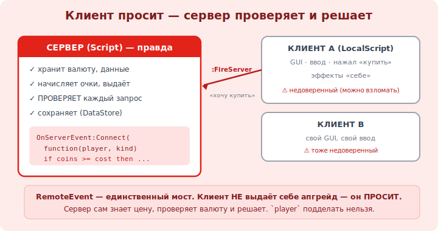

# 15 · Клиент-сервер и RemoteEvents ⭐⭐ 🖼️

> 🎯 **Цель блока:** связать клиент и сервер через RemoteEvents — единственный правильный способ
> «попросить сервер что-то сделать». Это основа честных и работающих многопользовательских игр.

---

## ⭐⭐ Зачем мост клиент↔сервер

```
   напоминание (модуль 11): клиент (LocalScript) и сервер (Script) — разные среды.
   • клиент видит ввод, GUI, нажатия. но НЕ авторитетен (его можно взломать).
   • сервер владеет правдой (валюта, данные). но НЕ видит нажатий кнопок клиента напрямую.

   ПРОБЛЕМА: игрок нажал «купить» в GUI (клиент), а валюту списать и апгрейд выдать должен СЕРВЕР.
   как клиенту «попросить» сервер? → через REMOTE EVENT (мост между ними).
```

🖼️
```
   КЛИЕНТ (LocalScript)                          СЕРВЕР (Script)
   нажал кнопку «купить»                          слушает запросы
        │                                              ▲
        │ remote:FireServer("speed")  ───────────────► │ remote.OnServerEvent
        │                                              │ → ПРОВЕРИТЬ валюту
        │                                              │ → списать, выдать апгрейд
        ▼                                              ▼
   (ждёт результата)               сервер решает — он авторитетен
```



💡 ⭐⭐ **RemoteEvent** — труба между клиентом и сервером. Клиент НЕ выдаёт себе апгрейд сам (подделает)
— он лишь **просит** сервер через RemoteEvent, а сервер **проверяет и решает**. Это золотое правило
сетевой игры: клиент просит, сервер проверяет и делает. Так строятся все покупки, действия, способности.

---

## ⭐⭐ RemoteEvent: как настроить

```lua
   -- 1) создать RemoteEvent в ReplicatedStorage (виден обоим): назови, напр., "BuyUpgrade".
   --    (вставить вручную в Explorer или Instance.new на сервере)

   -- 2) КЛИЕНТ (LocalScript) — отправляет запрос:
   local remote = game.ReplicatedStorage:WaitForChild("BuyUpgrade")
   buyButton.MouseButton1Click:Connect(function()
       remote:FireServer("speed")          -- попросить сервер купить «speed». игрок НЕ передаётся — сервер знает сам!
   end)

   -- 3) СЕРВЕР (Script) — принимает и ПРОВЕРЯЕТ:
   local remote = game.ReplicatedStorage:WaitForChild("BuyUpgrade")
   remote.OnServerEvent:Connect(function(player, upgradeType)
       -- player — Roblox САМ подставляет, кто прислал (нельзя подделать!)
       local cost = 100
       if playerCoins[player] >= cost then          -- ПРОВЕРКА на сервере
           playerCoins[player] -= cost
           -- выдать апгрейд (увеличить WalkSpeed и т.п.)
           print(player.Name .. " купил " .. upgradeType)
       else
           print("недостаточно валюты")             -- отказ
       end
   end)
```

💡 ⭐⭐ Ключевые факты: на `FireServer` первым аргументом в `OnServerEvent` Roblox **сам** подставляет
`player` (кто прислал) — это нельзя подделать. И сервер **обязан проверить** (хватает ли валюты), а не
верить клиенту. `:FireServer(...)` — клиент→сервер; `:FireClient(player, ...)` / `:FireAllClients(...)`
— сервер→клиент (например, обновить GUI).

---

## ⭐ Направления и RemoteFunction

```lua
   RemoteEvent — «выстрелил и забыл» (без ответа):
   • клиент → сервер:  remote:FireServer(args)          → remote.OnServerEvent
   • сервер → один:    remote:FireClient(player, args)  → remote.OnClientEvent
   • сервер → все:     remote:FireAllClients(args)      → remote.OnClientEvent

   RemoteFunction — запрос С ОТВЕТОМ (клиент ждёт результат):
   • client:InvokeServer(args) → сервер OnServerInvoke возвращает значение.
   ⚠️ осторожно: если сервер зависнет/ошибётся, клиент ждёт. для большинства задач хватает RemoteEvent.
```

💡 ⭐ Чаще нужен **RemoteEvent** (асинхронно, без ожидания). `FireAllClients` удобно для «событий для
всех» (кто-то победил, обновить общий счёт). RemoteFunction — когда клиенту реально нужен ответ
(редко); им злоупотреблять не стоит.

---

## ⚠️ Ловушки

- ❌❌ Доверять данным от клиента без проверки на сервере (главная дыра — модуль 19).
- ❌ Передавать `player` через FireServer вручную (Roblox сам подставит; переданному верить нельзя).
- ❌ Выдавать апгрейд/валюту в LocalScript вместо запроса к серверу.
- ❌ RemoteEvent не в ReplicatedStorage (должен быть виден И клиенту, И серверу).
- ❌ RemoteFunction там, где хватило бы RemoteEvent (риск зависания на ответе).
- ❌ Слать RemoteEvent слишком часто (каждый кадр) → нагрузка на сеть.

---

## ✅ Задачи

1. Создай RemoteEvent `BuyUpgrade` в ReplicatedStorage.
2. Клиент (кнопка): `FireServer("speed")`. Сервер (`OnServerEvent`): печатай `player.Name` и тип.
3. На сервере добавь проверку валюты: хватает → списать и «выдать», не хватает → отказ.
4. ⭐ Сервер обновляет GUI клиента: после покупки `FireClient(player, newCoins)` → LocalScript меняет счётчик.
5. ⭐ Объясни, почему `player` в `OnServerEvent` нельзя подделать и почему это важно.

---

## ❓ Проверь себя

1. Зачем нужен RemoteEvent (какую проблему решает)?
2. Кто подставляет `player` в `OnServerEvent` и почему это безопасно?
3. Почему сервер обязан проверять запрос клиента?
4. Чем RemoteEvent отличается от RemoteFunction?

---

## ✅ Чек-лист

- [ ] Связываю клиент и сервер через RemoteEvent (в ReplicatedStorage)
- [ ] Клиент просит (`FireServer`), сервер проверяет и решает (`OnServerEvent`)
- [ ] Знаю про `FireClient`/`FireAllClients` (сервер→клиент)
- [ ] Никогда не доверяю данным клиента без серверной проверки

➡️ Следующий: [16 · Сохранение прогресса: DataStore](16-datastore-save.md)
