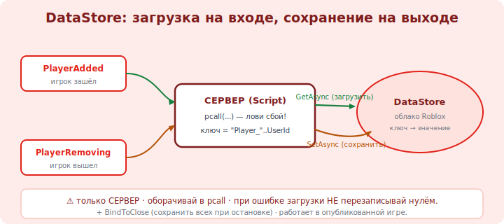

# 16 · Сохранение прогресса: DataStore 🖼️⭐⭐

> 🎯 **Цель блока:** сохранять прогресс игрока между сессиями через DataStore. Без сохранения симулятор
> бессмысленен — игрок копит валюту, выходит, и всё должно остаться.

---

## ⭐ Что такое DataStore

```
   DATASTORE — облачное хранилище данных игры на серверах Roblox (база данных «ключ → значение»).
   сохраняешь по игроку: ключ = его UserId, значение = его данные (валюта, апгрейды, уровень).

   сервис: DataStoreService. работает ТОЛЬКО на СЕРВЕРЕ (Script), не на клиенте.

   ⚠️ требует включить доступ: Game Settings → Security → Enable Studio Access to API Services.
   ⚠️ полноценно работает в ОПУБЛИКОВАННОЙ игре (модуль 22). в локальном тесте — ограниченно.
```

💡 ⭐ DataStore — это база данных твоей игры в облаке Roblox. Доступна только серверу (клиенту нельзя —
он подделает). Чтобы тестировать в Studio, включи «Studio Access to API Services» в настройках игры.
Это пересечение с [треком баз данных](../../Database/00-intro/00-why-databases.md): тот же принцип
«ключ → значение», что в key-value БД.

---

## ⭐⭐ Загрузка и сохранение

```lua
   local DataStoreService = game:GetService("DataStoreService")
   local Players = game:GetService("Players")
   local store = DataStoreService:GetDataStore("PlayerData")     -- именованное хранилище

   -- ЗАГРУЗИТЬ при входе игрока:
   Players.PlayerAdded:Connect(function(player)
       local key = "Player_" .. player.UserId            -- ключ — по UserId (уникален)
       local data
       local ok, err = pcall(function()                  -- pcall — поймать сетевую ошибку!
           data = store:GetAsync(key)
       end)
       if ok then
           playerCoins[player] = data or 0               -- нет данных (новичок) → 0
       else
           warn("не удалось загрузить: " .. tostring(err))  -- НЕ перезаписывай при ошибке!
       end
   end)

   -- СОХРАНИТЬ при выходе игрока:
   Players.PlayerRemoving:Connect(function(player)
       local key = "Player_" .. player.UserId
       local ok, err = pcall(function()
           store:SetAsync(key, playerCoins[player])      -- записать валюту
       end)
       if not ok then warn("не сохранилось: " .. tostring(err)) end
   end)
```



💡 ⭐⭐ Два ключевых правила: **(1) всегда оборачивай DataStore-вызовы в `pcall`** (это сеть, она
падает) и **(2) при ошибке ЗАГРУЗКИ не перезаписывай данные нулём** — иначе сотрёшь чужой прогресс из-за
временного сбоя. Ключ — по `UserId` (он постоянный, в отличие от имени). Загрузка — на `PlayerAdded`,
сохранение — на `PlayerRemoving`.

---

## ⭐ Надёжность сохранения

```
   • SetAsync — просто записать значение.
   • UpdateAsync — прочитать+изменить АТОМАРНО (безопаснее при гонках, напр. два сервера). предпочтительнее для важного.
   • BindToClose — сохранить ВСЕХ при остановке сервера:
       game:BindToClose(function() ...сохранить всех игроков... end)
   • не спамь запросами — у DataStore ЛИМИТЫ (частота вызовов). сохраняй на выходе и периодически (напр. раз в минуту).
   • сохраняй ТАБЛИЦУ (валюта+апгрейды+уровень) одним значением, а не десять ключей.
```

💡 ⭐ Для надёжности: `UpdateAsync` (атомарно) для важных данных, `BindToClose` (сохранить при
закрытии сервера), и периодическое автосохранение (вдруг сервер упадёт — потеряется меньше). Уважай
лимиты частоты — не вызывай DataStore на каждый собранный коин.

---

## 📖 Что и как хранить

```lua
   -- храни СТРУКТУРУ одним значением (таблицей):
   local saveData = {
       coins = playerCoins[player],
       walkSpeedLevel = 3,
       gems = 12,
   }
   store:SetAsync(key, saveData)        -- одно значение = вся прогрессия
   -- при загрузке: data.coins, data.walkSpeedLevel ...
```

---

## ⚠️ Ловушки

- ❌❌ DataStore-вызов без `pcall` → необработанная сетевая ошибка ломает скрипт.
- ❌❌ При ошибке загрузки перезаписать данные нулём → потеря чужого прогресса.
- ❌ Ключ по имени игрока (меняется) вместо UserId (постоянный).
- ❌ Сохранять на каждый коин → упёрся в лимиты частоты DataStore.
- ❌ Забыть `BindToClose` → при остановке сервера прогресс не сохранён.
- ❌ Пытаться читать/писать DataStore с клиента (только сервер!).
- ❌ Не включить «Studio Access to API Services» → в тесте DataStore не работает.

---

## ✅ Задачи

1. Включи API-доступ в Game Settings. Создай DataStore `PlayerData`.
2. Сохраняй валюту на `PlayerRemoving`, загружай на `PlayerAdded` (с `pcall` и ключом по UserId).
3. Проверь цикл: набрал валюту → вышел → зашёл снова → она на месте.
4. ⭐ Перейди на сохранение ТАБЛИЦЫ (coins + один апгрейд). Загружай поля.
5. ⭐ Добавь `BindToClose` (сохранить всех) и автосейв раз в N секунд.

---

## ❓ Проверь себя

1. Что такое DataStore и почему он только на сервере?
2. Зачем `pcall` и почему нельзя перезаписывать при ошибке загрузки?
3. Почему ключ — по UserId, а не по имени?
4. Зачем `UpdateAsync`, `BindToClose` и автосейв?

---

## ✅ Чек-лист

- [ ] Сохраняю/загружаю прогресс через DataStore (ключ по UserId)
- [ ] Оборачиваю вызовы в `pcall`, не перезаписываю при ошибке загрузки
- [ ] Сохраняю на выходе + `BindToClose` + периодически, уважаю лимиты
- [ ] Храню всю прогрессию одной таблицей

➡️ Следующий: [17 · Механики: очки, апгрейды, лидерборд](17-mechanics.md)
