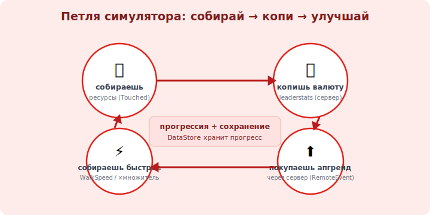

# 17 · Механики: очки, апгрейды, лидерборд 🖼️⭐⭐

> 🎯 **Цель блока:** собрать игровые механики симулятора воедино — leaderstats (видимые очки), система
> апгрейдов и таблица лидеров. Это превращает «сбор ресурсов» в настоящую игру с прогрессией.

---

## ⭐⭐ leaderstats — видимые очки игрока

```lua
   -- leaderstats — особая папка в Player: её содержимое Roblox показывает в таблице игроков (Tab).
   -- стандартный способ показать валюту/уровень.
   local Players = game:GetService("Players")

   Players.PlayerAdded:Connect(function(player)
       local stats = Instance.new("Folder")
       stats.Name = "leaderstats"           -- ИМЯ обязано быть ровно "leaderstats"!
       stats.Parent = player

       local coins = Instance.new("IntValue")   -- число (IntValue) — целые очки
       coins.Name = "Coins"
       coins.Value = 0
       coins.Parent = stats

       -- теперь "Coins" видно в таблице игроков и из кода: player.leaderstats.Coins.Value
   end)
```

💡 ⭐⭐ Папка с именем ровно **`leaderstats`** внутри Player + `IntValue`/`StringValue` в ней = Roblox
автоматически показывает их в таблице игроков (Tab). Это стандарт отображения валюты/уровня. Меняешь
`coins.Value` — число обновляется у всех само (оно реплицируется). Хранить прогресс в `Value`-объектах
удобно: и видно, и легко сохранять в DataStore (модуль 16).

---

## ⭐⭐ Система апгрейдов

```lua
   -- апгрейд = трата валюты на улучшение (скорость, множитель, вместимость).
   -- запрос идёт через RemoteEvent (модуль 15), сервер проверяет и применяет.

   local UPGRADES = {
       speed = { baseCost = 50, perLevel = 25 },   -- дорожает с уровнем
   }

   buyRemote.OnServerEvent:Connect(function(player, kind)
       local coins = player.leaderstats.Coins
       local levelVal = player.leaderstats:FindFirstChild("SpeedLevel")
       local cost = UPGRADES.speed.baseCost + levelVal.Value * UPGRADES.speed.perLevel

       if coins.Value >= cost then                 -- ПРОВЕРКА на сервере
           coins.Value -= cost
           levelVal.Value += 1
           -- применить эффект:
           local hum = player.Character and player.Character:FindFirstChild("Humanoid")
           if hum then hum.WalkSpeed = 16 + levelVal.Value * 4 end   -- быстрее = быстрее собирать
       end
   end)
```



💡 ⭐⭐ Петля прогрессии симулятора: **собрал валюту → купил апгрейд (через сервер) → собираешь быстрее
→ копишь больше**. Апгрейды обычно дорожают с уровнем (`baseCost + level*perLevel`) — это растягивает
игру. Применяй эффект сразу (WalkSpeed, множитель сбора) и сохраняй уровень апгрейда (DataStore).

---

## ⭐ Множители и экономика

```
   типичные механики симулятора:
   • МНОЖИТЕЛЬ сбора — апгрейд «×2 монет за коин» (вместо +1 даёшь +2).
   • ВМЕСТИМОСТЬ/рюкзак — сколько носишь до «сдачи» на базе.
   • РЕБАЗ/перерождение (rebirth) — обнулить прогресс ради постоянного бонуса (классика жанра, удержание).
   • РАЗНЫЕ ЗОНЫ — дороже ресурсы за прогресс (открываются за валюту).

   баланс экономики: стоимость апгрейдов vs доход. слишком дёшево → скучно; дорого → бросают.
```

💡 ⭐ Хорошая экономика — суть симулятора: каждый апгрейд должен ощутимо ускорять, но следующий —
стоить заметно дороже (кривая прогресса). Это [инженерный trade-off/баланс](../../Senior/02-decisions/08-tradeoffs.md):
подбирается тестами и ощущением «хочется ещё чуть-чуть».

---

## 📖 Лидерборд (таблица рекордов)

```
   • встроенный (Tab) — это leaderstats, виден сразу.
   • ГЛОБАЛЬНЫЙ топ (лучшие за всё время) — через OrderedDataStore (отсортированное хранилище):
     записываешь значение игрока, читаешь топ-N, рисуешь на SurfaceGui/доске в мире.
   глобальный топ — мощный мотиватор (соревнование), но это уже работа с OrderedDataStore.
```

---

## ⚠️ Ловушки

- ❌ Папка не названа ровно `leaderstats` → не показывается в таблице.
- ❌❌ Покупка/начисление БЕЗ серверной проверки валюты (клиент подделает — модули 15, 19).
- ❌ Апгрейды без роста цены → игра проходится за минуты (нет прогрессии).
- ❌ Забыть сохранять уровни апгрейдов в DataStore → сбрасываются при выходе.
- ❌ Эффект апгрейда применён, но не переприменяется после респауна (Character новый!).
- ❌ Дисбаланс экономики (слишком быстро/медленно) → игроки уходят.

---

## ✅ Задачи

1. Заведи `leaderstats` с `Coins` (IntValue) на `PlayerAdded`. Проверь, что видно в таблице (Tab).
2. Свяжи сбор монет (модуль 10/12) с `Coins.Value` — растёт ли число в таблице?
3. Сделай апгрейд скорости через RemoteEvent: проверка валюты на сервере, рост цены, эффект на WalkSpeed.
4. ⭐ Сохрани валюту И уровень апгрейда в DataStore; переприменяй WalkSpeed после респауна (CharacterAdded).
5. ⭐ Добавь множитель сбора (×2) как второй апгрейд. Сбалансируй цены.

---

## ❓ Проверь себя

1. Что такое leaderstats и почему имя должно быть точным?
2. Как устроена петля прогрессии симулятора?
3. Почему апгрейды дорожают с уровнем?
4. Где и почему проверяется покупка апгрейда?

---

## ✅ Чек-лист

- [ ] Показываю очки через `leaderstats` (IntValue)
- [ ] Делаю апгрейды через сервер (проверка валюты, рост цены, эффект)
- [ ] Сохраняю валюту и уровни апгрейдов, переприменяю после респауна
- [ ] Думаю про баланс экономики (прогрессия)

➡️ Следующий: [17b · Сделай свою механику (step-by-step) 🧗](17b-build-your-own-mechanic.md) — метод + зацеп ЛКМ/ПКМ.

🎉 (После него — [✅ Задачи уровня 3](TASKS.md) · 🚀 [Проект: полный цикл](PROJECT.md).)
