# 🎮 Трек · Roblox (геймдев на Luau)

> **Сделай свою игру и опубликуй её для миллионов игроков.** Roblox — это редактор **Roblox Studio**
> + язык **Luau** (диалект Lua). Делать игру = расставлять объекты в 3D-мире и оживлять их скриптами:
> события, сервисы, клиент-сервер, сохранение прогресса. Отличный мотивирующий вход в
> программирование и в геймдев.

> 🧭 Скриптинг на Luau опирается на общие основы программирования — если хочешь глубже понять язык,
> загляни в [мостик к основам](02-scripting/08-luau-basics.md). Идеи «как делить код» — как в
> [любом проекте](../C/01-basics/07b-multiple-files.md), но в Roblox это модули `ModuleScript`.

---

## 🗺️ Дорожная карта

```mermaid
graph TD
    subgraph L0 [🥚 Уровень 0 — Введение]
        A0[00 · Что такое Roblox и Luau]
        A1[01 · Установка Studio]
        A2[02 · Explorer и первый Part]
    end
    subgraph L1 [🐣 Уровень 1 — Мир и Studio]
        B0[03 · Parts и свойства]
        B1[04 · Instances: дерево объектов]
        B2[05 · Terrain и освещение]
        B3[06 · Спавн игрока]
        B4[07 · Toolbox и ассеты]
    end
    subgraph L2 [🐥 Уровень 2 — Скриптинг ⭐ ядро]
        C0[08 · Luau: основы]
        C1[09 · Объекты из кода ⭐⭐]
        C2[10 · События ⭐⭐]
        C3[11 · Сервисы, Script vs LocalScript]
        C4[12 · Состояние и игровой цикл]
    end
    subgraph L3 [🦅 Уровень 3 — Геймплей]
        D0[13 · Движение и физика]
        D1[14 · GUI: интерфейс игрока]
        D2[15 · Клиент-сервер, RemoteEvents ⭐⭐]
        D3[16 · Сохранение: DataStore]
        D4[17 · Механики: очки, апгрейды]
    end
    subgraph L4 [🚀 Уровень 4 — Доводка и публикация]
        E0[18 · Мультиплеер и репликация]
        E1[19 · Безопасность: эксплойты]
        E2[20 · Оптимизация]
        E3[21 · Монетизация]
        E4[22 · Публикация и рост]
        E5[23 · Куда расти дальше]
    end
    L0 --> L1 --> L2 --> L3 --> L4 --> Done([🎮 Опубликовал игру])
```

---

## 🎯 Ядро трека — Скриптинг на Luau

> **Расставить кубики мало — игру делают скрипты:** доступ к объектам из кода, реакция на **события**
> (игрок коснулся, нажал кнопку), сервисы и логика клиент-сервер. Кто понимает скриптинг — тот делает
> игру, а не декорацию.

Поэтому центр трека (Уровень 2) — от первой строки Luau до управления объектами мира и событиями.

---

## 🕹️ Сквозной проект — Simulator (кликер/прокачка)

Через все уровни ты собираешь свою игру-**симулятор**: собираешь ресурсы → копишь валюту → покупаешь
апгрейды → собираешь быстрее. Классический жанр Roblox, который проходит через всё: мир, скрипты,
GUI, клиент-сервер, сохранение, монетизация, публикация.

---

## 📂 Содержание

### 🥚 Уровень 0 — Введение
- [00 · Что такое Roblox, Studio и Luau](00-intro/00-what-is-roblox.md)
- [01 · Установка Roblox Studio](00-intro/01-studio-setup.md)
- [02 · Explorer, Properties и первый Part](00-intro/02-explorer-first-part.md)

### 🐣 Уровень 1 — Мир и Studio
- [03 · Parts: свойства, материалы, якорь](01-studio/03-parts-properties.md)
- [04 · Instances: дерево объектов](01-studio/04-instances-hierarchy.md)
- [05 · Terrain, освещение, атмосфера](01-studio/05-terrain-lighting.md)
- [06 · Спавн игрока и персонаж](01-studio/06-player-spawn.md)
- [07 · Toolbox, ассеты, импорт](01-studio/07-toolbox-assets.md)
- ✅ [Задачи уровня 1](01-studio/TASKS.md) · 🚀 [Проект: мир симулятора](01-studio/PROJECT.md)

### 🐥 Уровень 2 — Скриптинг ⭐ ядро
- [08 · Luau: переменные, функции, типы](02-scripting/08-luau-basics.md)
- [09 · Объекты из кода ⭐⭐](02-scripting/09-instances-from-code.md)
- [10 · События (Events) ⭐⭐](02-scripting/10-events.md)
- [11 · Сервисы, Script vs LocalScript](02-scripting/11-services-script-types.md)
- [12 · Состояние и игровой цикл](02-scripting/12-game-state-loops.md)
- ✅ [Задачи уровня 2](02-scripting/TASKS.md) · 🚀 [Проект: ядро симулятора](02-scripting/PROJECT.md)

### 🦅 Уровень 3 — Геймплей
- [13 · Движение и физика](03-gameplay/13-movement-physics.md)
- [14 · GUI: интерфейс игрока](03-gameplay/14-gui.md)
- [15 · Клиент-сервер и RemoteEvents ⭐⭐](03-gameplay/15-client-server-remotes.md)
- [16 · Сохранение прогресса: DataStore](03-gameplay/16-datastore-save.md)
- [17 · Механики: очки, апгрейды, лидерборд](03-gameplay/17-mechanics.md)
- ✅ [Задачи уровня 3](03-gameplay/TASKS.md) · 🚀 [Проект: полный цикл](03-gameplay/PROJECT.md)

### 🚀 Уровень 4 — Доводка и публикация
- [18 · Мультиплеер и репликация](04-publish/18-multiplayer-replication.md)
- [19 · Безопасность: эксплойты и защита](04-publish/19-security-exploits.md)
- [20 · Оптимизация и производительность](04-publish/20-optimization.md)
- [21 · Монетизация (Game Passes, Robux)](04-publish/21-monetization.md)
- [22 · Публикация и рост игры](04-publish/22-publishing-growth.md)
- [23 · Куда расти дальше](04-publish/23-whats-next.md)
- ✅ [Задачи уровня 4](04-publish/TASKS.md) · 🚀 [Проект: опубликуй игру](04-publish/PROJECT.md)

---

## 🧭 Как проходить

Всё — **руками в Roblox Studio** (бесплатна, Windows/Mac). Заведи аккаунт на roblox.com, поставь
Studio, и повторяй каждый шаг в своём месте (place). Скриптинг осваивается только за клавиатурой —
пиши, запускай (▶ Play), смотри **Output** (ошибки/print). Не бойся ломать — это твоя песочница.

> ⚠️ **Ответственно:** Roblox популярен у несовершеннолетних. Монетизация — за **реальные деньги**
> (Robux ↔ валюта). Раздел про монетизацию и публикацию — образовательный; следуй правилам Roblox,
> возрастным ограничениям и (если ты несовершеннолетний) обсуждай покупки/выплаты с родителями.

➡️ Начни с [00 · Что такое Roblox, Studio и Luau](00-intro/00-what-is-roblox.md)
