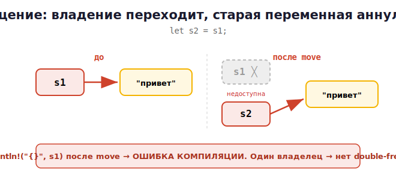

# 08 · Владение (Ownership) 🖼️⭐⭐

> 🎯 **Цель блока:** понять владение — **главную идею Rust**, благодаря которой память
> безопасна без сборщика мусора. Это самый важный модуль всего курса. Читай медленно.

---

## 📖 Три правила владения

Вся модель памяти Rust держится на трёх правилах:

1. **У каждого значения есть владелец** — переменная.
2. **Владелец может быть только один** в каждый момент времени.
3. **Когда владелец выходит из области видимости — значение освобождается.**

```rust
{
    let s = String::from("привет");   // s — владелец строки (данные в куче)
    // ... используем s ...
}                                     // s вышел из области → память освобождена
                                      // АВТОМАТИЧЕСКИ. Без free, без сборщика мусора.
```

🖼️
```
   {                                  STACK        HEAP
       let s = String::from("привет");  s ──────►  ["привет"]
       ...
   }   ← конец области: s уничтожается, его данные в куче освобождаются
       (Rust сам вызывает освобождение — как деструктор C++, но гарантированно)
```

💡 Это похоже на RAII из C++ (память освобождается в конце области), но Rust **встраивает
это в язык** и проверяет компилятором. Освобождение детерминированное, без GC.

---

## ⭐⭐ Перемещение (move) — значения перемещаются, а не копируются

Вот что отличает Rust от всех. Присваивание `String` **перемещает** владение:

```rust
let s1 = String::from("привет");
let s2 = s1;                  // владение ПЕРЕМЕЩЕНО из s1 в s2
println!("{}", s2);          // ✅ ок
println!("{}", s1);          // ❌ ОШИБКА КОМПИЛЯЦИИ! s1 больше не владеет данными
```

🖼️ Почему. `String` хранит указатель на данные в куче. При `let s2 = s1` копируется
указатель, но чтобы **не было двух владельцев** одних данных (иначе двойное освобождение!),
Rust **аннулирует** `s1`:



🆚 Сравни:
- **C++:** `s2 = s1` сделал бы **копию** (или ты пишешь `std::move` явно). Двойного
  владения избегаешь сам.
- **Python:** `s2 = s1` создал бы **второй ярлык** на тот же объект (оба валидны, GC уберёт).
- **Rust:** владение **перемещается**, старая переменная недоступна. Компилятор гарантирует
  один владелец → невозможны двойное освобождение и висячие указатели.

> 💡 Это и есть гениальность Rust: правило «один владелец» делает целый класс ошибок памяти
> (use-after-free, double-free) **невозможным на этапе компиляции**.

---

## 📖 Простые типы копируются (Copy)

Числа, булевы, char и кортежи из них — маленькие и лежат на стеке, поэтому **копируются**,
а не перемещаются:

```rust
let x = 5;
let y = x;            // x КОПИРУЕТСЯ (число дешёво копировать)
println!("{} {}", x, y);   // ✅ оба доступны — 5 5
```

🖼️
```
   Тип Copy (числа):   let y = x  → копия, оба валидны
   Не-Copy (String):   let y = x  → move, x аннулирован
```

💡 Типы, реализующие трейт `Copy` (все скалярные), копируются. Большие/владеющие типы
(`String`, `Vec`) — перемещаются. Различие — в стоимости копирования.

---

## ⭐ Владение и функции

Передача в функцию **перемещает** владение (для не-Copy типов):

```rust
fn take(s: String) {          // s становится владельцем
    println!("{}", s);
}                             // s уничтожается здесь

let text = String::from("привет");
take(text);                   // владение text перешло в функцию
// println!("{}", text);      // ❌ ОШИБКА! text больше не владеет

let n = 5;
take_number(n);               // число копируется
println!("{}", n);            // ✅ n всё ещё доступно
```

🖼️
```
   take(text)   →   владение text ПЕРЕМЕСТИЛОСЬ в функцию
                    после вызова text недоступен
```

### Возврат владения
Функция может **вернуть** владение:
```rust
fn give() -> String {
    String::from("привет")    // владение возвращается вызывающему
}
let s = give();               // s теперь владелец
```

> ⚠️ Постоянно отдавать и забирать владение через параметры/возврат — неудобно. Поэтому
> существует **заимствование** (`&`) — следующий модуль. Оно позволяет «одолжить» доступ
> без передачи владения.

---

## 📖 Клонирование — явная глубокая копия

Если правда нужна копия данных (не move) — `.clone()`:

```rust
let s1 = String::from("привет");
let s2 = s1.clone();          // ГЛУБОКАЯ копия — копируются и данные в куче
println!("{} {}", s1, s2);    // ✅ оба валидны
```

🖼️
```
   s1 ──► ["привет"]
   s2 ──► ["привет"]   (отдельная копия данных в куче)
```

> 💡 `.clone()` явный и «дорогой» (копирует данные). Rust заставляет писать его явно, чтобы
> ты **видел**, где происходит затратное копирование. В C++ копии часто скрыты и незаметны.

---

## ✅ Задачи

1. **Move.** Создай `String`, присвой другой переменной, попробуй использовать первую —
   поймай ошибку. Объясни своими словами.
2. **Copy.** Сделай то же с числом — убедись, что обе переменные работают. Почему разница?
3. **clone.** Через `.clone()` получи две независимые `String`, измени одну.
4. **Функция забирает владение.** Передай `String` в функцию, убедись, что снаружи она
   недоступна.
5. **Возврат владения.** Напиши функцию, создающую и возвращающую `String`.
6. **Область видимости.** Создай `String` в блоке `{}`, покажи, что после блока она
   уничтожена.
7. ⭐ **Эмуляция проблемы C.** Подумай: какой баг C (use-after-free) Rust сделал
   невозможным здесь?

---

## ❓ Проверь себя

1. Назови три правила владения.
2. Что происходит при `let s2 = s1` для `String`? Почему `s1` становится недоступной?
3. Чем move в Rust отличается от копии в C++ и от ссылки в Python?
4. Почему числа копируются, а `String` перемещается?
5. Что происходит с владением при передаче в функцию?
6. Зачем нужен `.clone()` и почему он явный?
7. Какой класс ошибок памяти владение делает невозможным?

---

## ✅ Чек-лист

- [ ] Знаю три правила владения
- [ ] Понимаю перемещение (move) и почему старая переменная аннулируется
- [ ] Различаю Copy-типы и перемещаемые
- [ ] Понимаю передачу/возврат владения в функциях
- [ ] Использую `.clone()` осознанно
- [ ] Понимаю, что владение освобождает память без GC

> 🏆 Владение — фундамент Rust. Если понял его — понял суть языка. Дальше — как одалживать
> доступ без передачи владения.

➡️ Следующий: [09 · Заимствование и ссылки](09-borrowing.md)
