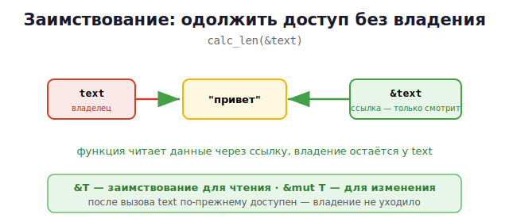

# 09 · Заимствование и ссылки 🖼️⭐

> 🎯 **Цель блока:** научиться **одалживать** доступ к данным через ссылки (`&`) без
> передачи владения. Это делает Rust удобным, сохраняя безопасность.

---

## 📖 Проблема: постоянно отдавать владение неудобно

Из прошлого модуля: передача в функцию забирает владение. Чтобы пользоваться значением
дальше, пришлось бы возвращать его обратно — громоздко:

```rust
fn calc_len(s: String) -> (String, usize) {
    let len = s.len();
    (s, len)              // приходится возвращать строку обратно — неудобно!
}
```

🎯 Решение — **заимствование**: дать функции **ссылку** на данные, не передавая владение.

---

## ⭐ Ссылка `&` — одалживаем доступ

```rust
fn calc_len(s: &String) -> usize {    // & — берём ссылку, НЕ владение
    s.len()
}

let text = String::from("привет");
let len = calc_len(&text);            // &text — одалживаем text
println!("{} — длина {}", text, len); // ✅ text всё ещё наш! владение не уходило
```



💡 **Заимствование** = «одолжить, посмотреть и вернуть». Функция получает `&String` —
ссылку на данные, но не становится владельцем. После вызова `text` по-прежнему доступен.

> 💡 Это похоже на передачу по `const&` в C++ — но в Rust компилятор **гарантирует**, что
> ссылка валидна (не висячая) на этапе компиляции.

---

## ⭐ Изменяемые ссылки `&mut`

Обычная ссылка `&` даёт только **чтение**. Чтобы менять данные через ссылку — `&mut`:

```rust
fn add_world(s: &mut String) {        // изменяемая ссылка
    s.push_str(", мир");              // меняем данные владельца
}

let mut text = String::from("привет");
add_world(&mut text);                 // одалживаем изменяемо
println!("{}", text);                 // "привет, мир" — оригинал изменён
```

🖼️
```
   let mut text = ...        text ──► ["привет"]
   add_world(&mut text)      функция меняет данные через &mut
   text ──► ["привет, мир"]  оригинал изменился
```

> ⚠️ Чтобы взять `&mut`, сама переменная должна быть `mut`. Логично: одолжить «на изменение»
> можно только то, что в принципе изменяемо.

---

## 📋 Три способа работать со значением

```rust
fn by_value(s: String)      { }   // забрать владение (move)
fn by_ref(s: &String)       { }   // одолжить для чтения
fn by_mut_ref(s: &mut String) { } // одолжить для изменения
```

| Способ | Владение | Можно менять | Когда |
|--------|----------|--------------|-------|
| `String` | забирает | — | нужно стать владельцем |
| `&String` | одалживает | нет | только читать (по умолчанию) |
| `&mut String` | одалживает | да | надо изменить оригинал |

💡 По умолчанию используй `&` (заимствование для чтения) — это самый частый и безопасный
способ. `&mut` — когда правда нужно менять. Забирать владение — реже всего.

---

## 📖 Разыменование `*`

Чтобы добраться до значения по ссылке (для простых типов), используют `*`:

```rust
let x = 5;
let r = &x;             // ссылка на x
println!("{}", *r);     // 5 — разыменование
println!("{}", r);      // тоже 5 — для печати Rust разыменует сам

let mut n = 10;
let m = &mut n;
*m += 5;                // изменить значение по ссылке
println!("{}", n);      // 15
```

💡 Часто `*` не нужен — Rust автоматически разыменует при вызове методов (`s.len()`
работает и для `&String`). Но при прямом изменении значения через `&mut` он нужен (`*m += 5`).

---

## 🧪 Эксперимент: заимствование vs владение

```rust
// move — text уходит
fn consume(s: String) { println!("{}", s); }

// borrow — text остаётся
fn observe(s: &String) { println!("{}", s); }

let text = String::from("привет");
observe(&text);          // одолжили
observe(&text);          // можно сколько угодно раз!
println!("{}", text);    // ✅ text наш
consume(text);           // а теперь отдали владение
// println!("{}", text); // ❌ text больше нет
```

---

## ✅ Задачи

1. **Заимствование для чтения.** Напиши функцию `print_len(s: &String)`, вызови её, потом
   используй строку снова — убедись, что владение не ушло.
2. **&mut.** Функция, добавляющая `"!"` к строке через `&mut`. Проверь, что оригинал изменён.
3. **Три способа.** Напиши три версии функции: by value, by `&`, by `&mut`. Сравни, что
   можно делать после каждой.
4. **Изменение через ссылку.** Удвой число через `&mut` и `*`.
5. **Сумма вектора.** Функция, считающая сумму `&Vec<i32>` (заимствование для чтения).
6. **Без clone.** Перепиши задачу, где ты передавал `String` по значению и возвращал, —
   на заимствование (`&`).

---

## ❓ Проверь себя

1. Что такое заимствование? Чем оно лучше передачи владения?
2. Чем `&` отличается от `&mut`?
3. Почему для `&mut` переменная должна быть `mut`?
4. Когда какой из трёх способов (value/`&`/`&mut`) выбрать?
5. Зачем нужно `*` (разыменование)? Когда оно не нужно?
6. Сколько раз можно одолжить значение для чтения?

---

## ✅ Чек-лист

- [ ] Понимаю заимствование как «одолжить без владения»
- [ ] Использую `&` для чтения, `&mut` для изменения
- [ ] Знаю три способа передачи значения
- [ ] Понимаю разыменование `*`
- [ ] Предпочитаю заимствование передаче владения

➡️ Следующий: [10 · Правила borrow checker](10-borrow-checker.md)
