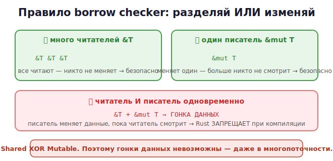

# 10 · Правила borrow checker 🖼️⭐⭐

> 🎯 **Цель блока:** понять правила заимствования, которые проверяет компилятор. Это они
> делают Rust безопасным — предотвращают гонки данных и висячие ссылки **на этапе
> компиляции**.

---

## ⭐⭐ Главное правило заимствования

В любой момент времени для данных может существовать **либо**:
- **любое число неизменяемых ссылок (`&`)**, ИЛИ
- **ровно одна изменяемая ссылка (`&mut`)**.

Но **не одновременно**.



💡 Формула: **«разделяй ИЛИ изменяй, но не одновременно»** (shared XOR mutable). Много
читателей безопасны (никто не меняет). Один писатель безопасен (никто больше не смотрит). А
вот читать и писать одновременно — источник багов, и Rust это **запрещает**.

---

## 🧪 Что разрешено и что нет

```rust
let mut s = String::from("привет");

// ✅ много неизменяемых ссылок — ок
let r1 = &s;
let r2 = &s;
println!("{} {}", r1, r2);    // оба читают — безопасно

// ✅ одна изменяемая ссылка — ок
let m = &mut s;
m.push_str("!");

// ❌ изменяемая + неизменяемая одновременно — ОШИБКА
let r = &s;
let m = &mut s;               // ❌ нельзя: уже есть & 
println!("{} {}", r, m);
```

Сообщение компилятора:
```
error: cannot borrow `s` as mutable because it is also borrowed as immutable
```

> 💡 Rust буквально объясняет, что не так и где. Поначалу «борьба с borrow checker» кажется
> строгой, но он ловит реальные баги, которые в C/C++ привели бы к краху или порче данных.

---

## ⭐ Почему это важно: гонки данных невозможны

Представь: один кусок кода читает данные, другой их одновременно меняет. Размер данных
поменялся, читатель работает с устаревшим указателем → краш или мусор. Это **гонка
данных** — кошмар в C/C++ (особенно в многопоточности).

🖼️
```
   &mut s меняет строку (перевыделяет память)
        ▲
   &s   │ читает по старому указателю → 💥 (в C/C++ это краш)
   
   Rust ЗАПРЕЩАЕТ такую комбинацию при компиляции → гонка невозможна
```

💡 То же правило защищает и в многопоточности (Уровень 4): нельзя расшарить изменяемый
доступ между потоками без синхронизации. Поэтому в Rust **гонки данных невозможны** — это
называют «бесстрашной многопоточностью».

---

## ⭐ Висячие ссылки невозможны

В C классическая ошибка — вернуть указатель на локальную переменную (она уже удалена). Rust
это **не даёт скомпилировать**:

```rust
fn dangle() -> &String {          // ❌ ошибка
    let s = String::from("привет");
    &s                            // возвращаем ссылку на s...
}                                 // ...но s уничтожается здесь → ссылка повисла!
```

Компилятор скажет: `missing lifetime specifier` / ссылка переживёт данные. Правильно —
вернуть **владение**:
```rust
fn no_dangle() -> String {
    String::from("привет")        // ✅ отдаём владение, данные живут дальше
}
```

🖼️
```
   C:    return &local;   → компилируется, в рантайме краш (висячий указатель)
   Rust: return &local;   → НЕ компилируется. Баг пойман до запуска.
```

💡 Помнишь из [C-курса](../../C/02-memory/09-pointers.md) висячие указатели? Rust делает их
**невозможными** — компилятор гарантирует, что ссылка никогда не переживёт данные, на
которые указывает.

---

## 📖 Область действия ссылки (NLL)

Ссылка «жива» от создания до **последнего использования**, а не до конца блока. Поэтому
такое работает:

```rust
let mut s = String::from("привет");
let r = &s;
println!("{}", r);            // последнее использование r здесь
let m = &mut s;               // ✅ ок! r больше не используется
m.push_str("!");
```

💡 Это «нелексические времена жизни» (NLL) — компилятор умный: как только неизменяемая
ссылка больше не нужна, можно брать изменяемую. Не нужно ждать конца блока.

---

## ✅ Задачи

1. **Много читателей.** Создай несколько `&` на одну строку, читай через все — убедись,
   что работает.
2. **Конфликт.** Попробуй взять `&` и `&mut` одновременно — поймай ошибку, прочитай
   сообщение компилятора.
3. **Висячая ссылка.** Напиши функцию, возвращающую ссылку на локальную переменную —
   поймай ошибку. Почини, вернув владение.
4. **NLL.** Покажи, что после последнего использования `&` можно взять `&mut`.
5. **Изменение в цикле.** Попробуй менять вектор, пока по нему идёт `&`-итерация — пойми,
   почему Rust это запрещает (защита от гонки).
6. ⭐ **Объясни.** Какие два бага из C-курса (висячий указатель, гонка) Rust делает
   невозможными и как?

---

## ❓ Проверь себя

1. Сформулируй главное правило заимствования.
2. Почему много `&` можно, а `&` + `&mut` — нельзя?
3. Что такое гонка данных и почему правило её предотвращает?
4. Почему `return &local` не компилируется в Rust?
5. Что такое NLL (нелексические времена жизни)?
6. Как borrow checker связан с «бесстрашной многопоточностью»?

---

## ✅ Чек-лист

- [ ] Знаю правило: много `&` ИЛИ один `&mut`, не вместе
- [ ] Понимаю, почему это предотвращает гонки данных
- [ ] Понимаю, что висячие ссылки невозможны
- [ ] Умею читать ошибки borrow checker
- [ ] Понимаю NLL

➡️ Следующий: [11 · Слайсы, String и &str](11-slices-strings.md)
