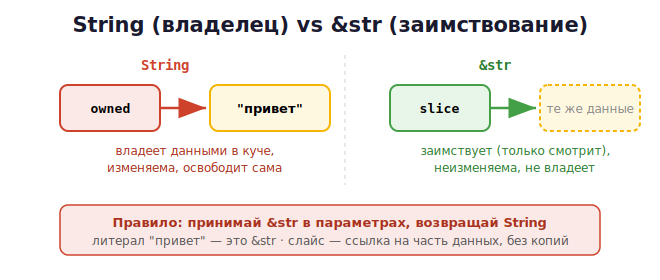

# 11 · Слайсы, String и &str 🖼️⭐

> 🎯 **Цель блока:** разобраться с двумя строковыми типами Rust и слайсами — это частый
> источник путаницы у новичков, но за ним стоит чёткая логика владения.

---

## ⭐ Два строковых типа: String и &str

```rust
let owned: String = String::from("привет");   // владеющая строка (в куче)
let slice: &str = "привет";                   // строковый срез (заимствование)
```

| | `String` | `&str` |
|--|----------|--------|
| Владение | **владеет** данными | **заимствует** (ссылка) |
| Где данные | в куче | где угодно (литерал, часть String) |
| Изменяемость | да (с `mut`) | нет |
| Размер | растёт/меняется | фиксирован |



💡 Думай так: **`String` — владелец, `&str` — заимствованный взгляд на строку**. Литерал
`"привет"` — это `&str` (он «зашит» в программу, String им не владеет).

---

## ⭐ Слайс (slice) — ссылка на часть данных

**Слайс** — это ссылка на **непрерывный кусок** коллекции (части строки или массива), без
владения.

```rust
let s = String::from("привет мир");
let hello: &str = &s[0..6];        // слайс байтов 0..6 → "привет" (12 байт кириллицы!)
let world: &str = &s[13..];        // от 13 до конца

let arr = [1, 2, 3, 4, 5];
let slice: &[i32] = &arr[1..4];    // слайс массива → [2, 3, 4]
```

🖼️
```
   s: "привет мир"   (данные в куче)
       └──────┘
        &s[0..6] — слайс: указатель на начало + длина, БЕЗ копирования
```

💡 Слайс не копирует данные — он хранит указатель и длину, «окно» в чужие данные. Поэтому
он подчиняется правилам заимствования (borrow checker следит, чтобы данные жили дольше
слайса).

> ⚠️ Индексы слайсов строк — в **байтах**. `&s[0..6]` для кириллицы — это 3 символа (по 2
> байта). Резать строку посередине символа Rust не даст — паника. Для безопасной работы с
> символами есть `.chars()`.

---

## ⭐ Почему функции принимают &str, а не &String

Идиоматичный Rust: параметры-строки принимают `&str`, а не `&String`:

```rust
fn greet(name: &str) {             // ✅ принимает и &str, и &String
    println!("Привет, {}!", name);
}

let owned = String::from("Гена");
greet(&owned);                     // String автоматически приводится к &str
greet("Чебур");                    // литерал — это уже &str
```

💡 `&str` гибче: функция работает и с `String` (он приводится), и с литералами. Поэтому
правило: **принимай `&str`, возвращай `String`** (когда нужно владение).

---

## 📖 Работа со строками

```rust
let mut s = String::from("привет");
s.push_str(", мир");               // дописать срез
s.push('!');                       // дописать символ

s.len();                           // длина в БАЙТАХ
s.chars().count();                 // количество символов (для Unicode)
s.to_uppercase();
s.contains("мир");
s.replace("мир", "Rust");
s.trim();                          // убрать пробелы по краям
let parts: Vec<&str> = s.split(' ').collect();   // разбить → вектор слайсов

// перебор символов
for c in s.chars() {
    print!("{} ", c);
}
```

> 💡 Заметь: `split` возвращает слайсы (`&str`), указывающие внутрь `s` — снова
> заимствование без копий.

---

## 🧪 Эксперимент: слайс и borrow checker

```rust
let mut s = String::from("привет мир");
let word = &s[0..6];          // слайс (заимствование s)
// s.clear();                 // ❌ ОШИБКА! нельзя менять s, пока живёт слайс word
println!("{}", word);         // слайс используется здесь
s.clear();                    // ✅ теперь можно — word больше не нужен
```

💡 Слайс — это `&`-заимствование. Пока он жив, нельзя изменять источник (правило из модуля
10). Это защищает от классического бага: «изменили строку, а слайс указывает в никуда».

---

## ✅ Задачи

1. **String vs &str.** Создай обе, выведи. Объясни, кто владеет, кто заимствует.
2. **Слайсы.** Возьми из строки `"привет мир"` слайс первого и второго слова.
3. **&str-параметр.** Напиши функцию, принимающую `&str`, вызови её и со `String`, и с
   литералом.
4. **first_word.** Функция, возвращающая слайс первого слова строки (`&str`).
5. **Подсчёт.** Сравни `s.len()` и `s.chars().count()` для строки с кириллицей. Объясни
   разницу.
6. **split.** Разбей строку на слова, посчитай их количество.
7. ⭐ **Слайс и borrow.** Воспроизведи ошибку «изменение источника при живом слайсе»,
   объясни, какой баг это предотвращает.

---

## ❓ Проверь себя

1. Чем `String` отличается от `&str`? Кто из них владелец?
2. Что такое слайс? Копирует ли он данные?
3. Почему функции лучше принимать `&str`, а не `&String`?
4. Почему `len()` строки — в байтах, и чем это грозит на Unicode?
5. Почему нельзя менять строку, пока жив слайс на неё?
6. Как перебрать строку по символам?

---

## ✅ Чек-лист

- [ ] Различаю `String` (владелец) и `&str` (заимствование)
- [ ] Понимаю слайс как ссылку на часть данных
- [ ] Принимаю `&str` в параметрах функций
- [ ] Знаю про байты vs символы в строках
- [ ] Понимаю, как слайсы подчиняются borrow checker

➡️ Следующий: [12 · Времена жизни (Lifetimes)](12-lifetimes.md)
