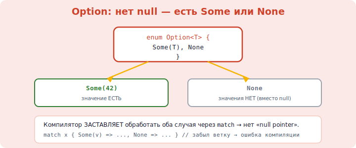

# 14 · Перечисления и Option 🖼️⭐

> 🎯 **Цель блока:** освоить перечисления (`enum`) и `Option` — то, как Rust устранил
> «ошибку на миллиард долларов» (null) и сделал отсутствие значения безопасным.

---

## 📖 Перечисления

`enum` описывает тип, который может быть **одним из** нескольких вариантов:

```rust
enum Direction {
    North,
    South,
    East,
    West,
}

let dir = Direction::North;
```

### ⭐ Варианты могут хранить данные!
В отличие от C, варианты enum в Rust могут нести значения:

```rust
enum Message {
    Quit,                          // без данных
    Move { x: i32, y: i32 },       // именованные поля
    Write(String),                 // одно значение
    Color(u8, u8, u8),             // кортеж
}

let m = Message::Move { x: 10, y: 20 };
let w = Message::Write(String::from("привет"));
```



💡 Это мощнее C-enum (который просто числа). Rust-enum — это «тип-сумма»: значение точно
одного из вариантов, с любыми данными. Идеально для состояний, команд, результатов.

---

## ⭐ match с enum

```rust
fn process(msg: Message) {
    match msg {
        Message::Quit => println!("выход"),
        Message::Move { x, y } => println!("движение в ({}, {})", x, y),
        Message::Write(text) => println!("текст: {}", text),
        Message::Color(r, g, b) => println!("цвет {} {} {}", r, g, b),
    }
}
```

💡 `match` **разбирает** enum и извлекает данные. И компилятор требует покрыть **все**
варианты — забудешь один, не скомпилируется.

---

## ⭐⭐ Option — нет больше null

В C/C++ указатель может быть `NULL`, в Python переменная — `None`, и забытая проверка =
краш. Rust **убрал null** и заменил его типом `Option<T>`:

```rust
enum Option<T> {        // встроен в язык
    Some(T),            // есть значение
    None,               // значения нет
}
```

```rust
let some_number: Option<i32> = Some(5);
let no_number: Option<i32> = None;

// нельзя использовать Option как обычное число — компилятор ЗАСТАВЛЯЕТ проверить:
// let x = some_number + 1;        // ❌ ошибка! Option<i32> ≠ i32
```

🖼️
```
   C:      int* p = find();  *p   ← забыл проверить NULL → 💥 краш
   Rust:   Option<i32> = find();  компилятор НЕ ДАСТ использовать,
                                  пока не обработаешь Some и None
```

💡 Гениальность: Rust **на этапе компиляции** заставляет обработать случай «значения нет».
Невозможно случайно разыменовать «null» — этого класса багов в Rust **не существует**.

---

## ⭐ Как доставать значение из Option

```rust
let maybe = Some(5);

// 1. match — самый явный
match maybe {
    Some(n) => println!("есть {}", n),
    None => println!("ничего"),
}

// 2. if let — короткий вариант для одного случая
if let Some(n) = maybe {
    println!("есть {}", n);
}

// 3. unwrap_or — значение или дефолт
let n = maybe.unwrap_or(0);        // 5, или 0 если None

// 4. методы-комбинаторы
let doubled = maybe.map(|n| n * 2);   // Some(10)

// 5. unwrap / expect — взять или паника (осторожно!)
let n = maybe.unwrap();            // 5, но ПАНИКА если None
```

> ⚠️ `.unwrap()` берёт значение, но **паникует** (крашит программу) при `None`. Используй
> его только когда уверен, что значение есть. В нормальном коде предпочитай `match`,
> `if let`, `unwrap_or`.

---

## 🧪 Пример: поиск

```rust
fn find_first_even(numbers: &[i32]) -> Option<i32> {
    for &n in numbers {
        if n % 2 == 0 {
            return Some(n);        // нашли
        }
    }
    None                           // не нашли
}

let nums = [1, 3, 5, 8, 9];
match find_first_even(&nums) {
    Some(n) => println!("первое чётное: {}", n),
    None => println!("чётных нет"),
}
```

💡 Функция честно говорит «может не найти» через `Option`. Вызывающий **обязан** обработать
оба случая. Никаких «магических» -1 или null.

---

## ✅ Задачи

1. **enum состояний.** `TrafficLight` (Red/Yellow/Green), функция следующего сигнала через
   `match`.
2. **enum с данными.** `Shape` с вариантами `Circle(f64)`, `Rectangle(f64, f64)`, функция
   площади через `match`.
3. **Option-поиск.** Функция, возвращающая `Option<usize>` — индекс элемента в срезе (или
   None).
4. **Безопасное деление.** Функция `divide(a, b) -> Option<f64>` (None при делении на 0).
5. **unwrap_or.** Считай число, при ошибке парсинга используй 0 (`parse().ok().unwrap_or`).
6. **if let.** Обработай `Option`, печатая значение только если оно есть.
7. ⭐ **Калькулятор-команды.** `enum Command` с вариантами-операциями, выполнение через `match`.

---

## ❓ Проверь себя

1. Чем enum в Rust мощнее enum в C?
2. Что такое `Option<T>` и какую проблему он решает?
3. Почему в Rust невозможно случайно разыменовать «null»?
4. Назови способы достать значение из `Option`.
5. Чем опасен `.unwrap()`? Когда его можно использовать?
6. Почему `match` по enum безопасен?

---

## ✅ Чек-лист

- [ ] Создаю enum, в том числе с данными в вариантах
- [ ] Разбираю enum через `match`, покрываю все варианты
- [ ] Понимаю `Option` как замену null
- [ ] Достаю значения через match/if let/unwrap_or/map
- [ ] Использую `.unwrap()` осторожно

➡️ Следующий: [15 · Обработка ошибок (Result)](15-error-handling.md)
