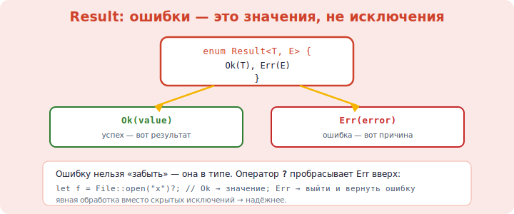

# 15 · Обработка ошибок (Result) 🖼️⭐

> 🎯 **Цель блока:** освоить обработку ошибок через `Result` и оператор `?`. В Rust нет
> исключений — ошибки это **значения**, которые компилятор заставляет обработать.

---

## 📖 Две категории ошибок

| Категория | Механизм | Пример |
|-----------|----------|--------|
| **Невосстановимые** | `panic!` — крах программы | выход за границы массива, баг |
| **Восстановимые** | `Result<T, E>` — значение-ошибка | файл не найден, неверный ввод |

---

## 📖 panic! — невосстановимая ошибка

```rust
panic!("что-то сломалось!");        // немедленный крах с сообщением

let arr = [1, 2, 3];
// arr[10];                         // паника: index out of bounds
```

💡 `panic!` — для ситуаций «так не должно было случиться» (баг в коде). Для ожидаемых ошибок
(файл, сеть, ввод) используют `Result`.

---

## ⭐⭐ Result — ошибки как значения



```rust
enum Result<T, E> {        // встроен в язык
    Ok(T),                 // успех со значением T
    Err(E),                // ошибка с описанием E
}
```

Функция, которая может ошибиться, возвращает `Result`:

```rust
fn divide(a: f64, b: f64) -> Result<f64, String> {
    if b == 0.0 {
        Err(String::from("деление на ноль"))
    } else {
        Ok(a / b)
    }
}

match divide(10.0, 2.0) {
    Ok(result) => println!("результат: {}", result),
    Err(msg) => println!("ошибка: {}", msg),
}
```

🖼️
```
   C:      возвращает -1 или errno   (легко забыть проверить)
   C++:    бросает исключение         (невидимо в сигнатуре)
   Rust:   возвращает Result<T, E>    (в сигнатуре видно, компилятор заставит обработать)
```

💡 Ошибка — часть **типа возврата**. Глядя на сигнатуру, сразу видно, что функция может
ошибиться. И ты **обязан** обработать `Result` — игнорировать его компилятор не даст
(предупредит).

---

## ⭐ Оператор `?` — изящная передача ошибок

Постоянно писать `match` для каждой ошибки утомительно. Оператор `?` делает это за тебя:
если `Result` — это `Err`, он **сразу возвращает** ошибку из функции; если `Ok` —
извлекает значение.

```rust
use std::fs;

fn read_config() -> Result<String, std::io::Error> {
    let content = fs::read_to_string("config.txt")?;  // ? — если ошибка, вернуть её
    Ok(content)
}
```

🖼️
```
   fs::read_to_string("...")?
                            └─ Ok(s)  → извлечь s, продолжить
                               Err(e) → немедленно return Err(e) из функции
```

Без `?` это было бы:
```rust
let content = match fs::read_to_string("config.txt") {
    Ok(s) => s,
    Err(e) => return Err(e),       // ? заменяет это
};
```

💡 `?` делает код с обработкой ошибок коротким и читаемым — как будто ошибок нет, но они
всё равно обрабатываются. Можно делать цепочки: `read(f)?.parse()?`.

> ⚠️ `?` работает только в функции, возвращающей `Result` (или `Option`). Тип ошибки должен
> совпадать (или приводиться).

---

## ⭐ Методы Result

```rust
let r: Result<i32, String> = Ok(5);

r.unwrap();              // 5, но ПАНИКА если Err
r.unwrap_or(0);          // 5, или 0 если Err
r.expect("должно быть"); // 5, или паника с твоим сообщением
r.is_ok();               // true
r.ok();                  // Option<i32> — превратить в Option (отбросив ошибку)

// map / and_then для цепочек
let doubled = r.map(|n| n * 2);   // Ok(10)
```

---

## 🧪 Пример: парсинг с обработкой

```rust
fn parse_and_double(s: &str) -> Result<i32, std::num::ParseIntError> {
    let n: i32 = s.parse()?;       // ? передаст ошибку парсинга наверх
    Ok(n * 2)
}

match parse_and_double("21") {
    Ok(n) => println!("{}", n),    // 42
    Err(e) => println!("не число: {}", e),
}
```

---

## 📖 main может возвращать Result

```rust
fn main() -> Result<(), Box<dyn std::error::Error>> {
    let content = std::fs::read_to_string("file.txt")?;  // ? прямо в main!
    println!("{}", content);
    Ok(())
}
```

💡 `Box<dyn std::error::Error>` — универсальный тип ошибки (любая ошибка). Удобно для
маленьких программ и прототипов.

---

## ✅ Задачи

1. **divide.** Функция деления, возвращающая `Result<f64, String>` (Err при делении на 0).
   Обработай через `match`.
2. **parse.** Функция, парсящая строку в число через `?`, возвращающая `Result`.
3. **Цепочка `?`.** Функция, читающая число из строки и возвращающая его квадрат, с
   передачей ошибок через `?`.
4. **unwrap_or.** Считай число, при ошибке используй значение по умолчанию.
5. **Чтение файла.** Функция, читающая файл и возвращающая `Result`, с `?`. Обработай оба
   случая.
6. **panic vs Result.** Реши, где уместен `panic!`, а где `Result` (придумай 2 примера).
7. ⭐ **Калькулятор с Result.** Операции возвращают `Result`, ошибки (деление на 0,
   переполнение) обрабатываются.

---

## ❓ Проверь себя

1. Чем невосстановимые ошибки отличаются от восстановимых?
2. Когда `panic!`, а когда `Result`?
3. Что такое `Result<T, E>` и чем он лучше исключений/кодов ошибок?
4. Что делает оператор `?`? Где его можно использовать?
5. Чем `unwrap` отличается от `unwrap_or` и `expect`?
6. Почему ошибка в сигнатуре функции — это хорошо?

---

## ✅ Чек-лист

- [ ] Различаю panic! и Result
- [ ] Возвращаю `Result<T, E>` из функций, которые могут ошибиться
- [ ] Обрабатываю Result через match
- [ ] Использую `?` для передачи ошибок
- [ ] Применяю unwrap_or/expect осознанно

➡️ Следующий: [16 · Обобщения и трейты](16-generics-traits.md)
