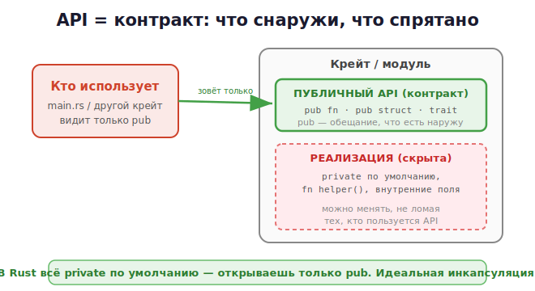

# 2 · Проектирование API (pub, трейты, ошибки) 🖼️⭐

> 🎯 **Цель блока:** научиться проектировать чистый API библиотеки на Rust. Благодаря
> приватности по умолчанию и системе типов Rust делает хорошие API почти автоматически.

---

## 📖 Что такое API в Rust

**API** твоего крейта — это всё, помеченное `pub`: функции, структуры, трейты, методы.
Остальное скрыто. Это **контракт**: «вот что я умею, а как — моё дело».



💡 В Rust граница API задаётся `pub`. Всё приватное — деталь реализации, которую можно
менять, не ломая пользователей.

---

## ⭐ Принцип №1: минимальная публичная поверхность

```rust
pub struct Stack<T> {
    items: Vec<T>,           // приватное — пользователь не трогает внутренности
}

impl<T> Stack<T> {
    pub fn new() -> Self { Stack { items: Vec::new() } }
    pub fn push(&mut self, value: T) { self.items.push(value); }
    pub fn pop(&mut self) -> Option<T> { self.items.pop() }
    pub fn len(&self) -> usize { self.items.len() }

    fn grow(&mut self) {}    // приватный помощник — не часть API
}
```

💡 Открывай `pub` только то, что нужно пользователю. Поле `items` приватно → ты можешь
сменить `Vec` на другую структуру, не сломав код пользователей. «Маленькая дверь, большой
дом».

---

## ⭐ Принцип №2: трейты как контракты-интерфейсы

Трейты (модуль 16) — идеальный способ описать абстракцию API:

```rust
pub trait Storage {
    fn save(&mut self, key: &str, value: String);
    fn load(&self, key: &str) -> Option<String>;
}

// пользователь может подставить ЛЮБУЮ реализацию
pub struct MemoryStorage { /* ... */ }
impl Storage for MemoryStorage { /* ... */ }

pub struct FileStorage { /* ... */ }
impl Storage for FileStorage { /* ... */ }
```

💡 Трейт в API говорит «дай мне что угодно, что умеет save/load». Гибко и расширяемо — как
интерфейсы в других языках, но проверяется компилятором.

---

## ⭐ Принцип №3: свои типы ошибок

Хороший API возвращает **понятные ошибки** через `Result` и собственный тип ошибки (а не
строку):

```rust
#[derive(Debug)]
pub enum ConfigError {
    NotFound,
    InvalidFormat(String),
    IoError(std::io::Error),
}

impl std::fmt::Display for ConfigError {
    fn fmt(&self, f: &mut std::fmt::Formatter) -> std::fmt::Result {
        match self {
            ConfigError::NotFound => write!(f, "конфиг не найден"),
            ConfigError::InvalidFormat(s) => write!(f, "неверный формат: {}", s),
            ConfigError::IoError(e) => write!(f, "ошибка ввода-вывода: {}", e),
        }
    }
}
impl std::error::Error for ConfigError {}

pub fn load_config(path: &str) -> Result<Config, ConfigError> {
    // ...
}
```

💡 Свой enum-ошибки даёт пользователю **разобрать** ошибку через `match` и реагировать
по-разному. В реальных проектах это упрощают библиотекой **`thiserror`** (генерирует
boilerplate). Сравни: ошибка — часть типа возврата, видна в сигнатуре (в отличие от
исключений C++/Python).

---

## ⭐ Принцип №4: паттерн «строитель» (builder)

Когда у объекта много опциональных настроек — builder делает API удобным:

```rust
pub struct ServerBuilder {
    port: u16,
    host: String,
    threads: usize,
}

impl ServerBuilder {
    pub fn new() -> Self {
        ServerBuilder { port: 8080, host: "localhost".into(), threads: 4 }
    }
    pub fn port(mut self, p: u16) -> Self { self.port = p; self }   // возвращает self
    pub fn host(mut self, h: &str) -> Self { self.host = h.into(); self }
    pub fn build(self) -> Server { /* ... */ }
}

// использование — цепочка (fluent API):
let server = ServerBuilder::new()
    .port(3000)
    .host("0.0.0.0")
    .build();
```

💡 Builder читается как фраза и не требует помнить порядок 10 аргументов. Частый паттерн в
Rust-библиотеках.

---

## 📖 Принцип №5: документация и тесты — часть API

```rust
/// Складывает два числа.
///
/// # Примеры
/// ```
/// let r = mylib::add(2, 3);
/// assert_eq!(r, 5);
/// ```
pub fn add(a: i32, b: i32) -> i32 {
    a + b
}
```

💡 Документация через `///` генерируется в HTML (`cargo doc`), а примеры в ней **выполняются
как тесты** (`cargo test`)! Это уникально: документация Rust не может устареть — компилятор
проверяет её примеры.

---

## ⭐ Принцип №6: стабильность и SemVer

Cargo **встроенно поддерживает** семантическое версионирование `MAJOR.MINOR.PATCH`:
- PATCH — починка, API не меняется;
- MINOR — добавили возможности (например новый `pub`);
- MAJOR — сломали совместимость.

```rust
#[non_exhaustive]            // позволяет добавлять варианты enum, не ломая пользователей
pub enum Status { Active, Inactive }
```

💡 `#[non_exhaustive]` заставляет пользователей писать `_ =>` в match — тогда добавление
нового варианта не сломает их код. Приватность по умолчанию + SemVer = легко поддерживать
стабильный API.

---

## 📋 Чек-лист хорошего Rust API

```
   ✅ Минимум pub — приватно по умолчанию
   ✅ Трейты для абстракций/расширяемости
   ✅ Свой тип ошибки (enum), не String
   ✅ Builder для сложных настроек
   ✅ /// документация с примерами-тестами
   ✅ #[derive(Debug)] на публичных типах
   ✅ SemVer, #[non_exhaustive] где нужно
```

---

## ✅ Задачи

1. **Минимальный pub.** Сделай структуру с приватным полем и pub-методами доступа. Проверь,
   что снаружи поле недоступно.
2. **Трейт-API.** Опиши трейт `Storage` с двумя реализациями (память и «файл»).
3. **Свой тип ошибки.** Создай enum-ошибку с `Display`, верни её из функции через `Result`.
   Разбери через `match` у вызова.
4. **Builder.** Реализуй builder для структуры с 3+ опциональными полями (fluent-цепочка).
5. **Doc-тесты.** Напиши `///`-документацию с примером, запусти `cargo test` — убедись, что
   пример выполняется.
6. ⭐ **API-ревью.** Перечитай свой крейт: минимальна ли публичная поверхность? Понятен ли он
   по `cargo doc` без чтения исходников?

---

## ❓ Проверь себя

1. Что задаёт границу API в Rust?
2. Почему приватность по умолчанию хороша для API?
3. Зачем трейты в дизайне API?
4. Почему свой тип ошибки лучше строки?
5. Что такое паттерн builder и когда он полезен?
6. Почему doc-тесты — уникальная фишка Rust?
7. Что делает `#[non_exhaustive]`?

---

## ✅ Чек-лист

- [ ] Держу публичную поверхность минимальной (pub только нужное)
- [ ] Использую трейты для абстракций
- [ ] Возвращаю свои типы ошибок через Result
- [ ] Применяю builder для сложных настроек
- [ ] Документирую с примерами-тестами
- [ ] Понимаю SemVer и `#[non_exhaustive]`

➡️ Следующий: [3 · Работа с веб-API (reqwest, JSON)](03-web-api.md)
