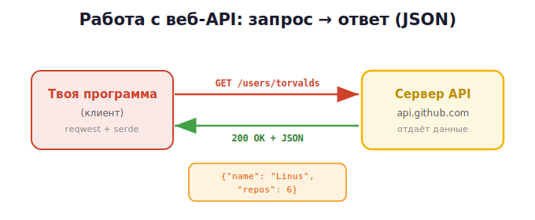

# 3 · Работа с веб-API (reqwest, JSON) 🖼️

> 🎯 **Цель блока:** понять, что такое веб-API, и обратиться к нему из Rust через `reqwest`
> и `serde`. Rust делает это типобезопасно — JSON превращается прямо в твои структуры.

---

## 📖 Что такое веб-API

Если раньше «API» был интерфейсом твоего крейта, то **веб-API** — это интерфейс **чужого
сервиса в интернете**: ты шлёшь HTTP-запрос на URL, он отвечает данными (обычно JSON).



Примеры: погода, курсы валют, GitHub, карты. Ты отправляешь запрос и получаешь ответ.

---

## 📖 HTTP кратко

| Метод | Зачем |
|-------|-------|
| `GET` | получить данные |
| `POST` | отправить/создать |
| `PUT`/`PATCH` | изменить |
| `DELETE` | удалить |

**Коды:** `200` OK · `404` не найдено · `401` нет доступа · `429` лимит · `500` ошибка
сервера. **JSON** — формат ответа: `{"name": "Linus", "public_repos": 6}`.

---

## ⭐ Запрос через reqwest

В стандартной библиотеке Rust нет HTTP — берут крейт **reqwest** (самый популярный
HTTP-клиент). Есть синхронный (blocking) и async режим.

> 🛠️ Зависимости в `Cargo.toml`:
> ```toml
> [dependencies]
> reqwest = { version = "0.11", features = ["blocking", "json"] }
> serde = { version = "1", features = ["derive"] }
> ```

### Синхронный (blocking) — проще для начала
```rust
fn main() -> Result<(), Box<dyn std::error::Error>> {
    let body = reqwest::blocking::Client::new()
        .get("https://api.github.com/users/torvalds")
        .header("User-Agent", "rust-course")        // GitHub требует
        .send()?                                     // отправить, ? передаст ошибку
        .text()?;                                    // тело как строку

    println!("{}", body);
    Ok(())
}
```

💡 Заметь оператор `?` (из [модуля 15](../03-middle/15-error-handling.md)) — он изящно
передаёт ошибки сети. Сравни с [C](../../C/03b-projects-api/03-external-api.md), где буфер
надо было собирать вручную через `realloc` — Rust и reqwest делают это за тебя.

---

## ⭐⭐ JSON прямо в структуры (serde) — киллер-фича

Вместо ручного разбора JSON, `serde` превращает ответ **прямо в твою типизированную
структуру**:

```rust
use serde::Deserialize;

#[derive(Deserialize, Debug)]      // serde сгенерирует разбор JSON
struct User {
    login: String,
    name: Option<String>,          // может отсутствовать → Option
    public_repos: u32,
}

fn main() -> Result<(), Box<dyn std::error::Error>> {
    let user: User = reqwest::blocking::Client::new()
        .get("https://api.github.com/users/torvalds")
        .header("User-Agent", "rust-course")
        .send()?
        .json()?;                  // распарсить JSON прямо в User!

    println!("{} — {} репозиториев", user.login, user.public_repos);
    Ok(())
}
```

🖼️
```
   JSON {"login":"torvalds","public_repos":6}  ──.json()──►  User { login, public_repos }
   serde автоматически сопоставляет поля по именам, проверяя типы
```

💡 Это типобезопасный парсинг: если поле отсутствует или не того типа — ошибка, а не
тихий баг. `Option<String>` для поля, которого может не быть. Сравни с динамическим
`data["key"]` в Python — здесь компилятор гарантирует структуру.

---

## ⭐ Async-версия (для масштаба)

Для тысяч запросов используют async (модуль 24) с `tokio`:

```rust
#[tokio::main]
async fn main() -> Result<(), Box<dyn std::error::Error>> {
    let user: User = reqwest::Client::new()
        .get("https://api.github.com/users/torvalds")
        .header("User-Agent", "rust-course")
        .send().await?              // .await — асинхронно
        .json().await?;

    println!("{:?}", user);
    Ok(())
}
```

---

## ⚠️ Что всегда учитывать

```
   ✅ Проверяй статус (.status()), обрабатывай 404/500
   ✅ Ставь таймаут (Client::builder().timeout(...))
   ✅ Обрабатывай ошибки сети/парсинга через Result/?
   ✅ Не храни API-ключи в коде — бери из переменных окружения (std::env::var)
   ✅ Уважай лимиты (rate limit)
```

```rust
let token = std::env::var("GITHUB_TOKEN").unwrap_or_default();   // ключ из окружения

let resp = client.get(url).send()?;
if resp.status() == reqwest::StatusCode::NOT_FOUND {
    println!("не найдено");
}
```

---

## ⭐ Хороший тон: оберни API в свой клиент

Не разбрасывай `reqwest` по коду — спрячь за своим типом (модуль 2!):

```rust
pub struct GitHubClient {
    client: reqwest::blocking::Client,
    token: Option<String>,
}

impl GitHubClient {
    pub fn new() -> Self {
        GitHubClient { client: reqwest::blocking::Client::new(), token: None }
    }

    // чистый API — пользователь не знает про reqwest/serde
    pub fn get_user(&self, login: &str) -> Result<User, reqwest::Error> {
        self.client
            .get(format!("https://api.github.com/users/{}", login))
            .header("User-Agent", "rust-course")
            .send()?
            .json()
    }
}
```

💡 Это соединяет обе грани раздела: ты **используешь** чужой веб-API и **проектируешь свой**
чистый клиент поверх него — так устроены все нормальные SDK.

---

## 💡 Rust vs Python для веб-API

В Python короче (`requests.get(...).json()`), но в Rust ты получаешь **типобезопасность**:
JSON проверяется на соответствие структуре при разборе. Rust выбирают, когда веб-клиент —
часть надёжной высоконагруженной системы.

---

## ✅ Задачи

1. **Первый запрос.** Подключи reqwest (blocking), сделай GET к
   `https://api.github.com/users/<логин>`, выведи тело.
2. **serde-структура.** Опиши `struct User` с `#[derive(Deserialize)]`, распарси ответ
   через `.json()`, выведи поля.
3. **Коды и ошибки.** Запроси несуществующего пользователя, обработай 404 и ошибки через `?`.
4. **Погода.** Через открытый API (open-meteo, без ключа) распарси температуру в структуру.
5. **Ключ из окружения.** Используй API с ключом из `std::env::var`.
6. ⭐ **Свой клиент.** Оберни выбранный API в `struct Client` с методами, возвращающими
   типизированные структуры через `Result`.

---

## ❓ Проверь себя

1. Чем веб-API отличается от API твоего крейта?
2. Зачем reqwest и serde? Чего нет в стандартной библиотеке?
3. Как serde превращает JSON в структуру? Зачем `Option` для полей?
4. Как `?` помогает с ошибками сети?
5. Где хранить API-ключи?
6. Зачем оборачивать reqwest в свой клиент?

---

## ✅ Чек-лист «раздел Проекты и API пройден» 🎉

- [ ] Раскладываю проект по модулям и крейтам
- [ ] Проектирую чистый API (pub-минимум, трейты, типы ошибок)
- [ ] Делаю запросы через reqwest
- [ ] Парсю JSON в структуры через serde
- [ ] Обрабатываю ошибки/коды, храню ключи в окружении
- [ ] Оборачиваю чужой API в свой клиент

➡️ ✅ [Задачи раздела](TASKS.md) → 🚀 [Мини-проект: библиотека-клиент с чистым API](PROJECT.md)
